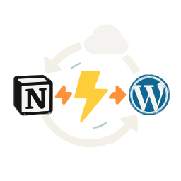

**🏠 主页** • [📚 用户指南](docs/Wiki.zh_CN.md) • [📊 项目概览](docs/PROJECT_OVERVIEW-zh_CN.md) • [🚀 开发者指南](docs/DEVELOPER_GUIDE-zh_CN.md) • [🔄 更新日志](https://github.com/Frank-Loong/Notion-to-WordPress/commits)

**🌐 语言：** [English](README.md) • **中文**

---

#  Notion-to-WordPress

> 🚀 一键将 Notion 变身 WordPress — 告别复制粘贴，实现全自动内容发布与同步

  

---

## 🖼️ 效果演示

   
  <em>▲ 可视化后台：一键配置、同步与监控</em>

   
  <em>▲ 在你熟悉的 Notion 中编写和组织内容</em>

   
  <em>▲ 一键同步，内容完美还原到 WordPress，所见即所得</em>

---

## 简介
**Notion-to-WordPress** 是一款现代化 WordPress 插件，让你无需写一行代码，就能把 Notion 数据库里的文章、页面、图片、数学公式、Mermaid 图表等内容批量同步到 WordPress，并保持实时更新。

*告别重复粘贴，专注内容创作，让 Notion 成为你的「内容 CMS」，WordPress 负责高可用发布与 SEO。*

---

## 核心特性
- **⚡ 极速同步**：支持手动、一键刷新、定时 Cron 以及 Notion Webhook 四种触发方式
- **🧠 智能增量同步**：仅同步变更内容，优化性能表现
- **🔄 三重同步模式**：手动控制 + 自动调度 + 实时 Webhook
- **🗑️ 智能删除检测**：自动清理已删除的 Notion 页面
- **🧠 智能映射**：可视化字段映射，轻松绑定分类、标签、自定义字段与特色图
- **📐 完美排版**：KaTeX 数学公式、mhchem 化学式、Mermaid 流程 / 时序图原生渲染
- **🔒 安全稳定**：严格 nonce、权限 与 CSP 校验，附件下载自动校验 MIME & 大小
- **🗂 多场景支持**：博客、知识库、团队协作、课程站点、一键搞定
- **🌍 多语言**：内置 i18n，现已支持简体中文 / English
- **📝 一键卸载**：可选清理所有设置与日志，干净无残留

> 需要帮助或想了解所有高级玩法？访问 [📚 用户指南](./docs/Wiki.zh_CN.md) – 中文 | [English](./docs/Wiki.md)，包含模板、截图和故障排除。

---

## 快速上手

### 🚀 三步上手
1. **安装**：下载 ZIP → WordPress 后台上传 → 激活插件
2. **配置**：获取 Notion API 密钥和数据库 ID
3. **同步**：点击「手动同步」，观看内容出现在 WordPress！

---

## 🚀 核心功能

### **三重同步模式**
- **🖱️ 手动同步** – 按需控制，即时反馈
- **⏰ 定时同步** – 自动化后台处理
- **⚡ Webhook同步** – 在Notion中输入时实时更新

### **智能技术**
- **增量同步** – 仅处理变更内容
- **智能删除** – 自动清理已删除页面
- **丰富内容支持** – 数学公式、图表、图片等

## 💡 使用场景
适用于博客、知识库、团队协作和在线课程。在熟悉的Notion界面中写作，自动发布到WordPress。
| 实时发布 | Webhook触发即时同步 | 边写边更新 |

---

## 📈 性能与可靠性

### **生产就绪**
- **智能同步** – 增量技术优化性能表现
- **大规模处理** – 高效处理1000+页面的数据库
- **错误恢复** – 高级错误处理与详细日志记录
- **企业级** – 遵循WordPress标准的安全加固

---

## 🌟 Star 历史

---

## 贡献 ⭐
如果这个项目帮助到了你，请 **点个 ⭐Star 支持一下**！同时欢迎 PR、Issue、翻译与任何形式的贡献。

* [🚀 开发者指南](./docs/DEVELOPER_GUIDE-zh_CN.md) - 完整的开发和贡献指南
* [提交 Issue](https://github.com/Frank-Loong/Notion-to-WordPress/issues)
* [功能请求](https://github.com/Frank-Loong/Notion-to-WordPress/discussions)

---

## 致谢与参考

本项目的开发过程中参考了以下优秀的开源项目，在此表示感谢：

- **[NotionNext](https://github.com/tangly1024/NotionNext)** - 基于 Notion 的强大静态博客系统，为 Notion API 集成和内容处理提供了宝贵的参考
- **[Elog](https://github.com/LetTTGACO/elog)** - 支持多平台的开源博客写作客户端，为多平台内容同步提供了优秀的参考方案
- **[notion-content](https://github.com/pchang78/notion-content)** - 内容管理解决方案，帮助我们完善了 Notion 内容处理的方法

感谢这些项目及其维护者对开源社区的贡献，正是有了他们的努力，才让本项目得以实现。

---

## License
GPL-3.0-or-later

> © 2025 Frank-Loong · Notion-to-WordPress v1.8.3-beta.2