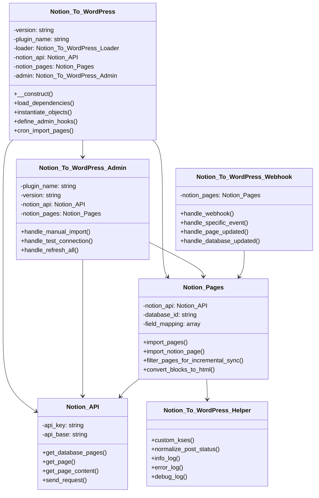
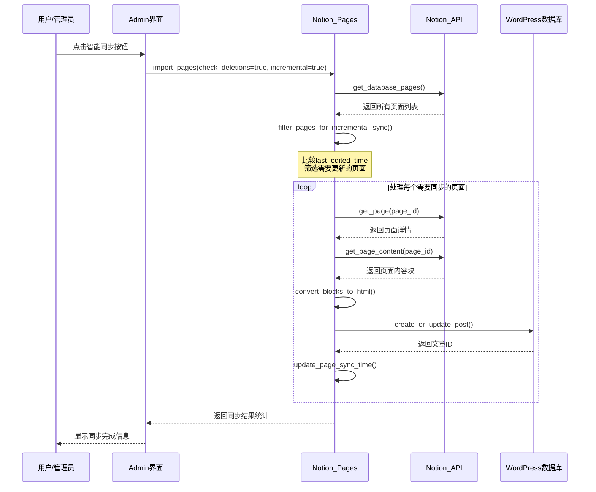
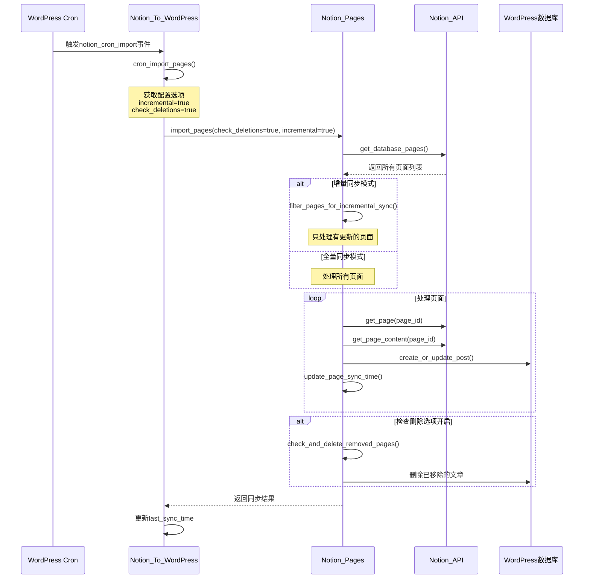
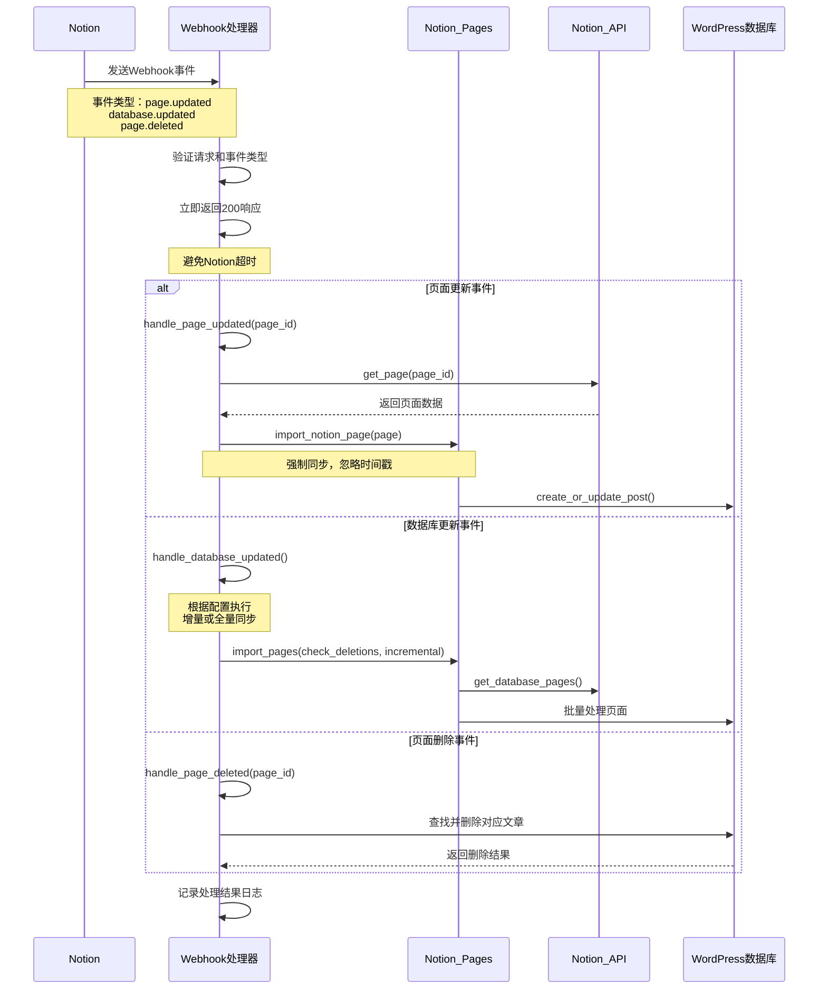

** [🏠 主页](../README-zh_CN.md) • [📚 用户指南](Wiki.zh_CN.md) • [📊 项目概览](PROJECT_OVERVIEW-zh_CN.md) • **🚀 开发者指南** • [🔄 更新日志](https://github.com/Frank-Loong/Notion-to-WordPress/commits)

**🌐 语言：** **中文** • [English](DEVELOPER_GUIDE.md)

---

# 🚀 Notion-to-WordPress 开发者指南

> **专业的WordPress插件开发、贡献和发布完整指南**

---

## 📋 目录

- [🚀 快速开始](#-快速开始)
- [🛠️ 开发环境](#-开发环境)
- [🏗️ 项目架构](#-项目架构)
- [📝 开发流程](#-开发流程)
- [🔧 命令参考](#-命令参考)
- [🐛 调试指南](#-调试指南)
- [🚀 发布管理](#-发布管理)
- [📚 最佳实践](#-最佳实践)
- [🤝 贡献指南](#-贡献指南)
- [🔗 资源链接](#-资源链接)
- [📖 术语表](#-术语表)

---

## 🚀 快速开始

### ⚡ 5分钟上手

```bash
# 1. 克隆项目
git clone https://github.com/Frank-Loong/Notion-to-WordPress.git
cd Notion-to-WordPress

# 2. 安装依赖
npm install

# 3. 验证版本一致性
npm run validate:version

# 4. 构建测试
npm run build

# 5. 检查结果
# Linux/Mac: ls -la build/notion-to-wordpress-*.zip
# Windows: Get-ChildItem build/notion-to-wordpress-*.zip
```

### ⚡ 简化开发工作流

**日常开发的3步工作流：**

```bash
# 1. 检查版本一致性
npm run validate:version

# 2. 升级版本（如需要）
npm run version:bump:patch    # 或 minor/major/beta

# 3. 构建生产包
npm run build
```

**常用命令速查：**
- `npm run version:bump:help` - 查看版本管理帮助
- `npm run version:bump:check` - 仅检查版本一致性
- `npm run version:bump:rollback` - 回滚到上一版本

### ✅ 环境要求

| 组件 | 最低版本 | 推荐版本 |
|------|----------|----------|
| Node.js | 16.0+ | 18.0+ |
| npm | 8.0+ | 9.0+ |
| Git | 2.0+ | 最新版 |
| PHP | 8.0+ | 8.1+ |
| WordPress | 6.0+ | 最新版 |

---

## 🛠️ 开发环境

### 🔧 IDE配置

#### VS Code设置
```json
{
  "php.validate.executablePath": "/usr/bin/php",
  "editor.formatOnSave": true,
  "files.associations": {
    "*.php": "php"
  }
}
```

#### Git配置
```bash
git config core.autocrlf false
git config core.filemode false
git config pull.rebase true
```

### 🐳 WordPress测试环境

```bash
# Docker方式（推荐）
docker-compose up -d wordpress

# 本地环境
# XAMPP、WAMP、MAMP或Local by Flywheel
```

---

## 🏗️ 项目架构

### 📁 目录结构

```
notion-to-wordpress/
├── admin/                  # 后台管理界面
├── includes/               # 核心功能类
│   ├── class-notion-api.php
│   ├── class-notion-pages.php
│   └── class-notion-to-wordpress.php
├── scripts/                # 自动化脚本
│   ├── build.js
│   ├── release.js
│   └── local-package.js
├── languages/              # 国际化文件
└── notion-to-wordpress.php # 插件入口
```

### 🔄 核心类关系图



### 🔄 数据流向

```
Notion API → API通信层 → 数据转换 → 同步引擎 → WordPress数据库
     ↑                                      ↑
  Webhook处理器                        管理界面触发
```

### 📊 同步流程序列图

#### 智能同步（增量同步）流程



#### 定时同步（Cron任务）流程



#### Webhook实时同步流程



---

## 📝 开发流程

### 🔄 标准工作流

```bash
# 1. 创建功能分支
git checkout -b feature/your-feature

# 2. 开发和测试
npm run validate:version
npm run build

# 3. 代码检查
npm run validate:config
php -l notion-to-wordpress.php

# 4. 提交代码
git add .
git commit -m "feat: 添加新功能"

# 5. 合并主分支
git checkout main
git merge feature/your-feature
```

### 📋 提交规范

```
<类型>: <描述>

类型：
- feat: 新功能
- fix: 修复bug
- docs: 文档更新
- style: 代码格式
- refactor: 重构
- test: 测试
- chore: 构建工具
```

---

## 🔧 命令参考

### 🏗️ 构建命令

| 命令 | 功能 | 用途 |
|------|------|------|
| `npm run build` | 构建生产包 | 发布前构建 |
| `npm run validate:config` | 验证配置 | 环境检查 |
| `npm run validate:github-actions` | 验证CI配置 | 发布前检查 |

### 📦 开发工作流

| 步骤 | 命令 | 说明 |
|------|------|------|
| 1. 检查版本 | `npm run validate:version` | 验证版本一致性 |
| 2. 升级版本 | `npm run version:bump:patch` | 根据需要升级版本 |
| 3. 构建打包 | `npm run build` | 生成生产包 |

### 🚀 发布命令

| 命令 | 功能 | 说明 |
|------|------|------|
| `npm run release:patch` | 补丁发布 | 自动发布到GitHub |
| `npm run release:minor` | 小版本发布 | 包含新功能 |
| `npm run release:major` | 主版本发布 | 破坏性更改 |
| `npm run release:beta` | 测试版发布 | 预发布版本 |
| `npm run test:release:patch` | 预览发布 | 安全预览模式 |
| `npm run release:help` | 显示帮助 | 查看选项 |

### 🔍 版本管理

| 命令 | 功能 | 用途 |
|------|------|------|
| `npm run version:bump:check` | 检查版本一致性 | 验证所有文件版本号一致 |
| `npm run version:bump:patch` | 补丁版本升级 | 1.0.0 → 1.0.1 |
| `npm run version:bump:minor` | 小版本升级 | 1.0.0 → 1.1.0 |
| `npm run version:bump:major` | 主版本升级 | 1.0.0 → 2.0.0 |
| `npm run version:bump:beta` | 测试版本升级 | 1.0.0 → 1.0.1-beta.1 |
| `npm run version:bump:rollback` | 回滚版本 | 恢复备份 |
| `npm run version:bump:help` | 显示帮助 | 显示使用说明 |

**注意**: 所有版本操作都会自动创建备份，可以使用rollback恢复。

### 🧪 测试命令

| 命令 | 功能 | 用途 |
|------|------|------|
| `npm run test:integration` | 集成测试 | 全面测试 |
| `php -l *.php` | PHP语法检查 | 代码验证 |
| `Get-ChildItem includes/ -Filter "*.php" \| ForEach-Object { php -l $_.FullName }` | 批量语法检查（Windows） | 全面验证 |

### 📝 单元测试指导

#### 测试文件结构
```
tests/
├── unit/                   # 单元测试
│   ├── test-notion-api.php
│   ├── test-notion-pages.php
│   └── test-helper.php
├── integration/            # 集成测试
│   ├── test-sync-flow.php
│   └── test-webhook.php
└── bootstrap.php           # 测试引导文件
```

#### 编写单元测试示例
```php
<?php
/**
 * Notion API 单元测试
 */
class Test_Notion_API extends WP_UnitTestCase {

    private $notion_api;

    public function setUp(): void {
        parent::setUp();
        $this->notion_api = new Notion_API();
    }

    /**
     * 测试API连接
     */
    public function test_api_connection() {
        // 模拟API响应
        $mock_response = [
            'object' => 'database',
            'id' => 'test-database-id'
        ];

        // 使用WordPress的HTTP API模拟
        add_filter('pre_http_request', function($response, $args, $url) use ($mock_response) {
            if (strpos($url, 'notion.com/v1') !== false) {
                return [
                    'response' => ['code' => 200],
                    'body' => json_encode($mock_response)
                ];
            }
            return $response;
        }, 10, 3);

        $result = $this->notion_api->test_connection();
        $this->assertTrue($result);
    }

    /**
     * 测试数据验证
     */
    public function test_data_validation() {
        // 测试无效的数据库ID
        $result = $this->notion_api->get_database_pages('invalid-id');
        $this->assertInstanceOf('WP_Error', $result);
        $this->assertEquals('invalid_database_id', $result->get_error_code());
    }

    /**
     * 测试错误处理
     */
    public function test_error_handling() {
        // 模拟API错误响应
        add_filter('pre_http_request', function($response, $args, $url) {
            return [
                'response' => ['code' => 401],
                'body' => json_encode(['message' => 'Unauthorized'])
            ];
        }, 10, 3);

        $result = $this->notion_api->get_database_pages('test-id');
        $this->assertInstanceOf('WP_Error', $result);
        $this->assertEquals('api_unauthorized', $result->get_error_code());
    }
}
```

#### 运行测试
```bash
# 安装PHPUnit（如果未安装）
composer require --dev phpunit/phpunit

# 运行所有测试
vendor/bin/phpunit

# 运行特定测试文件
vendor/bin/phpunit tests/unit/test-notion-api.php

# 运行测试并生成覆盖率报告
vendor/bin/phpunit --coverage-html coverage/
```

---

## 🐛 调试指南

### 🔍 常见问题

#### 构建失败
```bash
# 检查Node.js版本
node --version  # 需要18+

# 清理重装
# Linux/Mac: rm -rf node_modules package-lock.json
# Windows: Remove-Item node_modules, package-lock.json -Recurse -Force
npm install

# 验证环境
npm run validate:config
```

#### 版本不一致
```bash
# 自动修复版本不一致（选择合适的类型）
npm run version:bump:patch

# 手动检查版本
# Linux/Mac:
grep "Version:" notion-to-wordpress.php
grep "version" package.json

# Windows PowerShell:
Select-String "Version:" notion-to-wordpress.php
Select-String "version" package.json

# 查看帮助信息（使用任意类型命令）
npm run version:bump -- --help
```

#### 插件激活失败
```bash
# PHP语法检查
php -l notion-to-wordpress.php

# 启用WordPress调试
# wp-config.php中添加：
# define('WP_DEBUG', true);
# define('WP_DEBUG_LOG', true);
```

### 🛠️ 调试配置

#### WordPress调试
```php
// wp-config.php
define('WP_DEBUG', true);
define('WP_DEBUG_LOG', true);
define('WP_DEBUG_DISPLAY', false);
define('SCRIPT_DEBUG', true);
```

#### 性能监控
```php
// 内存使用监控
$memory_before = memory_get_usage();
// ... 代码 ...
$memory_after = memory_get_usage();
error_log('Memory used: ' . ($memory_after - $memory_before) . ' bytes');
```

### ❓ 故障排除FAQ

#### Q1: 同步失败，显示"API密钥无效"
**症状**: 测试连接失败，日志显示401错误
**解决方案**:
```bash
# 1. 检查API密钥格式
# 正确格式: secret_xxxxxxxxxxxxxxxxxxxxxxxxxxxxxxxxx

# 2. 验证API密钥权限
# 确保集成已添加到目标数据库

# 3. 重新生成API密钥
# 在Notion集成设置中重新生成密钥
```

#### Q2: 同步速度很慢
**症状**: 同步大量页面时耗时过长
**解决方案**:
```bash
# 1. 启用增量同步
# 设置 → 同步选项 → 启用增量同步

# 2. 调整批处理大小
# 设置 → 性能优化 → 批处理大小: 10-20

# 3. 检查服务器性能
php -m | grep -E "(curl|json|mbstring)"  # 确保扩展已安装
```

#### Q3: 图片无法显示
**症状**: 文章中的图片显示为链接或无法加载
**解决方案**:
```bash
# 1. 检查媒体库权限
# Linux/Mac: ls -la wp-content/uploads/
# Windows: Get-ChildItem wp-content/uploads/ -Force

# 2. 验证图片下载设置
# 设置 → 媒体选项 → 启用图片下载

# 3. 检查网络连接
curl -I https://s3.us-west-2.amazonaws.com/secure.notion-static.com/test.jpg
```

#### Q4: Webhook不工作
**症状**: Notion更新后WordPress没有自动同步
**解决方案**:
```bash
# 1. 检查Webhook URL
# 确保URL可从外网访问: https://yoursite.com/wp-json/notion-to-wordpress/v1/webhook

# 2. 验证SSL证书
curl -I https://yoursite.com/wp-json/notion-to-wordpress/v1/webhook

# 3. 检查防火墙设置
# 确保服务器允许来自Notion的请求
```

#### Q5: 内存不足错误
**症状**: 同步时出现"Fatal error: Allowed memory size exhausted"
**解决方案**:
```php
// 1. 增加PHP内存限制
// wp-config.php中添加:
ini_set('memory_limit', '512M');

// 2. 优化批处理大小
// 设置 → 性能优化 → 批处理大小: 5-10

// 3. 启用对象缓存
// 安装Redis或Memcached
```

#### Q6: 中文字符显示乱码
**症状**: 同步后中文内容显示为问号或乱码
**解决方案**:
```sql
-- 1. 检查数据库字符集
SHOW VARIABLES LIKE 'character_set%';

-- 2. 修改数据库字符集（如需要）
ALTER DATABASE wordpress CHARACTER SET utf8mb4 COLLATE utf8mb4_unicode_ci;

-- 3. 修改表字符集
ALTER TABLE wp_posts CONVERT TO CHARACTER SET utf8mb4 COLLATE utf8mb4_unicode_ci;
```

---

## 🚀 发布管理

### 📋 发布类型

| 类型 | 版本变化 | 使用场景 |
|------|----------|----------|
| Patch | 1.1.0 → 1.1.1 | Bug修复、安全补丁 |
| Minor | 1.1.0 → 1.2.0 | 新功能、向后兼容 |
| Major | 1.1.0 → 2.0.0 | 破坏性更改 |
| Beta | 1.1.0 → 1.1.1-beta.1 | 预发布测试 |

### 🚀 发布流程

```bash
# 1. 发布前检查
git status                    # 确保工作目录干净
npm run validate:config       # 验证配置
npm run test:release:patch    # 预览发布

# 2. 执行发布
npm run release:patch         # 选择合适类型

# 3. 发布后验证
# - 检查GitHub Actions状态
# - 验证GitHub Release页面
# - 测试下载的ZIP包
```

### 🔧 自定义版本

```bash
# 候选版本
npm run release:custom -- --version=1.3.0-rc.1

# 热修复版本
npm run release:custom -- --version=1.2.1-hotfix.1

# 预览模式
npm run release:custom -- --version=1.3.0-rc.1 --dry-run
```

---

## 📚 最佳实践

### 🔒 代码质量

#### PHP代码规范
```php
<?php
/**
 * 示例类展示最佳实践
 */
class Notion_To_WordPress_Example {

    /**
     * 处理数据的方法
     *
     * @param string $input 输入参数
     * @return array|WP_Error 处理结果
     * @since 1.0.0
     */
    public function process_data( $input ) {
        // 输入验证
        if ( empty( $input ) ) {
            return new WP_Error( 'invalid_input', '输入不能为空' );
        }

        // 数据清理
        $clean_input = sanitize_text_field( $input );

        // 处理逻辑
        $result = $this->transform_data( $clean_input );

        return $result;
    }
}
```

#### JavaScript代码规范
```javascript
(function($) {
    'use strict';

    const NotionWordPress = {
        init: function() {
            this.bindEvents();
        },

        bindEvents: function() {
            $('.sync-button').on('click', this.handleSync.bind(this));
        },

        handleSync: function(event) {
            event.preventDefault();
            this.showLoading();

            $.ajax({
                url: ajaxurl,
                type: 'POST',
                data: {
                    action: 'notion_sync',
                    nonce: notion_ajax.nonce
                },
                success: this.handleSuccess.bind(this),
                error: this.handleError.bind(this)
            });
        }
    };

    $(document).ready(function() {
        NotionWordPress.init();
    });

})(jQuery);
```

### 🛡️ 安全规范

#### 数据验证
```php
// 输入验证
$page_id = sanitize_text_field( $_POST['page_id'] );
if ( ! preg_match( '/^[a-f0-9-]{36}$/', $page_id ) ) {
    wp_die( '无效的页面ID格式' );
}

// 输出转义
echo '<h1>' . esc_html( $title ) . '</h1>';
echo '<a href="' . esc_url( $link ) . '">' . esc_html( $text ) . '</a>';

// Nonce验证
if ( ! wp_verify_nonce( $_POST['nonce'], 'notion_sync_action' ) ) {
    wp_die( '安全验证失败' );
}
```

### ⚡ 性能优化

#### 缓存策略
```php
// 使用WordPress对象缓存
$cache_key = 'notion_pages_' . md5( $database_id );
$pages = wp_cache_get( $cache_key );

if ( false === $pages ) {
    $pages = $this->fetch_notion_pages( $database_id );
    wp_cache_set( $cache_key, $pages, '', HOUR_IN_SECONDS );
}
```

#### 数据库优化
```php
// 批量查询而非循环查询
$post_ids = wp_list_pluck( $posts, 'ID' );
$meta_data = get_post_meta_batch( $post_ids, 'notion_id' );
```

### 🚨 错误处理最佳实践

#### 异常处理模式
```php
/**
 * 标准错误处理示例
 */
public function sync_notion_page( $page_id ) {
    try {
        // 输入验证
        if ( empty( $page_id ) || ! is_string( $page_id ) ) {
            throw new InvalidArgumentException( '页面ID不能为空且必须是字符串' );
        }

        // API调用错误处理
        $page_data = $this->notion_api->get_page( $page_id );
        if ( is_wp_error( $page_data ) ) {
            Notion_To_WordPress_Helper::error_log(
                sprintf( '获取页面失败: %s', $page_data->get_error_message() ),
                'SYNC_ERROR'
            );
            return $page_data; // 返回WP_Error对象
        }

        // 数据验证
        if ( ! isset( $page_data['properties'] ) ) {
            return new WP_Error(
                'invalid_page_data',
                '页面数据格式无效：缺少properties字段',
                ['page_id' => $page_id, 'data' => $page_data]
            );
        }

        // 业务逻辑处理
        $post_id = $this->create_or_update_post( $page_data );
        if ( is_wp_error( $post_id ) ) {
            // 记录详细错误信息
            Notion_To_WordPress_Helper::error_log(
                sprintf(
                    '创建/更新文章失败: %s (页面ID: %s)',
                    $post_id->get_error_message(),
                    $page_id
                ),
                'POST_CREATION_ERROR'
            );
            return $post_id;
        }

        // 成功日志
        Notion_To_WordPress_Helper::info_log(
            sprintf( '页面同步成功: %s -> 文章ID: %d', $page_id, $post_id ),
            'SYNC_SUCCESS'
        );

        return $post_id;

    } catch ( Exception $e ) {
        // 捕获所有未处理的异常
        $error_message = sprintf(
            '同步过程中发生异常: %s (文件: %s, 行: %d)',
            $e->getMessage(),
            $e->getFile(),
            $e->getLine()
        );

        Notion_To_WordPress_Helper::error_log( $error_message, 'EXCEPTION' );

        return new WP_Error(
            'sync_exception',
            '同步过程中发生未预期的错误',
            ['exception' => $e->getMessage(), 'page_id' => $page_id]
        );
    }
}
```

#### 错误分类和处理策略
```php
/**
 * 错误分类处理
 */
class Notion_Error_Handler {

    const ERROR_TYPES = [
        'API_ERROR' => 'API调用错误',
        'VALIDATION_ERROR' => '数据验证错误',
        'PERMISSION_ERROR' => '权限错误',
        'RATE_LIMIT_ERROR' => '速率限制错误',
        'NETWORK_ERROR' => '网络连接错误',
        'DATA_ERROR' => '数据处理错误'
    ];

    /**
     * 统一错误处理
     */
    public static function handle_error( $error, $context = [] ) {
        if ( ! is_wp_error( $error ) ) {
            return $error;
        }

        $error_code = $error->get_error_code();
        $error_message = $error->get_error_message();
        $error_data = $error->get_error_data();

        // 根据错误类型采取不同策略
        switch ( $error_code ) {
            case 'api_rate_limit':
                // 速率限制：等待后重试
                self::schedule_retry( $context, 60 ); // 60秒后重试
                break;

            case 'api_unauthorized':
                // 认证错误：通知管理员
                self::notify_admin( '认证失败，请检查API密钥', $error );
                break;

            case 'network_timeout':
                // 网络超时：短时间后重试
                self::schedule_retry( $context, 30 ); // 30秒后重试
                break;

            default:
                // 其他错误：记录日志
                Notion_To_WordPress_Helper::error_log(
                    sprintf( '未分类错误: %s', $error_message ),
                    'UNHANDLED_ERROR'
                );
        }

        return $error;
    }

    /**
     * 安排重试任务
     */
    private static function schedule_retry( $context, $delay_seconds ) {
        wp_schedule_single_event(
            time() + $delay_seconds,
            'notion_retry_sync',
            [$context]
        );
    }

    /**
     * 通知管理员
     */
    private static function notify_admin( $message, $error ) {
        // 发送邮件通知或在后台显示通知
        add_action( 'admin_notices', function() use ( $message ) {
            echo '<div class="notice notice-error"><p>' . esc_html( $message ) . '</p></div>';
        });
    }
}
```

---

## 🤝 贡献指南

### 📝 贡献类型

| 类型 | 说明 | 提交方式 |
|------|------|----------|
| 🐛 Bug报告 | 发现问题并提供详细信息 | [GitHub Issues](https://github.com/Frank-Loong/Notion-to-WordPress/issues) |
| ✨ 功能建议 | 提出新功能想法 | [GitHub Discussions](https://github.com/Frank-Loong/Notion-to-WordPress/discussions) |
| 🔧 代码贡献 | 提交代码修复或新功能 | Pull Request |
| 📚 文档改进 | 完善文档内容 | Pull Request |

### 🔄 贡献流程

```bash
# 1. Fork项目
# 在GitHub上点击Fork按钮

# 2. 克隆Fork
git clone https://github.com/YOUR_USERNAME/Notion-to-WordPress.git
cd Notion-to-WordPress

# 3. 创建功能分支
git checkout -b feature/your-feature-name

# 4. 开发测试
npm run validate:version
npm run build

# 5. 提交更改
git add .
git commit -m "feat: 添加新功能描述"

# 6. 推送到Fork
git push origin feature/your-feature-name

# 7. 创建Pull Request
# 在GitHub上创建PR到主仓库
```

### ✅ 质量要求

- [ ] 遵循WordPress编码标准
- [ ] 包含完整的PHPDoc注释
- [ ] 通过所有现有测试
- [ ] 添加新功能的测试用例
- [ ] 更新相关文档

### 🔍 代码审查流程

#### Pull Request检查清单

**提交前自检**:
- [ ] 代码符合PSR-12编码标准
- [ ] 所有函数都有PHPDoc注释
- [ ] 输入数据已正确验证和清理
- [ ] 输出数据已正确转义
- [ ] 错误处理完整且合理
- [ ] 性能影响已考虑
- [ ] 安全风险已评估
- [ ] 测试用例已添加
- [ ] 文档已更新

**审查者检查项**:
- [ ] **功能性**: 代码是否实现了预期功能？
- [ ] **安全性**: 是否存在安全漏洞？
- [ ] **性能**: 是否有性能问题？
- [ ] **可维护性**: 代码是否易于理解和维护？
- [ ] **测试覆盖**: 测试是否充分？
- [ ] **文档完整性**: 文档是否准确和完整？

#### 审查标准

**代码质量标准**:
```php
// ✅ 好的示例
/**
 * 同步Notion页面到WordPress
 *
 * @param string $page_id Notion页面ID
 * @param array  $options 同步选项
 * @return int|WP_Error 成功返回文章ID，失败返回WP_Error
 * @since 1.0.0
 */
public function sync_page( $page_id, $options = [] ) {
    // 输入验证
    if ( empty( $page_id ) ) {
        return new WP_Error( 'invalid_page_id', '页面ID不能为空' );
    }

    // 业务逻辑...
}

// ❌ 需要改进的示例
function sync($id) {  // 缺少类型提示和文档
    $data = $_POST['data'];  // 未验证输入
    echo $data;  // 未转义输出
}
```

**安全审查重点**:
- 所有用户输入必须验证和清理
- 所有输出必须适当转义
- 数据库查询必须使用预处理语句
- 文件操作必须验证路径和权限
- API调用必须处理错误和超时

**性能审查重点**:
- 避免N+1查询问题
- 合理使用缓存
- 优化数据库查询
- 控制内存使用
- 异步处理长时间操作

---

## 🔗 资源链接

### 📚 官方文档
- [WordPress插件开发手册](https://developer.wordpress.org/plugins/)
- [WordPress编码标准](https://developer.wordpress.org/coding-standards/)
- [Notion API文档](https://developers.notion.com/)
- [语义化版本规范](https://semver.org/lang/zh-CN/)

### 🛠️ 开发工具
- [WordPress CLI](https://wp-cli.org/) - WordPress命令行工具
- [PHPStan](https://phpstan.org/) - PHP静态分析
- [PHP_CodeSniffer](https://github.com/squizlabs/PHP_CodeSniffer) - 代码规范检查

### 🆘 获取帮助
- **一般问题**: [GitHub Discussions](https://github.com/Frank-Loong/Notion-to-WordPress/discussions)
- **Bug报告**: [GitHub Issues](https://github.com/Frank-Loong/Notion-to-WordPress/issues)
- **安全问题**: 直接联系维护者

---

## 📖 术语表

### 🔧 技术术语

| 术语 | 英文 | 解释 |
|------|------|------|
| **增量同步** | Incremental Sync | 只同步自上次同步后有更新的内容，提高效率 |
| **全量同步** | Full Sync | 同步所有内容，不考虑更新时间 |
| **Webhook** | Webhook | 实时事件通知机制，Notion有更新时立即通知WordPress |
| **API密钥** | API Key | 访问Notion API的认证凭据 |
| **数据库ID** | Database ID | Notion数据库的唯一标识符 |
| **页面ID** | Page ID | Notion页面的唯一标识符 |
| **字段映射** | Field Mapping | 将Notion属性映射到WordPress字段的配置 |
| **Nonce** | Nonce | WordPress安全机制，防止CSRF攻击 |
| **转义** | Escaping | 对输出内容进行安全处理，防止XSS攻击 |
| **清理** | Sanitization | 对输入数据进行清理和验证 |

### 🏗️ 架构术语

| 术语 | 英文 | 解释 |
|------|------|------|
| **API通信层** | API Communication Layer | 负责与Notion API交互的代码层 |
| **数据转换器** | Data Transformer | 将Notion数据格式转换为WordPress格式 |
| **同步引擎** | Sync Engine | 核心同步逻辑处理器 |
| **钩子系统** | Hook System | WordPress的事件驱动机制 |
| **加载器** | Loader | 负责注册钩子和初始化组件 |
| **助手类** | Helper Class | 提供通用工具函数的类 |

### 📝 开发术语

| 术语 | 英文 | 解释 |
|------|------|------|
| **约定式提交** | Conventional Commits | 标准化的Git提交信息格式 |
| **语义化版本** | Semantic Versioning | 版本号管理规范（主版本.次版本.修订版本） |
| **PHPDoc** | PHPDoc | PHP代码文档注释标准 |
| **PSR-12** | PSR-12 | PHP编码风格规范 |
| **单元测试** | Unit Testing | 测试单个代码单元的功能 |
| **集成测试** | Integration Testing | 测试多个组件协同工作 |
| **代码覆盖率** | Code Coverage | 测试覆盖的代码百分比 |

---

**感谢您为 Notion-to-WordPress 项目做出贡献！🚀**

*让我们一起构建最先进的 Notion-to-WordPress 集成解决方案。*

---

<div align="center">

**[⬆️ 返回顶部](#-notion-to-wordpress-开发者指南) • [🏠 主页](../README-zh_CN.md) • [📚 用户指南](Wiki.zh_CN.md) • [📊 项目概览](PROJECT_OVERVIEW-zh_CN.md) • [🇺🇸 English](DEVELOPER_GUIDE.md)**

</div>
