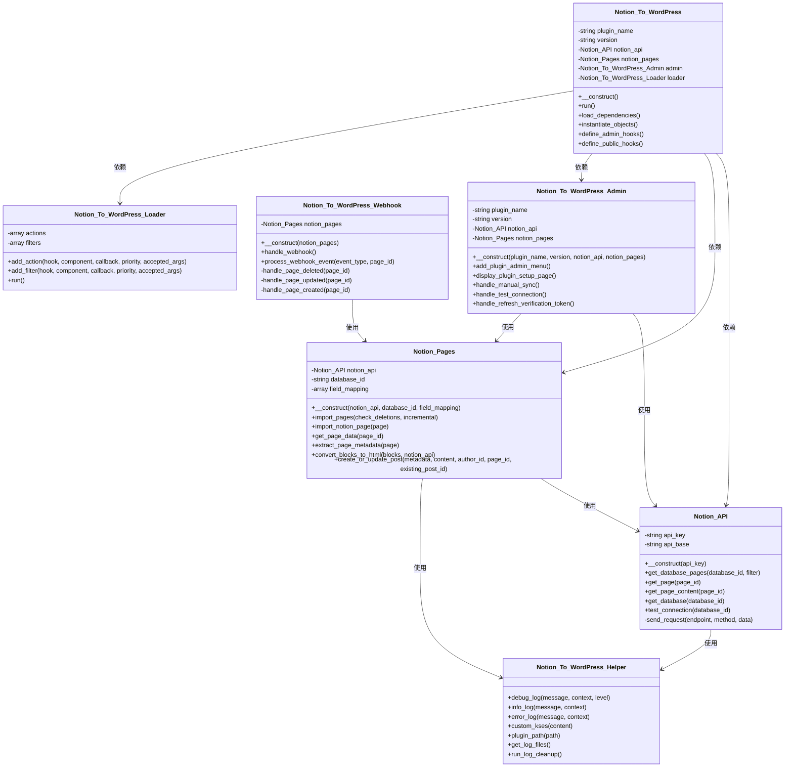
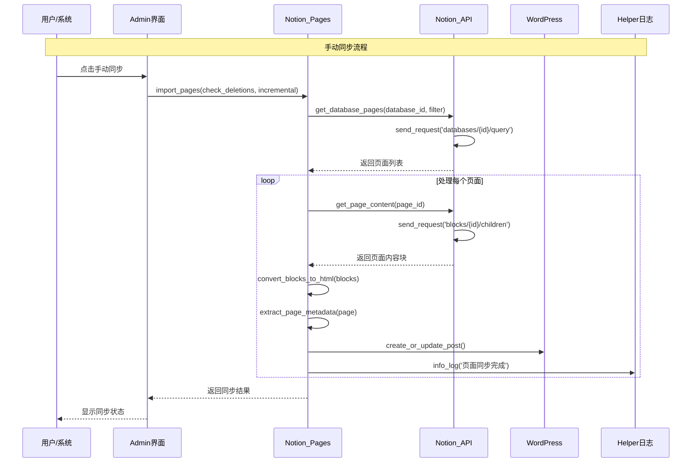
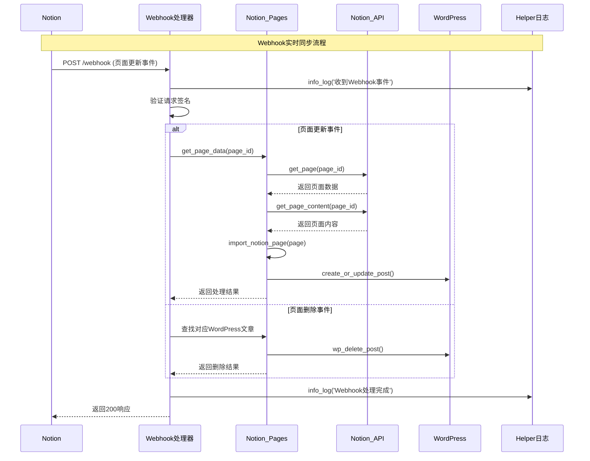

** [🏠 主页](../README-zh_CN.md) • [📚 用户指南](Wiki.zh_CN.md) • [📊 项目概览](PROJECT_OVERVIEW-zh_CN.md) • **🚀 开发者指南** • [🔄 更新日志](https://github.com/Frank-Loong/Notion-to-WordPress/commits)

**🌐 语言：** **中文** • [English](DEVELOPER_GUIDE.md)

---

# 🚀 Notion-to-WordPress 开发者指南

> **Notion-to-WordPress 插件完整开发、贡献和发布指南**

---

## 📋 目录

- [🛠️ 开发环境搭建](#-开发环境搭建)
- [🏗️ 项目架构](#-项目架构)
- [🤝 贡献指南](#-贡献指南)
- [📦 本地开发与测试](#-本地开发与测试)
- [🚀 发布管理](#-发布管理)
- [🔧 故障排除](#-故障排除)
- [📚 最佳实践](#-最佳实践)
- [🔗 资源链接](#-资源链接)

---

## 🛠️ 开发环境搭建

### 系统要求

```bash
# 必需环境
- Node.js 16+ (推荐 18+ 以获得最佳性能)
- Git 2.0+ 并具有 GitHub 访问权限
- WordPress 6.0+ (用于测试环境)
- PHP 8.0+ 及必需扩展：
  - curl (用于 API 请求)
  - mbstring (用于字符串处理)
  - json (用于数据处理)
- Notion 账户及 API 访问权限
```

### 快速搭建指南

```bash
# 1. 克隆仓库
git clone https://github.com/Frank-Loong/Notion-to-WordPress.git
cd Notion-to-WordPress

# 2. 安装 Node.js 依赖
npm install

# 3. 验证环境配置
npm run validate:config
npm run validate:github-actions

# 4. 创建开发分支
git checkout -b feature/your-feature-name

# 5. 测试构建系统
npm run build
```

### 开发工具配置

#### VS Code 设置（推荐）
```json
// .vscode/settings.json
{
  "php.validate.executablePath": "/path/to/php",
  "editor.formatOnSave": true,
  "files.associations": {
    "*.php": "php"
  }
}
```

#### Git 配置
```bash
# 为 WordPress 开发配置 Git
git config core.autocrlf false
git config core.filemode false
```

---

## 🏗️ 项目架构

### 目录结构

```
notion-to-wordpress/
├── admin/                      # WordPress 后台界面
│   ├── css/                   # 后台样式表
│   ├── js/                    # 后台 JavaScript
│   └── partials/              # 后台模板文件
├── assets/                     # 公共资源
│   ├── css/                   # 前端样式表
│   ├── js/                    # 前端 JavaScript
│   └── images/                # 图片资源
├── includes/                   # 核心插件逻辑
│   ├── class-notion-to-wordpress.php          # 主插件类
│   ├── class-notion-to-wordpress-activator.php # 激活逻辑
│   ├── class-notion-to-wordpress-deactivator.php # 停用逻辑
│   ├── class-notion-to-wordpress-i18n.php     # 国际化
│   ├── class-notion-to-wordpress-loader.php   # 钩子加载器
│   ├── class-notion-to-wordpress-admin.php    # 后台功能
│   └── class-notion-to-wordpress-public.php   # 前端功能
├── languages/                  # 国际化文件
│   ├── notion-to-wordpress.pot # 翻译模板
│   ├── notion-to-wordpress-zh_CN.po/.mo # 中文翻译
│   └── notion-to-wordpress-en_US.po/.mo # 英文翻译
├── scripts/                    # 自动化脚本
│   ├── build.js               # 构建系统
│   ├── release.js             # 发布自动化
│   ├── local-package.js       # 本地打包
│   └── version-bump.js        # 版本管理
├── docs/                       # 文档
├── wiki/                       # 用户指南
├── notion-to-wordpress.php     # 主插件文件
├── readme.txt                  # WordPress 插件描述
├── uninstall.php              # 清理卸载脚本
└── release.config.js          # 发布配置
```

### 核心组件

#### 1. 主插件类 (`includes/class-notion-to-wordpress.php`)
- 插件初始化和生命周期管理
- 钩子注册和依赖注入
- 配置管理

#### 2. 后台界面 (`admin/`)
- WordPress 后台仪表板集成
- 设置页面和表单
- 实时操作的 AJAX 处理器

#### 3. API 集成 (`includes/`)
- Notion API 通信
- 数据转换和验证
- WordPress 内容创建/更新

#### 4. 自动化脚本 (`scripts/`)
- 构建和打包系统
- 版本管理
- 发布自动化

### 详细技术架构

#### 核心类结构

插件采用模块化架构，具有清晰的关注点分离：

```
includes/
├── class-notion-api.php                    # API 集成层
├── class-notion-pages.php                  # 同步逻辑和处理
├── class-notion-to-wordpress-webhook.php   # Webhook 处理
├── class-notion-to-wordpress-helper.php    # 工具和日志
├── class-notion-to-wordpress-i18n.php      # 国际化
├── class-notion-to-wordpress-loader.php    # 钩子加载系统
├── class-notion-to-wordpress-admin.php     # 后台界面
├── class-notion-to-wordpress-public.php    # 公共功能
└── class-notion-to-wordpress.php           # 核心协调器
```

#### 类职责

**Notion_To_WordPress** (核心协调器)
- 管理插件生命周期和初始化
- 协调不同组件之间的交互
- 处理依赖注入和配置

**Notion_API** (API 集成层)
- 管理所有 Notion API 通信
- 处理身份验证和请求/响应处理
- 实现速率限制和错误处理
- 方法：`get_database_pages()`, `get_page()`, `get_page_content()`, `test_connection()`

**Notion_Pages** (同步逻辑引擎)
- 协调同步过程
- 将 Notion 内容转换为 WordPress 格式
- 管理增量同步和删除检测
- 方法：`import_pages()`, `import_notion_page()`, `convert_blocks_to_html()`

**Notion_To_WordPress_Admin** (后台界面)
- 提供 WordPress 后台仪表板集成
- 处理用户交互和设置管理
- 管理手动同步操作和状态显示
- 方法：`display_plugin_setup_page()`, `handle_manual_sync()`

**Notion_To_WordPress_Webhook** (实时处理)
- 处理来自 Notion 的传入 webhook 事件
- 处理实时内容更新和删除
- 实现事件特定的处理策略
- 方法：`handle_webhook()`, `process_webhook_event()`

**Notion_To_WordPress_Helper** (工具类)
- 提供日志记录和调试功能
- 实现安全功能和内容清理
- 管理文件操作和清理任务
- 方法：`debug_log()`, `custom_kses()`, `run_log_cleanup()`

#### 同步架构模式

**三重同步架构**
1. **手动同步**：用户发起，具有实时反馈
2. **计划同步**：自动化后台处理
3. **Webhook 同步**：由 Notion 事件触发的实时更新

**处理流程**
1. **数据检索**：从 Notion API 获取页面
2. **内容转换**：将 Notion 块转换为 HTML
3. **元数据提取**：处理页面属性和元数据
4. **WordPress 集成**：创建或更新 WordPress 文章
5. **状态报告**：记录结果并提供用户反馈

#### 性能优化

**增量同步策略**
- 基于时间戳的变更检测
- 仅处理修改的内容
- 减少 API 调用和处理时间

**内存管理**
- 大数据集的批处理
- 策略性内存清理
- 针对企业级操作进行优化

**缓存实现**
- API 响应缓存
- 重复操作的元数据缓存
- WordPress 对象缓存集成

**异步处理**
- 非阻塞 webhook 响应
- 大型操作的后台处理
- 基于队列的处理以确保可靠性

#### 核心类关系图

以下图表展示了核心插件类之间的关系：



#### 同步流程序列图

以下图表展示了完整的手动同步过程流程：



#### Webhook处理序列图

以下图表展示了实时 webhook 处理流程：



---

## 🤝 贡献指南

### 贡献类型

#### 🐛 Bug 报告
**报告前准备：**
- 搜索现有问题避免重复
- 使用最新插件版本测试
- 收集详细的重现信息

**必需信息：**
- WordPress 版本、PHP 版本、插件版本
- 详细的分步重现步骤
- 期望行为 vs 实际行为
- 错误信息、日志或截图
- 浏览器和环境详情（如相关）

**提交方式：** 使用 [GitHub Issues](https://github.com/Frank-Loong/Notion-to-WordPress/issues) 及 bug 报告模板。

#### ✨ 功能请求
**流程：**
1. 在 [GitHub Discussions](https://github.com/Frank-Loong/Notion-to-WordPress/discussions) 中检查现有想法
2. 确保功能符合插件范围和目标
3. 提供详细的使用场景和实现建议
4. 如适用，包含模型图或示例

#### 🔧 代码贡献
**开发标准：**
- 遵循 [WordPress 编码标准](https://developer.wordpress.org/coding-standards/)
- 使用 PSR-12 兼容格式（如适用）
- 为所有公共方法编写全面的 PHPDoc 注释
- 实现适当的输入清理和输出转义
- 包含新功能的单元测试（如适用）

### 代码质量标准

#### ✅ 推荐的代码模式

```php
<?php
/**
 * Notion to WordPress 同步处理器
 * 
 * 处理 Notion 数据库与 WordPress 文章之间的同步。
 * 
 * @since 1.0.0
 * @package Notion_To_WordPress
 */
class Notion_To_WordPress_Sync {
    
    /**
     * 同步 Notion 数据库到 WordPress
     * 
     * @since 1.0.0
     * @param string $database_id 要同步的 Notion 数据库 ID
     * @param array  $options     同步选项和配置
     * @return array|WP_Error     同步结果或错误对象
     */
    public function sync_database( $database_id, $options = array() ) {
        // 输入验证和清理
        $database_id = sanitize_text_field( $database_id );
        $options = wp_parse_args( $options, $this->get_default_sync_options() );
        
        // 验证必需参数
        if ( empty( $database_id ) ) {
            return new WP_Error( 'missing_database_id', __( '数据库 ID 是必需的。', 'notion-to-wordpress' ) );
        }
        
        // 执行同步逻辑
        $result = $this->execute_sync( $database_id, $options );
        
        // 返回清理后的结果
        return array(
            'status'    => 'success',
            'message'   => esc_html( $result['message'] ),
            'synced'    => absint( $result['count'] ),
            'timestamp' => current_time( 'mysql' )
        );
    }
    
    /**
     * 获取默认同步选项
     * 
     * @since 1.0.0
     * @return array 默认选项数组
     */
    private function get_default_sync_options() {
        return array(
            'batch_size'      => 10,
            'timeout'         => 30,
            'update_existing' => true,
            'delete_missing'  => false
        );
    }
}
```

#### ❌ 应避免的代码模式

```php
<?php
// 危险：没有输入验证或输出转义
$api_key = $_POST['notion_api_key'];  // 安全风险！
echo '<p>' . $message . '</p>';       // XSS 漏洞！

// 糟糕：没有错误处理
$result = wp_remote_get( $url );
$data = json_decode( $result['body'] );

// 不一致：混合编码风格
function badFunction($param1,$param2){
    if($param1){
        return $param2;
    }
}
```

### Pull Request 流程

```bash
# 1. 创建并切换到功能分支
git checkout -b feature/amazing-new-feature

# 2. 实现您的更改
# - 遵循编码标准
# - 添加全面的注释
# - 包含错误处理
# - 彻底测试

# 3. 使用描述性消息提交
git add .
git commit -m "feat: 添加令人惊叹的新功能

- 实现核心功能
- 添加输入验证
- 包含全面测试
- 更新文档"

# 4. 推送分支到您的 fork
git push origin feature/amazing-new-feature

# 5. 创建 Pull Request
# - 使用清晰、描述性的标题
# - 链接相关问题
# - 包含测试说明
# - 为 UI 更改添加截图
```

### 文档要求

#### 代码文档
- 所有类、方法和函数的 PHPDoc 注释
- 复杂逻辑的内联注释
- 新功能的 README 更新
- 所有更改的变更日志条目

#### 用户文档
- 新功能的 Wiki 更新
- UI 更改的截图更新
- 翻译字符串更新
- 常见问题的 FAQ 添加

---

## 📦 本地开发与测试

### 本地测试环境

#### WordPress 开发设置
```bash
# 选项 1：本地 WordPress 安装
# 下载 WordPress，配置数据库，安装插件

# 选项 2：Docker 设置（推荐）
docker-compose up -d wordpress

# 选项 3：本地开发工具
# XAMPP、WAMP、MAMP 或 Local by Flywheel
```

#### Notion API 测试
```bash
# 1. 在 https://www.notion.so/my-integrations 创建 Notion 集成
# 2. 获取内部集成令牌
# 3. 创建具有必需属性的测试数据库
# 4. 与您的集成共享数据库
```

### 本地打包系统

本地打包系统允许安全测试而不影响 Git 仓库。

#### 基本命令

```bash
# 查看所有可用选项
node scripts/local-package.js --help

# 标准版本递增
npm run package:local patch    # 1.2.0 → 1.2.1
npm run package:local minor    # 1.2.0 → 1.3.0  
npm run package:local major    # 1.2.0 → 2.0.0
npm run package:local beta     # 1.2.0 → 1.2.1-beta.1

# 自定义版本号
npm run package:local -- --version=1.2.6-test.1
npm run package:local -- --version=1.3.0-dev.1
npm run package:local -- --version=2.0.0-alpha.1
```

#### 高级选项

```bash
# 预览模式（首次使用推荐）
npm run package:local patch --dry-run
npm run package:local -- --version=1.2.6-test.1 --dry-run

# 仅打包（不更新版本）
npm run package:local -- --build-only

# 仅版本更新（不创建包）  
npm run package:local -- --version-only

# 直接脚本执行
node scripts/local-package.js --version=1.2.6-test.1 --dry-run
```

### 测试工作流程

```bash
# 1. 创建测试版本
npm run package:local -- --version=1.2.6-test.1

# 2. 定位生成的包
# 文件：build/notion-to-wordpress-1.2.6-test.1.zip

# 3. 在 WordPress 中测试
# - 上传 ZIP 到 WordPress 后台 → 插件 → 安装插件 → 上传
# - 激活插件并配置设置
# - 彻底测试所有功能
# - 验证新功能按预期工作

# 4. 满意时提交更改
git add .
git commit -m "feat: 实现新功能并进行全面测试"
```

### 本地包功能

- ✅ **安全测试**：无 Git 操作，仓库保持不变
- ✅ **自动备份**：更改前创建备份，出错时自动回滚
- ✅ **版本同步**：自动更新所有相关文件中的版本
- ✅ **WordPress 兼容**：生成的 ZIP 可直接在 WordPress 中安装
- ✅ **构建验证**：确保包符合 WordPress 插件标准

---

## 🚀 发布管理

### 自动化发布系统

我们先进的发布系统提供企业级 CI/CD 功能，将复杂的发布过程转化为简单的一键操作。

#### 发布类型和语义化版本

| 类型 | 版本变化 | 使用场景 | 命令 |
|------|----------|----------|------|
| **Patch** | 1.1.0 → 1.1.1 | Bug 修复、安全补丁、小改进 | `npm run release:patch` |
| **Minor** | 1.1.0 → 1.2.0 | 新功能、增强、向后兼容的更改 | `npm run release:minor` |
| **Major** | 1.1.0 → 2.0.0 | 破坏性更改、重大重写、API 修改 | `npm run release:major` |
| **Beta** | 1.1.0 → 1.1.1-beta.1 | 预发布测试、实验性功能 | `npm run release:beta` |

### 标准发布流程

#### 发布前检查清单

```bash
# 1. 确保工作目录干净
git status  # 应显示 "working tree clean"

# 2. 验证所有测试通过
npm run test:integration

# 3. 验证配置
npm run validate:config
npm run validate:github-actions

# 4. 预览发布（强烈推荐）
npm run test:release patch  # 或 minor/major/beta
```

#### 执行发布

```bash
# 标准发布
npm run release:patch   # 用于 bug 修复
npm run release:minor   # 用于新功能  
npm run release:major   # 用于破坏性更改
npm run release:beta    # 用于测试版本

# 监控过程
# - 提示时审查版本更改
# - 准备好时确认发布
# - 观察 GitHub Actions 完成情况
```

### 自定义版本发布

#### 使用 npm 脚本（推荐）

```bash
# 候选版本
npm run release:custom -- --version=1.3.0-rc.1
npm run release:custom -- --version=1.3.0-rc.2

# 热修复发布
npm run release:custom -- --version=1.2.1-hotfix.1
npm run release:custom -- --version=1.2.1-hotfix.2

# Alpha/Beta 发布
npm run release:custom -- --version=2.0.0-alpha.1
npm run release:custom -- --version=2.0.0-beta.1

# 预览自定义发布
npm run release:custom -- --version=1.3.0-rc.1 --dry-run

# 强制发布（跳过确认）
npm run release:custom -- --version=1.3.0-rc.1 --force
```

#### 直接脚本使用

```bash
# 具有完全控制的直接脚本执行
node scripts/release.js --version=1.3.0-rc.1
node scripts/release.js --version=1.3.0-rc.1 --dry-run
node scripts/release.js --version=1.3.0-rc.1 --force

# 查看所有可用选项
node scripts/release.js --help
```

### 发布过程深度解析

自动化发布系统执行以下全面工作流程：

#### 1. 环境验证
- **Git 仓库状态**：确保工作目录干净
- **Node.js 兼容性**：验证 Node.js 版本满足要求
- **工具可用性**：确认所有必需工具可访问
- **分支验证**：检查当前分支和远程状态

#### 2. 版本管理
- **当前版本检测**：从主插件文件读取版本
- **新版本计算**：根据发布类型计算新版本
- **多文件更新**：同步所有相关文件中的版本：
  - `notion-to-wordpress.php` (WordPress 插件头)
  - `readme.txt` (WordPress.org 稳定标签)
  - `package.json` (npm 包版本)
  - `includes/class-notion-to-wordpress.php` (PHP 类版本)
  - `docs/PROJECT_STATUS.md` 和 `docs/PROJECT_STATUS-zh_CN.md` (文档)

#### 3. 包构建
- **WordPress 标准**：创建 WordPress.org 兼容的 ZIP 包
- **文件优化**：排除开发文件，仅包含运行时必需文件
- **大小优化**：生成最小包以加快下载速度
- **验证**：确保包满足所有 WordPress 插件要求

#### 4. Git 操作
- **提交创建**：创建带有版本更改的描述性提交
- **标签生成**：创建带注释的 Git 标签（如 `v1.2.1`）
- **远程推送**：推送提交和标签到 GitHub 仓库

#### 5. GitHub Actions 集成
- **自动触发**：发布标签推送触发 GitHub Actions 工作流
- **构建验证**：在干净环境中重新构建和验证包
- **发布创建**：创建包含以下内容的 GitHub 发布：
  - 可下载的 ZIP 包
  - 安全校验和（SHA256、MD5）
  - 自动生成的发布说明
  - 安装说明
  - 版本比较链接

### 发布配置

#### 配置文件 (`release.config.js`)

```javascript
module.exports = {
    // 项目元数据
    project: {
        name: 'notion-to-wordpress',
        displayName: 'Notion-to-WordPress',
        author: 'Frank-Loong',
        description: '高级 Notion 到 WordPress 集成'
    },

    // 版本管理
    version: {
        files: [
            // 需要版本更新的文件
            {
                path: 'notion-to-wordpress.php',
                patterns: [
                    // WordPress 插件头
                    {
                        regex: /(\* Version:\s+)([0-9]+\.[0-9]+\.[0-9]+(?:-[a-zA-Z0-9.-]+)?)/,
                        replacement: '$1{VERSION}'
                    }
                ]
            }
            // ... 其他文件
        ]
    },

    // 构建配置
    build: {
        output: {
            directory: 'build',
            filename: '{PROJECT_NAME}-{VERSION}.zip'
        },
        include: {
            files: ['notion-to-wordpress.php', 'readme.txt', 'uninstall.php'],
            directories: ['admin/', 'assets/', 'includes/', 'languages/']
        },
        exclude: [
            'node_modules/', 'scripts/', '.git/', 'docs/', 'wiki/',
            '*.log', '*.tmp', '.env'
        ]
    }
};
```

#### 自定义选项

```bash
# 修改输出目录
# 编辑 release.config.js → build.output.directory

# 添加/删除包中的文件
# 编辑 release.config.js → build.include/exclude

# 自定义提交消息
# 编辑 release.config.js → git.commitMessage.template

# 更新 GitHub 设置
# 编辑 release.config.js → github 部分
```

---

## 🔧 故障排除

### 常见开发问题

#### "工作目录有未提交的更改"

**问题**：发布前 Git 工作目录不干净

**解决方案**：
```bash
# 检查哪些文件被修改
git status

# 选项 1：提交您的更改
git add .
git commit -m "feat: 实现新功能"

# 选项 2：临时储藏更改
git stash
# ... 执行发布 ...
git stash pop

# 选项 3：强制发布（不推荐）
node scripts/release.js patch --force
```

#### "检测到文件间版本不匹配"

**问题**：文件间版本号不一致

**解决方案**：
```bash
# 检查版本一致性
node scripts/version-bump.js

# 自动修复版本不一致
node scripts/version-bump.js patch

# 手动验证
grep -r "Version:" notion-to-wordpress.php
grep -r "Stable tag:" readme.txt
```

#### "构建过程失败"

**问题**：包构建遇到错误

**解决方案**：
```bash
# 检查 Node.js 版本兼容性
node --version  # 应该是 16+
npm --version   # 应该是 8+

# 清理并重新安装依赖
rm -rf node_modules package-lock.json
npm install

# 手动测试构建过程
npm run build

# 检查文件权限问题（Unix/Linux）
chmod +x scripts/*.js
```

#### "GitHub Actions 工作流失败"

**问题**：自动发布工作流失败

**解决方案**：
1. **检查 GitHub Actions 选项卡**在您的仓库中
2. **查看工作流日志**获取具体错误消息
3. **验证 GitHub 令牌权限**（通常是自动的）
4. **验证工作流文件语法**：
   ```bash
   npm run validate:github-actions
   ```
5. **推送前本地测试**：
   ```bash
   npm run test:release patch
   ```

#### "WordPress 插件激活错误"

**问题**：插件在 WordPress 中激活失败

**解决方案**：
```bash
# 检查 PHP 语法错误
php -l notion-to-wordpress.php

# 验证 WordPress 兼容性
# 检查 readme.txt 中的最低 WordPress 版本

# 查看 PHP 错误日志
tail -f /path/to/wordpress/wp-content/debug.log

# 使用 WordPress 调试模式测试
# 添加到 wp-config.php：
define('WP_DEBUG', true);
define('WP_DEBUG_LOG', true);
```

### 调试模式和日志记录

#### 启用调试模式

```bash
# 带完整输出的综合预览
node scripts/release.js patch --dry-run --force

# 逐步手动测试
node scripts/version-bump.js patch
npm run build
git status
```

#### WordPress 调试配置

```php
// wp-config.php
define('WP_DEBUG', true);
define('WP_DEBUG_LOG', true);
define('WP_DEBUG_DISPLAY', false);
define('SCRIPT_DEBUG', true);
```

### 获取帮助

#### 支持渠道

- **一般问题**：[GitHub Discussions](https://github.com/Frank-Loong/Notion-to-WordPress/discussions)
- **Bug 报告**：[GitHub Issues](https://github.com/Frank-Loong/Notion-to-WordPress/issues)
- **安全问题**：直接联系维护者 [frankloong@qq.com](mailto:frankloong@qq.com)
- **文档问题**：创建包含改进的 pull request

#### 寻求帮助前

1. **搜索现有问题**和讨论
2. **彻底检查文档**
3. **使用最新版本测试**
4. **收集详细信息**：
   - WordPress 版本
   - PHP 版本
   - 插件版本
   - 错误消息
   - 重现步骤

---

## 📚 最佳实践

### 开发工作流程

#### 推荐的开发过程

```bash
# 1. 规划阶段
- 为功能/bug 创建 GitHub 问题
- 讨论实现方法
- 规划测试策略

# 2. 开发阶段
- 从 main 创建功能分支
- 增量实现更改
- 频繁提交并使用清晰消息
- 开发过程中持续测试

# 3. 测试阶段
- 创建本地测试包
- 在多个 WordPress 环境中测试
- 验证所有功能正常工作
- 测试边缘情况和错误条件

# 4. 审查阶段
- 自我审查代码质量
- 根据需要更新文档
- 确保编码标准合规
- 运行所有验证工具

# 5. 发布准备
- 将功能分支合并到 main
- 运行综合测试套件
- 使用预览模式验证发布
- 更新变更日志和版本说明

# 6. 发布执行
- 选择适当的版本类型
- 执行发布命令
- 监控 GitHub Actions 状态
- 验证发布可用性
```

### 代码质量指南

#### 安全最佳实践

```php
<?php
// 始终清理输入
$user_input = sanitize_text_field( $_POST['field_name'] );

// 始终转义输出
echo '<p>' . esc_html( $message ) . '</p>';

// 使用 nonce 进行表单安全
wp_nonce_field( 'my_action', 'my_nonce' );
if ( ! wp_verify_nonce( $_POST['my_nonce'], 'my_action' ) ) {
    wp_die( '安全检查失败' );
}

// 验证用户权限
if ( ! current_user_can( 'manage_options' ) ) {
    wp_die( '权限不足' );
}
```

#### 性能优化

```php
<?php
// 使用 WordPress 缓存
$cache_key = 'notion_data_' . md5( $database_id );
$data = wp_cache_get( $cache_key );
if ( false === $data ) {
    $data = $this->fetch_notion_data( $database_id );
    wp_cache_set( $cache_key, $data, '', HOUR_IN_SECONDS );
}

// 优化数据库查询
global $wpdb;
$results = $wpdb->get_results( $wpdb->prepare(
    "SELECT * FROM {$wpdb->posts} WHERE post_type = %s AND post_status = %s",
    'post',
    'publish'
) );

// 使用 WordPress HTTP API
$response = wp_remote_get( $url, array(
    'timeout' => 30,
    'headers' => array(
        'Authorization' => 'Bearer ' . $api_token
    )
) );
```

### 版本策略

#### 语义化版本指南

- **Patch (1.1.0 → 1.1.1)**：
  - Bug 修复和安全补丁
  - 性能改进
  - 文档更新
  - 翻译更新

- **Minor (1.1.0 → 1.2.0)**：
  - 新功能和功能性
  - UI/UX 改进
  - 新配置选项
  - 向后兼容的 API 更改

- **Major (1.1.0 → 2.0.0)**：
  - 对现有功能的破坏性更改
  - 重大架构更改
  - 删除已弃用的功能
  - 不兼容的 API 修改

- **预发布 (1.1.0 → 1.1.1-beta.1)**：
  - 社区反馈的测试版本
  - 实验性功能
  - 候选版本

### 文档标准

#### 代码文档

```php
<?php
/**
 * 类描述，包含目的和用法
 *
 * 详细解释此类的作用，
 * 它如何适应整体架构，
 * 以及任何重要的使用说明。
 *
 * @since 1.0.0
 * @package Notion_To_WordPress
 * @subpackage Core
 */
class Notion_To_WordPress_Example {

    /**
     * 方法描述，明确目的
     *
     * 详细解释此方法的作用，
     * 包括任何副作用或重要行为。
     *
     * @since 1.0.0
     * @param string $param1 第一个参数的描述
     * @param array  $param2 {
     *     可选。数组参数的描述。
     *
     *     @type string $key1 数组键的描述
     *     @type int    $key2 另一个键的描述
     * }
     * @return array|WP_Error 成功数组或错误对象
     */
    public function example_method( $param1, $param2 = array() ) {
        // 实现
    }
}
```

#### 用户文档

- **清晰的标题**和逻辑结构
- **分步说明**配有截图
- **代码示例**配有解释
- **故障排除部分**解决常见问题
- **交叉引用**到相关文档

---

## 🔗 资源链接

### 重要链接

#### 官方文档
- **[WordPress 插件开发](https://developer.wordpress.org/plugins/)** - 官方 WordPress 插件指南
- **[WordPress 编码标准](https://developer.wordpress.org/coding-standards/)** - 代码质量指南
- **[Notion API 文档](https://developers.notion.com/)** - 完整的 Notion API 参考
- **[语义化版本](https://semver.org/lang/zh-CN/)** - 版本编号标准

#### 开发工具
- **[WordPress CLI](https://wp-cli.org/)** - WordPress 命令行界面
- **[PHPStan](https://phpstan.org/)** - PHP 静态分析工具
- **[PHP_CodeSniffer](https://github.com/squizlabs/PHP_CodeSniffer)** - 代码标准检查器
- **[Composer](https://getcomposer.org/)** - PHP 依赖管理

#### 测试资源
- **[WordPress 单元测试](https://make.wordpress.org/core/handbook/testing/automated-testing/phpunit/)** - WordPress 测试框架
- **[Local by Flywheel](https://localwp.com/)** - 本地 WordPress 开发
- **[Docker WordPress](https://hub.docker.com/_/wordpress)** - 容器化 WordPress

### 社区资源

#### 支持和讨论
- **[GitHub Discussions](https://github.com/Frank-Loong/Notion-to-WordPress/discussions)** - 社区问答
- **[WordPress.org 论坛](https://wordpress.org/support/)** - 一般 WordPress 支持
- **[Notion 社区](https://www.notion.so/help/community)** - Notion 特定帮助

#### 学习资源
- **[WordPress 开发者手册](https://developer.wordpress.org/)** - 综合开发指南
- **[PHP: The Right Way](https://phptherightway.com/)** - 现代 PHP 最佳实践
- **[Git 手册](https://guides.github.com/introduction/git-handbook/)** - Git 版本控制指南

---

## 🎉 成功指标

成功的开发贡献将展示：

- ✅ **代码质量**：遵循 WordPress 编码标准和最佳实践
- ✅ **功能性**：功能在多个环境中正确工作
- ✅ **安全性**：实现适当的输入验证和输出转义
- ✅ **性能**：针对速度和资源效率进行优化
- ✅ **文档**：全面的代码注释和用户文档
- ✅ **测试**：在各种场景和边缘情况下彻底测试
- ✅ **兼容性**：与支持的 WordPress 和 PHP 版本兼容
- ✅ **可访问性**：遵循 WordPress 可访问性指南
- ✅ **国际化**：为翻译做好适当准备

---

**感谢您为 Notion-to-WordPress 项目做出贡献！🚀**

*让我们一起构建最先进的 Notion-to-WordPress 集成解决方案。*

---

<div align="center">

**[⬆️ 返回顶部](#-notion-to-wordpress-开发者指南) • [🏠 主页](../README-zh_CN.md)• [📚 阅读文档](Wiki.zh_CN.md) • [📊 项目概览](PROJECT_OVERVIEW-zh_CN.md) • [🇺🇸 English](DEVELOPER_GUIDE.md)**

</div>