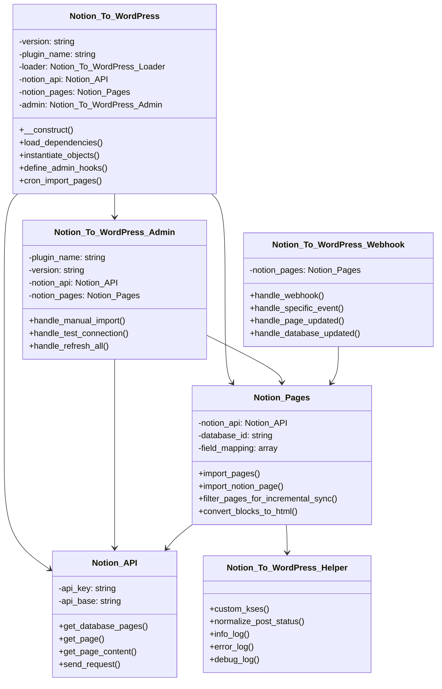
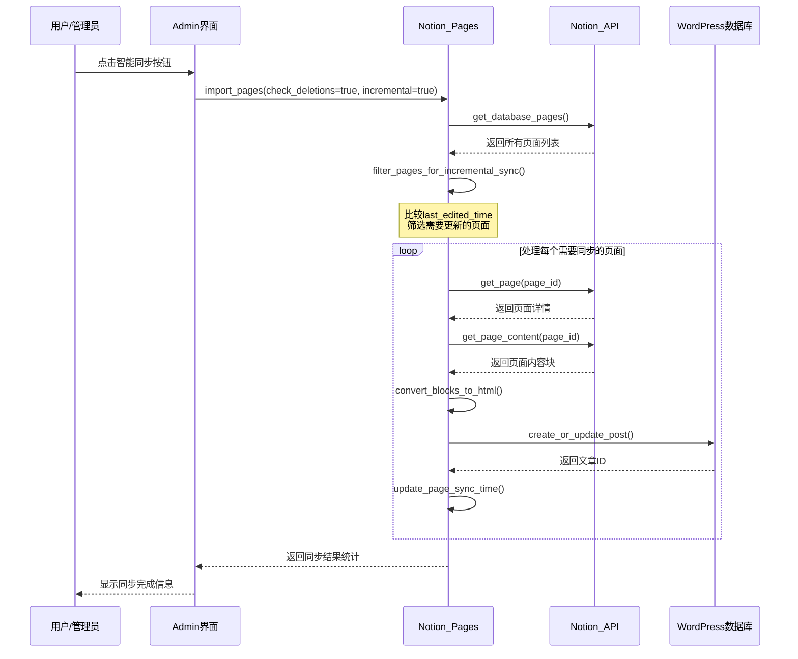
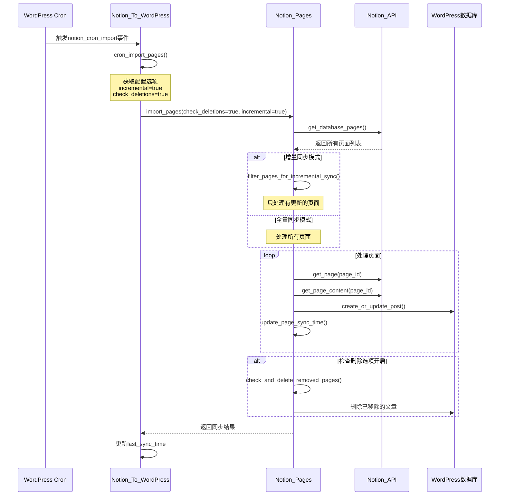
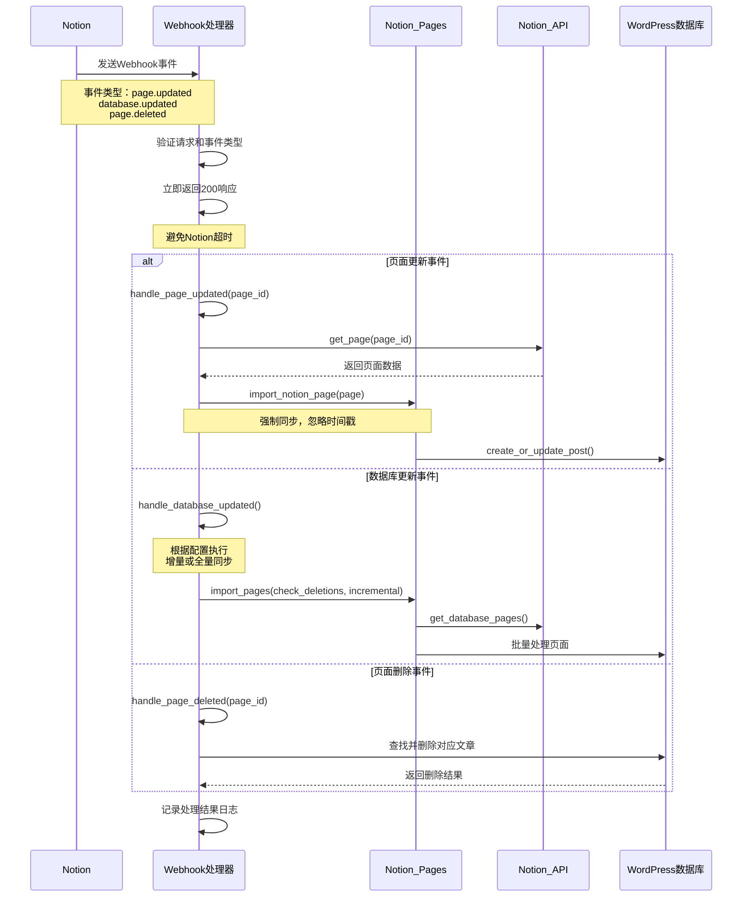

** [🏠 主页](../README-zh_CN.md) • [📚 用户指南](Wiki.zh_CN.md) • [📊 项目概览](PROJECT_OVERVIEW-zh_CN.md) • **🚀 开发者指南** • [🔄 更新日志](https://github.com/Frank-Loong/Notion-to-WordPress/commits)

**🌐 语言：** **中文** • [English](DEVELOPER_GUIDE.md)

---

# 🚀 Notion-to-WordPress 开发者指南

> **专业的WordPress插件开发、贡献和发布完整指南**

---

## 📋 目录

- [🚀 快速开始](#-快速开始)
- [🛠️ 开发环境](#-开发环境)
- [🏗️ 项目架构](#-项目架构)
- [📝 开发流程](#-开发流程)
- [🔧 命令参考](#-命令参考)
- [🐛 调试指南](#-调试指南)
- [🚀 发布管理](#-发布管理)
- [📚 最佳实践](#-最佳实践)
- [🤝 贡献指南](#-贡献指南)
- [🔗 资源链接](#-资源链接)

---

## 🚀 快速开始

### ⚡ 5分钟上手

```bash
# 1. 克隆项目
git clone https://github.com/Frank-Loong/Notion-to-WordPress.git
cd Notion-to-WordPress

# 2. 安装依赖
npm install

# 3. 验证环境
npm run validate:config

# 4. 构建测试
npm run build

# 5. 检查结果
ls -la build/notion-to-wordpress-*.zip
```

### ✅ 环境要求

| 组件 | 最低版本 | 推荐版本 |
|------|----------|----------|
| Node.js | 16.0+ | 18.0+ |
| npm | 8.0+ | 9.0+ |
| Git | 2.0+ | 最新版 |
| PHP | 8.0+ | 8.1+ |
| WordPress | 6.0+ | 最新版 |

---

## 🛠️ 开发环境

### 🔧 IDE配置

#### VS Code设置
```json
{
  "php.validate.executablePath": "/usr/bin/php",
  "editor.formatOnSave": true,
  "files.associations": {
    "*.php": "php"
  }
}
```

#### Git配置
```bash
git config core.autocrlf false
git config core.filemode false
git config pull.rebase true
```

### 🐳 WordPress测试环境

```bash
# Docker方式（推荐）
docker-compose up -d wordpress

# 本地环境
# XAMPP、WAMP、MAMP或Local by Flywheel
```

---

## 🏗️ 项目架构

### 📁 目录结构

```
notion-to-wordpress/
├── admin/                  # 后台管理界面
├── includes/               # 核心功能类
│   ├── class-notion-api.php
│   ├── class-notion-pages.php
│   └── class-notion-to-wordpress.php
├── scripts/                # 自动化脚本
│   ├── build.js
│   ├── release.js
│   └── local-package.js
├── languages/              # 国际化文件
└── notion-to-wordpress.php # 插件入口
```

### 🔄 核心类关系图



### 🔄 数据流向

```
Notion API → API通信层 → 数据转换 → 同步引擎 → WordPress数据库
     ↑                                      ↑
  Webhook处理器                        管理界面触发
```

### 📊 同步流程序列图

#### 智能同步（增量同步）流程



#### 定时同步（Cron任务）流程



#### Webhook实时同步流程



---

## 📝 开发流程

### 🔄 标准工作流

```bash
# 1. 创建功能分支
git checkout -b feature/your-feature

# 2. 开发和测试
npm run build
npm run package:local:patch

# 3. 代码检查
npm run validate:config
php -l notion-to-wordpress.php

# 4. 提交代码
git add .
git commit -m "feat: 添加新功能"

# 5. 合并主分支
git checkout main
git merge feature/your-feature
```

### 📋 提交规范

```
<类型>: <描述>

类型：
- feat: 新功能
- fix: 修复bug
- docs: 文档更新
- style: 代码格式
- refactor: 重构
- test: 测试
- chore: 构建工具
```

---

## 🔧 命令参考

### 🏗️ 构建命令

| 命令 | 功能 | 用途 |
|------|------|------|
| `npm run build` | 构建生产包 | 发布前构建 |
| `npm run validate:config` | 验证配置 | 环境检查 |
| `npm run validate:github-actions` | 验证CI配置 | 发布前检查 |

### 📦 本地打包

| 命令 | 功能 | 版本变化 |
|------|------|----------|
| `npm run package:local:patch` | 补丁版本 | 1.2.0 → 1.2.1 |
| `npm run package:local:minor` | 小版本 | 1.2.0 → 1.3.0 |
| `npm run package:local:major` | 主版本 | 1.2.0 → 2.0.0 |
| `npm run package:local:beta` | 测试版本 | 1.2.0 → 1.2.1-beta.1 |
| `npm run package:local:build-only` | 仅构建 | 不更新版本 |
| `npm run package:local:help` | 显示帮助 | 查看选项 |

### 🚀 发布命令

| 命令 | 功能 | 说明 |
|------|------|------|
| `npm run release:patch` | 补丁发布 | 自动发布到GitHub |
| `npm run release:minor` | 小版本发布 | 包含新功能 |
| `npm run release:major` | 主版本发布 | 破坏性更改 |
| `npm run release:beta` | 测试版发布 | 预发布版本 |
| `npm run test:release:patch` | 预览发布 | 安全预览模式 |
| `npm run release:help` | 显示帮助 | 查看选项 |

### 🔍 版本管理

| 命令 | 功能 | 用途 |
|------|------|------|
| `` | 检查版本一致性 | 诊断版本问题 |
| `npm run version:bump:patch` | 补丁版本升级 | 修复版本不一致 |
| `npm run version:bump:minor` | 小版本升级 | 版本管理 |
| `npm run version:bump:major` | 主版本升级 | 版本管理 |
| `npm run version:bump:beta` | 测试版本升级 | 版本管理 |
| `npm run version:bump:rollback` | 回滚版本 | 恢复备份 |

### 🧪 测试命令

| 命令 | 功能 | 用途 |
|------|------|------|
| `npm run test:integration` | 集成测试 | 全面测试 |
| `php -l *.php` | PHP语法检查 | 代码验证 |
| `find includes/ -name "*.php" -exec php -l {} \;` | 批量语法检查 | 全面验证 |

---

## 🐛 调试指南

### 🔍 常见问题

#### 构建失败
```bash
# 检查Node.js版本
node --version  # 需要18+

# 清理重装
rm -rf node_modules package-lock.json
npm install

# 验证环境
npm run validate:config
```

#### 版本不一致
```bash
# 检查版本
npm run version:bump

# 自动修复
npm run version:bump:patch

# 手动检查
grep -r "Version:" notion-to-wordpress.php
grep -r "version" package.json
```

#### 插件激活失败
```bash
# PHP语法检查
php -l notion-to-wordpress.php

# 启用WordPress调试
# wp-config.php中添加：
# define('WP_DEBUG', true);
# define('WP_DEBUG_LOG', true);
```

### 🛠️ 调试配置

#### WordPress调试
```php
// wp-config.php
define('WP_DEBUG', true);
define('WP_DEBUG_LOG', true);
define('WP_DEBUG_DISPLAY', false);
define('SCRIPT_DEBUG', true);
```

#### 性能监控
```php
// 内存使用监控
$memory_before = memory_get_usage();
// ... 代码 ...
$memory_after = memory_get_usage();
error_log('Memory used: ' . ($memory_after - $memory_before) . ' bytes');
```

---

## 🚀 发布管理

### 📋 发布类型

| 类型 | 版本变化 | 使用场景 |
|------|----------|----------|
| Patch | 1.1.0 → 1.1.1 | Bug修复、安全补丁 |
| Minor | 1.1.0 → 1.2.0 | 新功能、向后兼容 |
| Major | 1.1.0 → 2.0.0 | 破坏性更改 |
| Beta | 1.1.0 → 1.1.1-beta.1 | 预发布测试 |

### 🚀 发布流程

```bash
# 1. 发布前检查
git status                    # 确保工作目录干净
npm run validate:config       # 验证配置
npm run test:release:patch    # 预览发布

# 2. 执行发布
npm run release:patch         # 选择合适类型

# 3. 发布后验证
# - 检查GitHub Actions状态
# - 验证GitHub Release页面
# - 测试下载的ZIP包
```

### 🔧 自定义版本

```bash
# 候选版本
npm run release:custom -- --version=1.3.0-rc.1

# 热修复版本
npm run release:custom -- --version=1.2.1-hotfix.1

# 预览模式
npm run release:custom -- --version=1.3.0-rc.1 --dry-run
```

---

## 📚 最佳实践

### 🔒 代码质量

#### PHP代码规范
```php
<?php
/**
 * 示例类展示最佳实践
 */
class Notion_To_WordPress_Example {

    /**
     * 处理数据的方法
     *
     * @param string $input 输入参数
     * @return array|WP_Error 处理结果
     * @since 1.0.0
     */
    public function process_data( $input ) {
        // 输入验证
        if ( empty( $input ) ) {
            return new WP_Error( 'invalid_input', '输入不能为空' );
        }

        // 数据清理
        $clean_input = sanitize_text_field( $input );

        // 处理逻辑
        $result = $this->transform_data( $clean_input );

        return $result;
    }
}
```

#### JavaScript代码规范
```javascript
(function($) {
    'use strict';

    const NotionWordPress = {
        init: function() {
            this.bindEvents();
        },

        bindEvents: function() {
            $('.sync-button').on('click', this.handleSync.bind(this));
        },

        handleSync: function(event) {
            event.preventDefault();
            this.showLoading();

            $.ajax({
                url: ajaxurl,
                type: 'POST',
                data: {
                    action: 'notion_sync',
                    nonce: notion_ajax.nonce
                },
                success: this.handleSuccess.bind(this),
                error: this.handleError.bind(this)
            });
        }
    };

    $(document).ready(function() {
        NotionWordPress.init();
    });

})(jQuery);
```

### 🛡️ 安全规范

#### 数据验证
```php
// 输入验证
$page_id = sanitize_text_field( $_POST['page_id'] );
if ( ! preg_match( '/^[a-f0-9-]{36}$/', $page_id ) ) {
    wp_die( '无效的页面ID格式' );
}

// 输出转义
echo '<h1>' . esc_html( $title ) . '</h1>';
echo '<a href="' . esc_url( $link ) . '">' . esc_html( $text ) . '</a>';

// Nonce验证
if ( ! wp_verify_nonce( $_POST['nonce'], 'notion_sync_action' ) ) {
    wp_die( '安全验证失败' );
}
```

### ⚡ 性能优化

#### 缓存策略
```php
// 使用WordPress对象缓存
$cache_key = 'notion_pages_' . md5( $database_id );
$pages = wp_cache_get( $cache_key );

if ( false === $pages ) {
    $pages = $this->fetch_notion_pages( $database_id );
    wp_cache_set( $cache_key, $pages, '', HOUR_IN_SECONDS );
}
```

#### 数据库优化
```php
// 批量查询而非循环查询
$post_ids = wp_list_pluck( $posts, 'ID' );
$meta_data = get_post_meta_batch( $post_ids, 'notion_id' );
```

---

## 🤝 贡献指南

### 📝 贡献类型

| 类型 | 说明 | 提交方式 |
|------|------|----------|
| 🐛 Bug报告 | 发现问题并提供详细信息 | [GitHub Issues](https://github.com/Frank-Loong/Notion-to-WordPress/issues) |
| ✨ 功能建议 | 提出新功能想法 | [GitHub Discussions](https://github.com/Frank-Loong/Notion-to-WordPress/discussions) |
| 🔧 代码贡献 | 提交代码修复或新功能 | Pull Request |
| 📚 文档改进 | 完善文档内容 | Pull Request |

### 🔄 贡献流程

```bash
# 1. Fork项目
# 在GitHub上点击Fork按钮

# 2. 克隆Fork
git clone https://github.com/YOUR_USERNAME/Notion-to-WordPress.git
cd Notion-to-WordPress

# 3. 创建功能分支
git checkout -b feature/your-feature-name

# 4. 开发测试
npm run build
npm run package:local:patch

# 5. 提交更改
git add .
git commit -m "feat: 添加新功能描述"

# 6. 推送到Fork
git push origin feature/your-feature-name

# 7. 创建Pull Request
# 在GitHub上创建PR到主仓库
```

### ✅ 质量要求

- [ ] 遵循WordPress编码标准
- [ ] 包含完整的PHPDoc注释
- [ ] 通过所有现有测试
- [ ] 添加新功能的测试用例
- [ ] 更新相关文档

---

## 🔗 资源链接

### 📚 官方文档
- [WordPress插件开发手册](https://developer.wordpress.org/plugins/)
- [WordPress编码标准](https://developer.wordpress.org/coding-standards/)
- [Notion API文档](https://developers.notion.com/)
- [语义化版本规范](https://semver.org/lang/zh-CN/)

### 🛠️ 开发工具
- [WordPress CLI](https://wp-cli.org/) - WordPress命令行工具
- [PHPStan](https://phpstan.org/) - PHP静态分析
- [PHP_CodeSniffer](https://github.com/squizlabs/PHP_CodeSniffer) - 代码规范检查

### 🆘 获取帮助
- **一般问题**: [GitHub Discussions](https://github.com/Frank-Loong/Notion-to-WordPress/discussions)
- **Bug报告**: [GitHub Issues](https://github.com/Frank-Loong/Notion-to-WordPress/issues)
- **安全问题**: 直接联系维护者

---

**感谢您为 Notion-to-WordPress 项目做出贡献！🚀**

*让我们一起构建最先进的 Notion-to-WordPress 集成解决方案。*

---

<div align="center">

**[⬆️ 返回顶部](#-notion-to-wordpress-开发者指南) • [🏠 主页](../README-zh_CN.md) • [📚 用户指南](Wiki.zh_CN.md) • [📊 项目概览](PROJECT_OVERVIEW-zh_CN.md) • [🇺🇸 English](DEVELOPER_GUIDE.md)**

</div>
