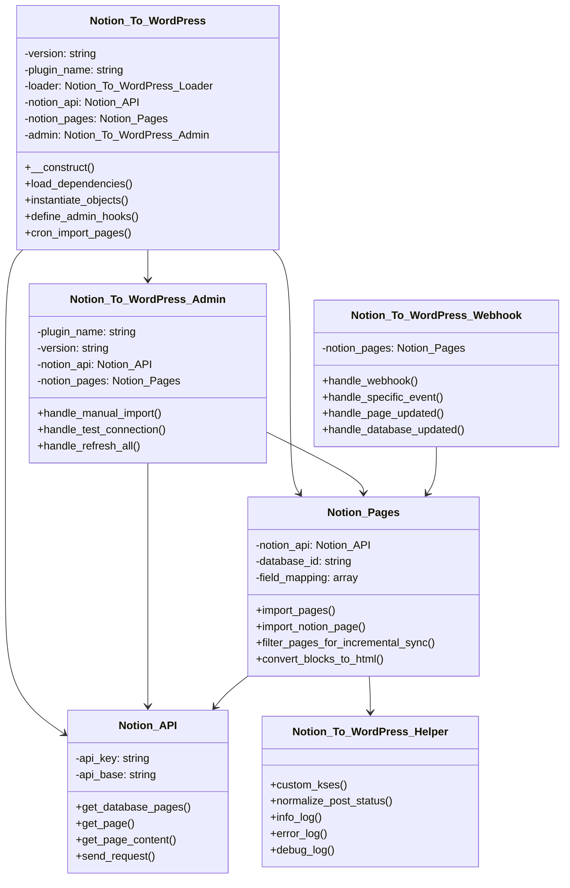
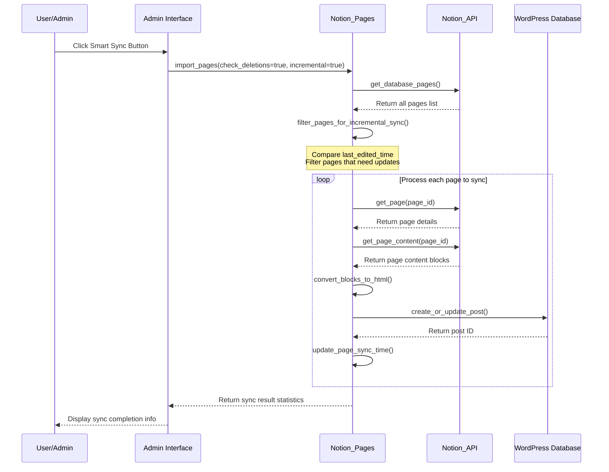
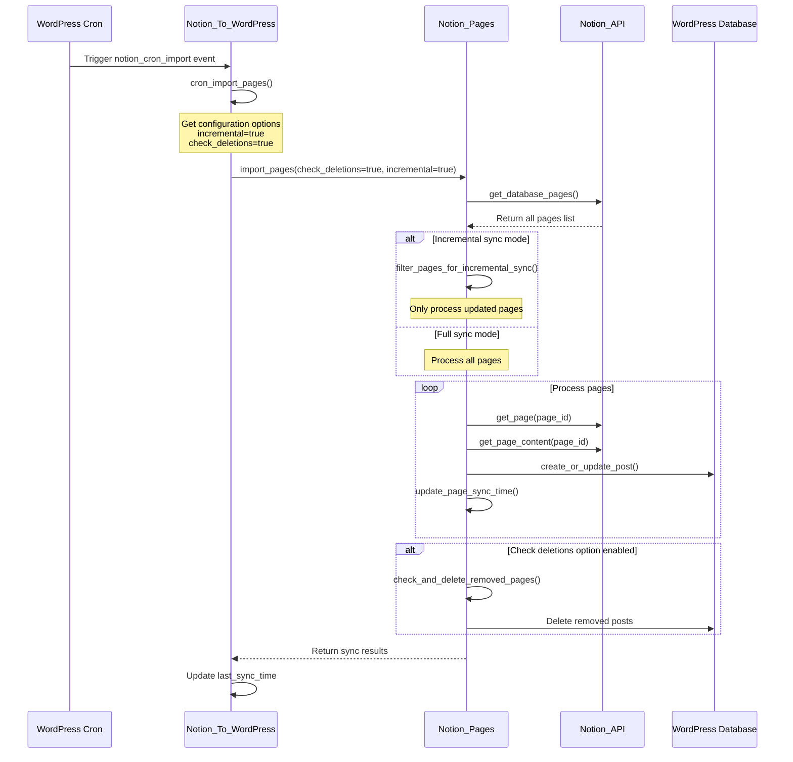
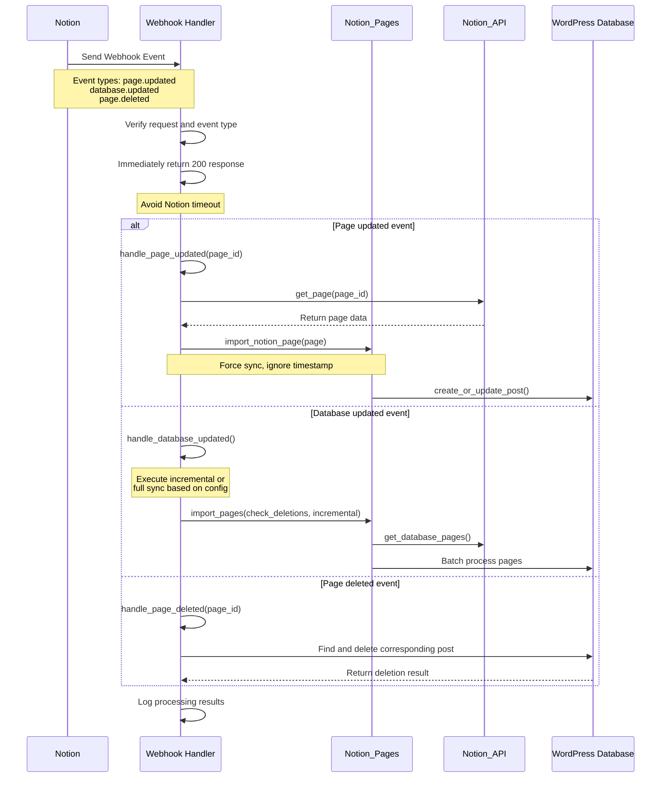

** [🏠 Home](../README.md) • [📚 User Guide](Wiki.md) • [📊 Project Overview](PROJECT_OVERVIEW.md) • **🚀 Developer Guide** • [🔄 Changelog](https://github.com/Frank-Loong/Notion-to-WordPress/commits)

**🌐 Language:** **English** • [中文](DEVELOPER_GUIDE-zh_CN.md)

---

# 🚀 Notion-to-WordPress Developer Guide

> **Professional WordPress Plugin Development, Contributing, and Release Complete Guide**

---

## 📋 Table of Contents

- [🚀 Quick Start](#-quick-start)
- [🛠️ Development Environment](#-development-environment)
- [🏗️ Project Architecture](#-project-architecture)
- [📝 Development Workflow](#-development-workflow)
- [🔧 Command Reference](#-command-reference)
- [🐛 Debug Guide](#-debug-guide)
- [🚀 Release Management](#-release-management)
- [📚 Best Practices](#-best-practices)
- [🤝 Contributing Guidelines](#-contributing-guidelines)
- [🔗 Resources](#-resources)
- [📖 Glossary](#-glossary)

---

## 🚀 Quick Start

### ⚡ 5-Minute Setup

```bash
# 1. Clone project
git clone https://github.com/Frank-Loong/Notion-to-WordPress.git
cd Notion-to-WordPress

# 2. Install dependencies
npm install

# 3. Verify version consistency
npm run version:check

# 4. Build test
npm run build

# 5. Check results
# Linux/Mac: ls -la build/notion-to-wordpress-*.zip
# Windows: Get-ChildItem build/notion-to-wordpress-*.zip
```

### ⚡ Quick Development Workflow

**3-Step Daily Development Workflow:**

```bash
# 1. Check version consistency
npm run version:check

# 2. Bump version (if needed)
npm run version:patch    # or minor/major/beta

# 3. Build production package
npm run build
```

**Quick Command Reference:**
- `npm run help` - Show all available commands
- `npm run version:help` - Show version management help
- `npm run version:check` - Check version consistency only
- `npm run clean` - Clean build files

### ✅ System Requirements

| Component | Minimum | Recommended |
|-----------|---------|-------------|
| Node.js | 16.0+ | 18.0+ |
| npm | 8.0+ | 9.0+ |
| Git | 2.0+ | Latest |
| PHP | 8.0+ | 8.1+ |
| WordPress | 6.0+ | Latest |

---

## 🛠️ Development Environment

### 🔧 IDE Configuration

#### VS Code Settings
```json
{
  "php.validate.executablePath": "/usr/bin/php",
  "editor.formatOnSave": true,
  "files.associations": {
    "*.php": "php"
  }
}
```

#### Git Configuration
```bash
git config core.autocrlf false
git config core.filemode false
git config pull.rebase true
```

### 🐳 WordPress Testing Environment

```bash
# Docker approach (recommended)
docker-compose up -d wordpress

# Local environment
# XAMPP, WAMP, MAMP, or Local by Flywheel
```

---

## 🏗️ Project Architecture

### 📁 Directory Structure

```
notion-to-wordpress/
├── admin/                  # Admin interface
├── includes/               # Core functionality classes
│   ├── class-notion-api.php
│   ├── class-notion-pages.php
│   └── class-notion-to-wordpress.php
├── scripts/                # Automation scripts
│   ├── build.js
│   └── release.js
├── languages/              # Internationalization files
└── notion-to-wordpress.php # Plugin entry point
```

### 🔄 Core Class Relationship Diagram



### 🔄 Data Flow

```
Notion API → API Communication Layer → Data Transform → Sync Engine → WordPress Database
     ↑                                                        ↑
  Webhook Handler                                      Admin Interface Trigger
```

### 📊 Sync Process Sequence Diagrams

#### Smart Sync (Incremental Sync) Flow



#### Scheduled Sync (Cron Job) Flow



#### Webhook Real-time Sync Flow



---

## 📝 Development Workflow

### 🔄 Standard Workflow

```bash
# 1. Create feature branch
git checkout -b feature/your-feature

# 2. Development and testing
npm run version:check
npm run build

# 3. Code checks
npm run validate:config
php -l notion-to-wordpress.php

# 4. Commit code
git add .
git commit -m "feat: add new feature"

# 5. Merge to main
git checkout main
git merge feature/your-feature
```

### 📋 Commit Conventions

```
<type>: <description>

Types:
- feat: New features
- fix: Bug fixes
- docs: Documentation updates
- style: Code formatting
- refactor: Refactoring
- test: Testing
- chore: Build tools
```

---

## 🔧 Command Reference

### 🏗️ Build Commands

| Command | Function | Purpose |
|---------|----------|---------|
| `npm run build` | Build production package | Pre-release build |
| `npm run build:clean` | Clean build directory | Remove old builds |
| `npm run build:verify` | Verify build results | Post-build validation |
| `npm run clean` | Clean all build files | Quick cleanup |

### 📦 Development Workflow

| Step | Command | Description |
|------|---------|-------------|
| 1. Check version | `npm run version:check` | Validate version consistency |
| 2. Bump version | `npm run version:patch` | Upgrade version as needed |
| 3. Build package | `npm run build` | Generate production package |
| 4. Test build | `npm run build:verify` | Verify build results |

### 🚀 Release Commands

| Command | Function | Description |
|---------|----------|-------------|
| `npm run release:patch` | Patch release | Auto-release to GitHub |
| `npm run release:minor` | Minor release | Contains new features |
| `npm run release:major` | Major release | Breaking changes |
| `npm run release:beta` | Beta release | Pre-release version |
| `node scripts/release.js custom --version=X.Y.Z --dry-run` | Custom release | Set specific version |
| `npm run release:dry-run` | Preview release | Safe preview mode |
| `npm run release:help` | Show help | View options |

### 🔍 Version Management

| Command | Function | Purpose |
|---------|----------|---------|
| `npm run version:check` | Check version consistency | Validate all files have same version |
| `node scripts/version-bump.js --version=X.Y.Z` | Set custom version | Directly update all version files |
| `npm run version:patch` | Patch version upgrade | 1.0.0 → 1.0.1 |
| `npm run version:minor` | Minor version upgrade | 1.0.0 → 1.1.0 |
| `npm run version:major` | Major version upgrade | 1.0.0 → 2.0.0 |
| `npm run version:beta` | Beta version upgrade | 1.0.0 → 1.0.1-beta.1 |
| `npm run version:help` | Show help | Display usage information |

**Note**: For custom version setting, use `node` command directly due to npm parameter passing limitations.

### 🧪 Testing Commands

| Command | Function | Purpose |
|---------|----------|---------|
| `npm run test` | Run default tests | Quick test suite |
| `npm run test:integration` | Integration testing | Comprehensive testing |
| `npm run test:syntax` | Syntax check | Code validation |
| `npm run test:release` | Test release process | Safe release preview |
| `npm run validate` | Run all validations | Complete validation suite |
| `npm run validate:config` | Validate configuration | Environment check |
| `npm run validate:github-actions` | Validate CI configuration | Pre-release check |
| `npm run validate:version` | Validate version consistency | Version check |

### 🔧 Utility Commands

| Command | Function | Purpose |
|---------|----------|---------|
| `npm run help` | Show all commands | Display categorized command list |
| `npm run clean` | Clean build files | Remove build directory |
| `npm run dev` | Development deployment | Quick build and deploy |
| `npm run dev:deploy` | Deploy to local WordPress | Local environment deployment |

**Custom Commands** (use `node` directly):
- `node scripts/version-bump.js --version=X.Y.Z` - Set custom version
- `node scripts/release.js custom --version=X.Y.Z --dry-run` - Custom release

### 📝 Unit Testing Guide

#### Test File Structure
```
tests/
├── unit/                   # Unit tests
│   ├── test-notion-api.php
│   ├── test-notion-pages.php
│   └── test-helper.php
├── integration/            # Integration tests
│   ├── test-sync-flow.php
│   └── test-webhook.php
└── bootstrap.php           # Test bootstrap file
```

#### Writing Unit Tests Example
```php
<?php
/**
 * Notion API Unit Tests
 */
class Test_Notion_API extends WP_UnitTestCase {

    private $notion_api;

    public function setUp(): void {
        parent::setUp();
        $this->notion_api = new Notion_API();
    }

    /**
     * Test API connection
     */
    public function test_api_connection() {
        // Mock API response
        $mock_response = [
            'object' => 'database',
            'id' => 'test-database-id'
        ];

        // Use WordPress HTTP API mock
        add_filter('pre_http_request', function($response, $args, $url) use ($mock_response) {
            if (strpos($url, 'notion.com/v1') !== false) {
                return [
                    'response' => ['code' => 200],
                    'body' => json_encode($mock_response)
                ];
            }
            return $response;
        }, 10, 3);

        $result = $this->notion_api->test_connection();
        $this->assertTrue($result);
    }

    /**
     * Test data validation
     */
    public function test_data_validation() {
        // Test invalid database ID
        $result = $this->notion_api->get_database_pages('invalid-id');
        $this->assertInstanceOf('WP_Error', $result);
        $this->assertEquals('invalid_database_id', $result->get_error_code());
    }

    /**
     * Test error handling
     */
    public function test_error_handling() {
        // Mock API error response
        add_filter('pre_http_request', function($response, $args, $url) {
            return [
                'response' => ['code' => 401],
                'body' => json_encode(['message' => 'Unauthorized'])
            ];
        }, 10, 3);

        $result = $this->notion_api->get_database_pages('test-id');
        $this->assertInstanceOf('WP_Error', $result);
        $this->assertEquals('api_unauthorized', $result->get_error_code());
    }
}
```

#### Running Tests
```bash
# Install PHPUnit (if not installed)
composer require --dev phpunit/phpunit

# Run all tests
vendor/bin/phpunit

# Run specific test file
vendor/bin/phpunit tests/unit/test-notion-api.php

# Run tests with coverage report
vendor/bin/phpunit --coverage-html coverage/
```

---

## 🐛 Debug Guide

### 🔍 Common Issues

#### Build Failures
```bash
# Check Node.js version
node --version  # Requires 18+

# Clean and reinstall
# Linux/Mac: rm -rf node_modules package-lock.json
# Windows: Remove-Item node_modules, package-lock.json -Recurse -Force
npm install

# Verify environment
npm run validate:config
```

#### Version Inconsistency
```bash
# Auto-fix version inconsistency (choose appropriate type)
npm run version:patch

# Manual version check
# Linux/Mac:
grep "Version:" notion-to-wordpress.php
grep "version" package.json

# Windows PowerShell:
Select-String "Version:" notion-to-wordpress.php
Select-String "version" package.json

# View help information
npm run version:help
```

#### Plugin Activation Failure
```bash
# PHP syntax check
php -l notion-to-wordpress.php

# Enable WordPress debug
# Add to wp-config.php:
# define('WP_DEBUG', true);
# define('WP_DEBUG_LOG', true);
```

### 🛠️ Debug Configuration

#### WordPress Debug
```php
// wp-config.php
define('WP_DEBUG', true);
define('WP_DEBUG_LOG', true);
define('WP_DEBUG_DISPLAY', false);
define('SCRIPT_DEBUG', true);
```

#### Performance Monitoring
```php
// Memory usage monitoring
$memory_before = memory_get_usage();
// ... code ...
$memory_after = memory_get_usage();
error_log('Memory used: ' . ($memory_after - $memory_before) . ' bytes');
```

### ❓ Troubleshooting FAQ

#### Q1: Sync fails with "Invalid API key"
**Symptoms**: Connection test fails, logs show 401 error
**Solutions**:
```bash
# 1. Check API key format
# Correct format: secret_xxxxxxxxxxxxxxxxxxxxxxxxxxxxxxxxx

# 2. Verify API key permissions
# Ensure integration is added to target database

# 3. Regenerate API key
# Regenerate key in Notion integration settings
```

#### Q2: Sync is very slow
**Symptoms**: Takes too long to sync large number of pages
**Solutions**:
```bash
# 1. Enable incremental sync
# Settings → Sync Options → Enable Incremental Sync

# 2. Adjust batch size
# Settings → Performance Optimization → Batch Size: 10-20

# 3. Check server performance
php -m | grep -E "(curl|json|mbstring)"  # Ensure extensions are installed
```

#### Q3: Images not displaying
**Symptoms**: Images in posts show as links or fail to load
**Solutions**:
```bash
# 1. Check media library permissions
# Linux/Mac: ls -la wp-content/uploads/
# Windows: Get-ChildItem wp-content/uploads/ -Force

# 2. Verify image download settings
# Settings → Media Options → Enable Image Download

# 3. Check network connectivity
curl -I https://s3.us-west-2.amazonaws.com/secure.notion-static.com/test.jpg
```

#### Q4: Webhook not working
**Symptoms**: WordPress doesn't auto-sync after Notion updates
**Solutions**:
```bash
# 1. Check Webhook URL
# Ensure URL is accessible from internet: https://yoursite.com/wp-json/notion-to-wordpress/v1/webhook

# 2. Verify SSL certificate
curl -I https://yoursite.com/wp-json/notion-to-wordpress/v1/webhook

# 3. Check firewall settings
# Ensure server allows requests from Notion
```

#### Q5: Out of memory error
**Symptoms**: "Fatal error: Allowed memory size exhausted" during sync
**Solutions**:
```php
// 1. Increase PHP memory limit
// Add to wp-config.php:
ini_set('memory_limit', '512M');

// 2. Optimize batch size
// Settings → Performance Optimization → Batch Size: 5-10

// 3. Enable object cache
// Install Redis or Memcached
```

#### Q6: Chinese characters display as garbled text
**Symptoms**: Chinese content shows as question marks or garbled after sync
**Solutions**:
```sql
-- 1. Check database charset
SHOW VARIABLES LIKE 'character_set%';

-- 2. Modify database charset (if needed)
ALTER DATABASE wordpress CHARACTER SET utf8mb4 COLLATE utf8mb4_unicode_ci;

-- 3. Modify table charset
ALTER TABLE wp_posts CONVERT TO CHARACTER SET utf8mb4 COLLATE utf8mb4_unicode_ci;
```

---

## 🚀 Release Management

### 📋 Release Types

| Type | Version Change | Use Case |
|------|---------------|----------|
| Patch | 1.1.0 → 1.1.1 | Bug fixes, security patches |
| Minor | 1.1.0 → 1.2.0 | New features, backward compatible |
| Major | 1.1.0 → 2.0.0 | Breaking changes |
| Beta | 1.1.0 → 1.1.1-beta.1 | Pre-release testing |

### 🚀 Release Process

```bash
# 1. Pre-release checks
git status                    # Ensure clean working directory
npm run validate:config       # Validate configuration
npm run release:dry-run       # Preview release

# 2. Execute release
npm run release:patch         # Choose appropriate type

# 3. Post-release verification
# - Check GitHub Actions status
# - Verify GitHub Release page
# - Test downloaded ZIP package
```

### 🔧 Custom Versions

```bash
# Release candidates
node scripts/release.js custom --version=1.8.1-rc.1

# Hotfix versions
node scripts/release.js custom --version=1.8.1-hotfix.1

# Preview mode
node scripts/release.js custom --version=X.Y.Z --dry-run
```

---

## 📚 Best Practices

### 🔒 Code Quality

#### PHP Code Standards
```php
<?php
/**
 * Example class demonstrating best practices
 */
class Notion_To_WordPress_Example {

    /**
     * Data processing method
     *
     * @param string $input Input parameter
     * @return array|WP_Error Processing result
     * @since 1.0.0
     */
    public function process_data( $input ) {
        // Input validation
        if ( empty( $input ) ) {
            return new WP_Error( 'invalid_input', 'Input cannot be empty' );
        }

        // Data sanitization
        $clean_input = sanitize_text_field( $input );

        // Processing logic
        $result = $this->transform_data( $clean_input );

        return $result;
    }
}
```

#### JavaScript Code Standards
```javascript
(function($) {
    'use strict';

    const NotionWordPress = {
        init: function() {
            this.bindEvents();
        },

        bindEvents: function() {
            $('.sync-button').on('click', this.handleSync.bind(this));
        },

        handleSync: function(event) {
            event.preventDefault();
            this.showLoading();

            $.ajax({
                url: ajaxurl,
                type: 'POST',
                data: {
                    action: 'notion_sync',
                    nonce: notion_ajax.nonce
                },
                success: this.handleSuccess.bind(this),
                error: this.handleError.bind(this)
            });
        }
    };

    $(document).ready(function() {
        NotionWordPress.init();
    });

})(jQuery);
```

### 🛡️ Security Standards

#### Data Validation
```php
// Input validation
$page_id = sanitize_text_field( $_POST['page_id'] );
if ( ! preg_match( '/^[a-f0-9-]{36}$/', $page_id ) ) {
    wp_die( 'Invalid page ID format' );
}

// Output escaping
echo '<h1>' . esc_html( $title ) . '</h1>';
echo '<a href="' . esc_url( $link ) . '">' . esc_html( $text ) . '</a>';

// Nonce verification
if ( ! wp_verify_nonce( $_POST['nonce'], 'notion_sync_action' ) ) {
    wp_die( 'Security verification failed' );
}
```

### ⚡ Performance Optimization

#### Caching Strategy
```php
// Use WordPress object cache
$cache_key = 'notion_pages_' . md5( $database_id );
$pages = wp_cache_get( $cache_key );

if ( false === $pages ) {
    $pages = $this->fetch_notion_pages( $database_id );
    wp_cache_set( $cache_key, $pages, '', HOUR_IN_SECONDS );
}
```

#### Database Optimization
```php
// Batch queries instead of loops
$post_ids = wp_list_pluck( $posts, 'ID' );
$meta_data = get_post_meta_batch( $post_ids, 'notion_id' );
```

### 🚨 Error Handling Best Practices

#### Exception Handling Pattern
```php
/**
 * Standard error handling example
 */
public function sync_notion_page( $page_id ) {
    try {
        // Input validation
        if ( empty( $page_id ) || ! is_string( $page_id ) ) {
            throw new InvalidArgumentException( 'Page ID cannot be empty and must be a string' );
        }

        // API call error handling
        $page_data = $this->notion_api->get_page( $page_id );
        if ( is_wp_error( $page_data ) ) {
            Notion_To_WordPress_Helper::error_log(
                sprintf( 'Failed to get page: %s', $page_data->get_error_message() ),
                'SYNC_ERROR'
            );
            return $page_data; // Return WP_Error object
        }

        // Data validation
        if ( ! isset( $page_data['properties'] ) ) {
            return new WP_Error(
                'invalid_page_data',
                'Invalid page data format: missing properties field',
                ['page_id' => $page_id, 'data' => $page_data]
            );
        }

        // Business logic processing
        $post_id = $this->create_or_update_post( $page_data );
        if ( is_wp_error( $post_id ) ) {
            // Log detailed error information
            Notion_To_WordPress_Helper::error_log(
                sprintf(
                    'Failed to create/update post: %s (Page ID: %s)',
                    $post_id->get_error_message(),
                    $page_id
                ),
                'POST_CREATION_ERROR'
            );
            return $post_id;
        }

        // Success log
        Notion_To_WordPress_Helper::info_log(
            sprintf( 'Page synced successfully: %s -> Post ID: %d', $page_id, $post_id ),
            'SYNC_SUCCESS'
        );

        return $post_id;

    } catch ( Exception $e ) {
        // Catch all unhandled exceptions
        $error_message = sprintf(
            'Exception occurred during sync: %s (File: %s, Line: %d)',
            $e->getMessage(),
            $e->getFile(),
            $e->getLine()
        );

        Notion_To_WordPress_Helper::error_log( $error_message, 'EXCEPTION' );

        return new WP_Error(
            'sync_exception',
            'Unexpected error occurred during sync',
            ['exception' => $e->getMessage(), 'page_id' => $page_id]
        );
    }
}
```

#### Error Classification and Handling Strategy
```php
/**
 * Error classification handling
 */
class Notion_Error_Handler {

    const ERROR_TYPES = [
        'API_ERROR' => 'API call error',
        'VALIDATION_ERROR' => 'Data validation error',
        'PERMISSION_ERROR' => 'Permission error',
        'RATE_LIMIT_ERROR' => 'Rate limit error',
        'NETWORK_ERROR' => 'Network connection error',
        'DATA_ERROR' => 'Data processing error'
    ];

    /**
     * Unified error handling
     */
    public static function handle_error( $error, $context = [] ) {
        if ( ! is_wp_error( $error ) ) {
            return $error;
        }

        $error_code = $error->get_error_code();
        $error_message = $error->get_error_message();
        $error_data = $error->get_error_data();

        // Different strategies based on error type
        switch ( $error_code ) {
            case 'api_rate_limit':
                // Rate limit: wait and retry
                self::schedule_retry( $context, 60 ); // Retry after 60 seconds
                break;

            case 'api_unauthorized':
                // Auth error: notify admin
                self::notify_admin( 'Authentication failed, please check API key', $error );
                break;

            case 'network_timeout':
                // Network timeout: retry after short delay
                self::schedule_retry( $context, 30 ); // Retry after 30 seconds
                break;

            default:
                // Other errors: log
                Notion_To_WordPress_Helper::error_log(
                    sprintf( 'Unclassified error: %s', $error_message ),
                    'UNHANDLED_ERROR'
                );
        }

        return $error;
    }

    /**
     * Schedule retry task
     */
    private static function schedule_retry( $context, $delay_seconds ) {
        wp_schedule_single_event(
            time() + $delay_seconds,
            'notion_retry_sync',
            [$context]
        );
    }

    /**
     * Notify admin
     */
    private static function notify_admin( $message, $error ) {
        // Send email notification or display admin notice
        add_action( 'admin_notices', function() use ( $message ) {
            echo '<div class="notice notice-error"><p>' . esc_html( $message ) . '</p></div>';
        });
    }
}
```

---

## 🤝 Contributing Guidelines

### 📝 Contribution Types

| Type | Description | Submission Method |
|------|-------------|-------------------|
| 🐛 Bug Reports | Discover issues and provide detailed information | [GitHub Issues](https://github.com/Frank-Loong/Notion-to-WordPress/issues) |
| ✨ Feature Suggestions | Propose new feature ideas | [GitHub Discussions](https://github.com/Frank-Loong/Notion-to-WordPress/discussions) |
| 🔧 Code Contributions | Submit code fixes or new features | Pull Request |
| 📚 Documentation Improvements | Enhance documentation content | Pull Request |

### 🔄 Contribution Process

```bash
# 1. Fork the project
# Click Fork button on GitHub

# 2. Clone your fork
git clone https://github.com/YOUR_USERNAME/Notion-to-WordPress.git
cd Notion-to-WordPress

# 3. Create feature branch
git checkout -b feature/your-feature-name

# 4. Develop and test
npm run version:check
npm run build

# 5. Commit changes
git add .
git commit -m "feat: add new feature description"

# 6. Push to your fork
git push origin feature/your-feature-name

# 7. Create Pull Request
# Create PR to main repository on GitHub
```

### ✅ Quality Requirements

- [ ] Follow WordPress coding standards
- [ ] Include complete PHPDoc comments
- [ ] Pass all existing tests
- [ ] Add test cases for new features
- [ ] Update relevant documentation

### 🔍 Code Review Process

#### Pull Request Checklist

**Pre-submission Self-check**:
- [ ] Code follows PSR-12 coding standards
- [ ] All functions have PHPDoc comments
- [ ] Input data is properly validated and sanitized
- [ ] Output data is properly escaped
- [ ] Error handling is complete and reasonable
- [ ] Performance impact considered
- [ ] Security risks assessed
- [ ] Test cases added
- [ ] Documentation updated

**Reviewer Checklist**:
- [ ] **Functionality**: Does the code implement expected functionality?
- [ ] **Security**: Are there any security vulnerabilities?
- [ ] **Performance**: Are there any performance issues?
- [ ] **Maintainability**: Is the code easy to understand and maintain?
- [ ] **Test Coverage**: Are tests sufficient?
- [ ] **Documentation**: Is documentation accurate and complete?

#### Review Standards

**Code Quality Standards**:
```php
// ✅ Good example
/**
 * Sync Notion page to WordPress
 *
 * @param string $page_id Notion page ID
 * @param array  $options Sync options
 * @return int|WP_Error Returns post ID on success, WP_Error on failure
 * @since 1.0.0
 */
public function sync_page( $page_id, $options = [] ) {
    // Input validation
    if ( empty( $page_id ) ) {
        return new WP_Error( 'invalid_page_id', 'Page ID cannot be empty' );
    }

    // Business logic...
}

// ❌ Needs improvement
function sync($id) {  // Missing type hints and documentation
    $data = $_POST['data'];  // Unvalidated input
    echo $data;  // Unescaped output
}
```

**Security Review Focus**:
- All user input must be validated and sanitized
- All output must be properly escaped
- Database queries must use prepared statements
- File operations must validate paths and permissions
- API calls must handle errors and timeouts

**Performance Review Focus**:
- Avoid N+1 query problems
- Use caching appropriately
- Optimize database queries
- Control memory usage
- Handle long operations asynchronously

---

## 🔗 Resources

### 📚 Official Documentation
- [WordPress Plugin Development Handbook](https://developer.wordpress.org/plugins/)
- [WordPress Coding Standards](https://developer.wordpress.org/coding-standards/)
- [Notion API Documentation](https://developers.notion.com/)
- [Semantic Versioning Specification](https://semver.org/)

### 🛠️ Development Tools
- [WordPress CLI](https://wp-cli.org/) - WordPress command-line tool
- [PHPStan](https://phpstan.org/) - PHP static analysis
- [PHP_CodeSniffer](https://github.com/squizlabs/PHP_CodeSniffer) - Code standards checker

### 🆘 Getting Help
- **General Questions**: [GitHub Discussions](https://github.com/Frank-Loong/Notion-to-WordPress/discussions)
- **Bug Reports**: [GitHub Issues](https://github.com/Frank-Loong/Notion-to-WordPress/issues)
- **Security Issues**: Contact maintainers directly

---

## 📖 Glossary

### 🔧 Technical Terms

| Term | Chinese | Explanation |
|------|---------|-------------|
| **Incremental Sync** | 增量同步 | Sync only content updated since last sync, improving efficiency |
| **Full Sync** | 全量同步 | Sync all content regardless of update time |
| **Webhook** | Webhook | Real-time event notification mechanism, notifies WordPress immediately when Notion updates |
| **API Key** | API密钥 | Authentication credential for accessing Notion API |
| **Database ID** | 数据库ID | Unique identifier for Notion database |
| **Page ID** | 页面ID | Unique identifier for Notion page |
| **Field Mapping** | 字段映射 | Configuration mapping Notion properties to WordPress fields |
| **Nonce** | Nonce | WordPress security mechanism preventing CSRF attacks |
| **Escaping** | 转义 | Security processing of output content to prevent XSS attacks |
| **Sanitization** | 清理 | Cleaning and validation of input data |

### 🏗️ Architecture Terms

| Term | Chinese | Explanation |
|------|---------|-------------|
| **API Communication Layer** | API通信层 | Code layer responsible for interacting with Notion API |
| **Data Transformer** | 数据转换器 | Converts Notion data format to WordPress format |
| **Sync Engine** | 同步引擎 | Core synchronization logic processor |
| **Hook System** | 钩子系统 | WordPress event-driven mechanism |
| **Loader** | 加载器 | Responsible for registering hooks and initializing components |
| **Helper Class** | 助手类 | Class providing common utility functions |

### 📝 Development Terms

| Term | Chinese | Explanation |
|------|---------|-------------|
| **Conventional Commits** | 约定式提交 | Standardized Git commit message format |
| **Semantic Versioning** | 语义化版本 | Version number management specification (major.minor.patch) |
| **PHPDoc** | PHPDoc | PHP code documentation comment standard |
| **PSR-12** | PSR-12 | PHP coding style specification |
| **Unit Testing** | 单元测试 | Testing individual code unit functionality |
| **Integration Testing** | 集成测试 | Testing multiple components working together |
| **Code Coverage** | 代码覆盖率 | Percentage of code covered by tests |

---

**Thank you for contributing to the Notion-to-WordPress project! 🚀**

*Together, we're building the most advanced Notion-to-WordPress integration available.*

---

<div align="center">

**[⬆️ Back to Top](#-notion-to-wordpress-developer-guide) • [🏠 Home](../README.md) • [📚 User Guide](Wiki.md) • [📊 Project Overview](PROJECT_OVERVIEW.md) • [🇨🇳 中文版](DEVELOPER_GUIDE-zh_CN.md)**

</div>

> © 2025 Frank-Loong · Notion-to-WordPress v1.8.3-beta.2