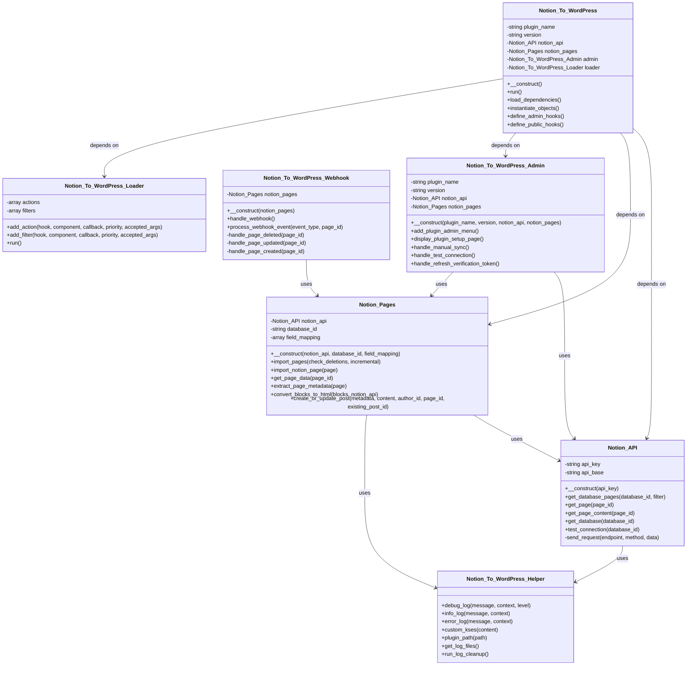
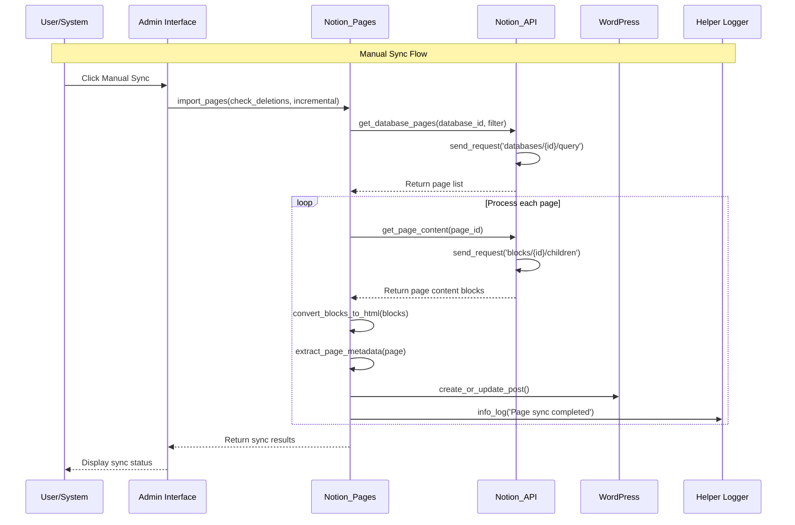
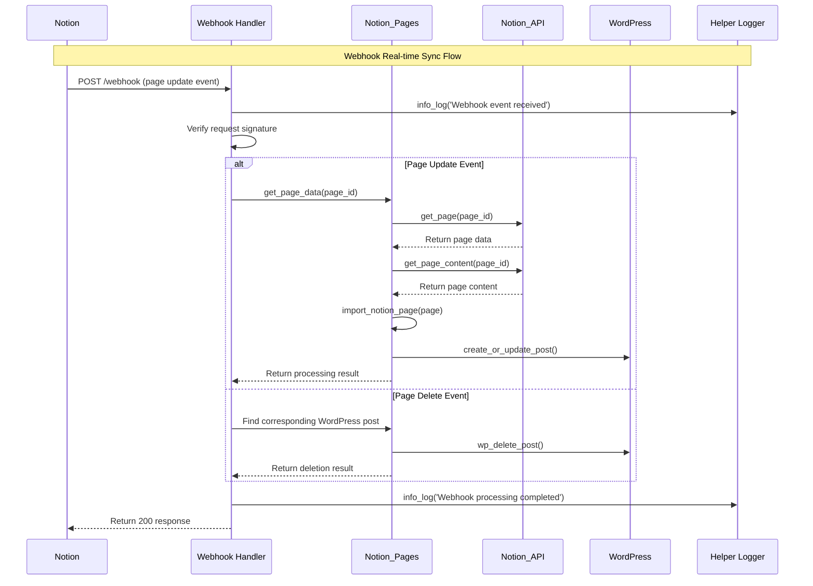

** [🏠 Home](../README.md) • [📚 User Guide](Wiki.md) • [📊 Project Overview](PROJECT_OVERVIEW.md) • **🚀 Developer Guide** • [🔄 Changelog](https://github.com/Frank-Loong/Notion-to-WordPress/commits)

**🌐 Language:** **English** • [中文](DEVELOPER_GUIDE-zh_CN.md)

---

# 🚀 Notion-to-WordPress Developer Guide

> **Complete Development, Contributing, and Release Guide for Notion-to-WordPress Plugin**

---

## 📋 Table of Contents

- [🛠️ Development Environment Setup](#-development-environment-setup)
- [🏗️ Project Architecture](#-project-architecture)
- [🤝 Contributing Guidelines](#-contributing-guidelines)
- [📦 Local Development & Testing](#-local-development--testing)
- [🚀 Release Management](#-release-management)
- [🔧 Troubleshooting](#-troubleshooting)
- [📚 Best Practices](#-best-practices)
- [🔗 Resources](#-resources)

---

## 🛠️ Development Environment Setup

### System Requirements

```bash
# Required Environment
- Node.js 16+ (18+ recommended for optimal performance)
- Git 2.0+ with GitHub access
- WordPress 6.0+ (for testing environment)
- PHP 8.0+ with required extensions:
  - curl (for API requests)
  - mbstring (for string handling)
  - json (for data processing)
- Notion Account with API access
```

### Quick Setup Guide

```bash
# 1. Clone the repository
git clone https://github.com/Frank-Loong/Notion-to-WordPress.git
cd Notion-to-WordPress

# 2. Install Node.js dependencies
npm install

# 3. Verify environment configuration
npm run validate:config
npm run validate:github-actions

# 4. Create your development branch
git checkout -b feature/your-feature-name

# 5. Test the build system
npm run build
```

### Development Tools Configuration

#### VS Code Setup (Recommended)
```json
// .vscode/settings.json
{
  "php.validate.executablePath": "/path/to/php",
  "editor.formatOnSave": true,
  "files.associations": {
    "*.php": "php"
  }
}
```

#### Git Configuration
```bash
# Configure Git for WordPress development
git config core.autocrlf false
git config core.filemode false
```

---

## 🏗️ Project Architecture

### Directory Structure

```
notion-to-wordpress/
├── admin/                      # WordPress Admin Interface
│   ├── css/                   # Admin stylesheets
│   ├── js/                    # Admin JavaScript
│   └── partials/              # Admin template files
├── assets/                     # Public Assets
│   ├── css/                   # Frontend stylesheets
│   ├── js/                    # Frontend JavaScript
│   └── images/                # Image resources
├── includes/                   # Core Plugin Logic
│   ├── class-notion-to-wordpress.php          # Main plugin class
│   ├── class-notion-to-wordpress-activator.php # Activation logic
│   ├── class-notion-to-wordpress-deactivator.php # Deactivation logic
│   ├── class-notion-to-wordpress-i18n.php     # Internationalization
│   ├── class-notion-to-wordpress-loader.php   # Hook loader
│   ├── class-notion-to-wordpress-admin.php    # Admin functionality
│   └── class-notion-to-wordpress-public.php   # Public functionality
├── languages/                  # Internationalization Files
│   ├── notion-to-wordpress.pot # Translation template
│   ├── notion-to-wordpress-zh_CN.po/.mo # Chinese translations
│   └── notion-to-wordpress-en_US.po/.mo # English translations
├── scripts/                    # Automation Scripts
│   ├── build.js               # Build system
│   ├── release.js             # Release automation
│   ├── local-package.js       # Local packaging
│   └── version-bump.js        # Version management
├── docs/                       # Documentation
├── wiki/                       # User guides
├── notion-to-wordpress.php     # Main plugin file
├── readme.txt                  # WordPress plugin description
├── uninstall.php              # Clean uninstall script
└── release.config.js          # Release configuration
```

### Core Components

#### 1. Main Plugin Class (`includes/class-notion-to-wordpress.php`)
- Plugin initialization and lifecycle management
- Hook registration and dependency injection
- Configuration management

#### 2. Admin Interface (`admin/`)
- WordPress admin dashboard integration
- Settings pages and forms
- AJAX handlers for real-time operations

#### 3. API Integration (`includes/`)
- Notion API communication
- Data transformation and validation
- WordPress content creation/updates

#### 4. Automation Scripts (`scripts/`)
- Build and packaging system
- Version management
- Release automation

### Detailed Technical Architecture

#### Core Class Structure

The plugin follows a modular architecture with clear separation of concerns:

```
includes/
├── class-notion-api.php                    # API integration layer
├── class-notion-pages.php                  # Sync logic and processing
├── class-notion-to-wordpress-webhook.php   # Webhook handling
├── class-notion-to-wordpress-helper.php    # Utilities and logging
├── class-notion-to-wordpress-i18n.php      # Internationalization
├── class-notion-to-wordpress-loader.php    # Hook loader system
├── class-notion-to-wordpress-admin.php     # Admin interface
├── class-notion-to-wordpress-public.php    # Public functionality
└── class-notion-to-wordpress.php           # Core orchestrator
```

#### Class Responsibilities

**Notion_To_WordPress** (Core Orchestrator)
- Manages plugin lifecycle and initialization
- Coordinates between different components
- Handles dependency injection and configuration

**Notion_API** (API Integration Layer)
- Manages all Notion API communications
- Handles authentication and request/response processing
- Implements rate limiting and error handling
- Methods: `get_database_pages()`, `get_page()`, `get_page_content()`, `test_connection()`

**Notion_Pages** (Sync Logic Engine)
- Orchestrates the synchronization process
- Converts Notion content to WordPress format
- Manages incremental sync and deletion detection
- Methods: `import_pages()`, `import_notion_page()`, `convert_blocks_to_html()`

**Notion_To_WordPress_Admin** (Admin Interface)
- Provides WordPress admin dashboard integration
- Handles user interactions and settings management
- Manages manual sync operations and status display
- Methods: `display_plugin_setup_page()`, `handle_manual_sync()`

**Notion_To_WordPress_Webhook** (Real-time Processing)
- Processes incoming webhook events from Notion
- Handles real-time content updates and deletions
- Implements event-specific processing strategies
- Methods: `handle_webhook()`, `process_webhook_event()`

**Notion_To_WordPress_Helper** (Utilities)
- Provides logging and debugging capabilities
- Implements security functions and content sanitization
- Manages file operations and cleanup tasks
- Methods: `debug_log()`, `custom_kses()`, `run_log_cleanup()`

#### Sync Architecture Patterns

**Triple Sync Architecture**
1. **Manual Sync**: User-initiated with real-time feedback
2. **Scheduled Sync**: Automated background processing
3. **Webhook Sync**: Real-time updates triggered by Notion events

**Processing Flow**
1. **Data Retrieval**: Fetch pages from Notion API
2. **Content Transformation**: Convert Notion blocks to HTML
3. **Metadata Extraction**: Process page properties and metadata
4. **WordPress Integration**: Create or update WordPress posts
5. **Status Reporting**: Log results and provide user feedback

#### Performance Optimizations

**Incremental Sync Strategy**
- Timestamp-based change detection
- Only processes modified content
- Reduces API calls and processing time

**Memory Management**
- Batch processing for large datasets
- Strategic memory cleanup
- Optimized for enterprise-scale operations

**Caching Implementation**
- API response caching
- Metadata caching for repeated operations
- WordPress object cache integration

**Async Processing**
- Non-blocking webhook responses
- Background processing for large operations
- Queue-based processing for reliability

#### Core Class Diagram

The following diagram illustrates the relationships between core plugin classes:



#### Sync Flow Sequence Diagram

The following diagram shows the complete manual sync process flow:



#### Webhook Processing Sequence Diagram

The following diagram illustrates the real-time webhook processing flow:



---

## 🤝 Contributing Guidelines

### Contribution Types

#### 🐛 Bug Reports
**Before Reporting:**
- Search existing issues to avoid duplicates
- Test with the latest plugin version
- Gather detailed reproduction information

**Required Information:**
- WordPress version, PHP version, Plugin version
- Detailed step-by-step reproduction steps
- Expected behavior vs. actual behavior
- Error messages, logs, or screenshots
- Browser and environment details (if relevant)

**Submission:** Use [GitHub Issues](https://github.com/Frank-Loong/Notion-to-WordPress/issues) with the bug report template.

#### ✨ Feature Requests
**Process:**
1. Check [GitHub Discussions](https://github.com/Frank-Loong/Notion-to-WordPress/discussions) for existing ideas
2. Ensure the feature aligns with plugin scope and goals
3. Provide detailed use cases and implementation suggestions
4. Include mockups or examples if applicable

#### 🔧 Code Contributions
**Development Standards:**
- Follow [WordPress Coding Standards](https://developer.wordpress.org/coding-standards/)
- Use PSR-12 compatible formatting where applicable
- Write comprehensive PHPDoc comments for all public methods
- Implement proper input sanitization and output escaping
- Include unit tests for new functionality (when applicable)

### Code Quality Standards

#### ✅ Recommended Code Patterns

```php
<?php
/**
 * Notion to WordPress Sync Handler
 *
 * Handles synchronization between Notion databases and WordPress posts.
 *
 * @since 1.0.0
 * @package Notion_To_WordPress
 */
class Notion_To_WordPress_Sync {

    /**
     * Synchronize Notion database to WordPress
     *
     * @since 1.0.0
     * @param string $database_id The Notion database ID to sync
     * @param array  $options     Sync options and configuration
     * @return array|WP_Error     Sync results or error object
     */
    public function sync_database( $database_id, $options = array() ) {
        // Input validation and sanitization
        $database_id = sanitize_text_field( $database_id );
        $options = wp_parse_args( $options, $this->get_default_sync_options() );

        // Validate required parameters
        if ( empty( $database_id ) ) {
            return new WP_Error( 'missing_database_id', __( 'Database ID is required.', 'notion-to-wordpress' ) );
        }

        // Execute sync logic
        $result = $this->execute_sync( $database_id, $options );

        // Return sanitized results
        return array(
            'status'    => 'success',
            'message'   => esc_html( $result['message'] ),
            'synced'    => absint( $result['count'] ),
            'timestamp' => current_time( 'mysql' )
        );
    }

    /**
     * Get default sync options
     *
     * @since 1.0.0
     * @return array Default options array
     */
    private function get_default_sync_options() {
        return array(
            'batch_size'    => 10,
            'timeout'       => 30,
            'update_existing' => true,
            'delete_missing'  => false
        );
    }
}
```

#### ❌ Code Patterns to Avoid

```php
<?php
// Dangerous: No input validation or output escaping
$api_key = $_POST['notion_api_key'];  // Security risk!
echo '<p>' . $message . '</p>';       // XSS vulnerability!

// Poor: No error handling
$result = wp_remote_get( $url );
$data = json_decode( $result['body'] );

// Inconsistent: Mixed coding styles
function badFunction($param1,$param2){
    if($param1){
        return $param2;
    }
}
```

### Pull Request Process

```bash
# 1. Create and switch to feature branch
git checkout -b feature/amazing-new-feature

# 2. Implement your changes
# - Follow coding standards
# - Add comprehensive comments
# - Include error handling
# - Test thoroughly

# 3. Commit with descriptive messages
git add .
git commit -m "feat: add amazing new feature

- Implement core functionality
- Add input validation
- Include comprehensive tests
- Update documentation"

# 4. Push branch to your fork
git push origin feature/amazing-new-feature

# 5. Create Pull Request
# - Use clear, descriptive title
# - Link related issues
# - Include testing instructions
# - Add screenshots for UI changes
```

### Documentation Requirements

#### Code Documentation
- PHPDoc comments for all classes, methods, and functions
- Inline comments for complex logic
- README updates for new features
- Changelog entries for all changes

#### User Documentation
- Wiki updates for new features
- Screenshot updates for UI changes
- Translation string updates
- FAQ additions for common questions

---

## 📦 Local Development & Testing

### Local Testing Environment

#### WordPress Development Setup
```bash
# Option 1: Local WordPress installation
# Download WordPress, configure database, install plugin

# Option 2: Docker setup (recommended)
docker-compose up -d wordpress

# Option 3: Local development tools
# XAMPP, WAMP, MAMP, or Local by Flywheel
```

#### Notion API Testing
```bash
# 1. Create Notion integration at https://www.notion.so/my-integrations
# 2. Get Internal Integration Token
# 3. Create test database with required properties
# 4. Share database with your integration
```

### Local Packaging System

The local packaging system allows safe testing without affecting the Git repository.

#### Basic Commands

```bash
# View all available options
node scripts/local-package.js --help

# Standard version increments
npm run package:local patch    # 1.2.0 → 1.2.1
npm run package:local minor    # 1.2.0 → 1.3.0
npm run package:local major    # 1.2.0 → 2.0.0
npm run package:local beta     # 1.2.0 → 1.2.1-beta.1

# Custom version numbers
npm run package:local -- --version=1.2.6-test.1
npm run package:local -- --version=1.3.0-dev.1
npm run package:local -- --version=2.0.0-alpha.1
```

#### Advanced Options

```bash
# Preview mode (recommended for first use)
npm run package:local patch --dry-run
npm run package:local -- --version=1.2.6-test.1 --dry-run

# Package only (no version update)
npm run package:local -- --build-only

# Version update only (no package creation)
npm run package:local -- --version-only

# Direct script execution
node scripts/local-package.js --version=1.2.6-test.1 --dry-run
```

### Testing Workflow

```bash
# 1. Create test version
npm run package:local -- --version=1.2.6-test.1

# 2. Locate generated package
# File: build/notion-to-wordpress-1.2.6-test.1.zip

# 3. Test in WordPress
# - Upload ZIP to WordPress admin → Plugins → Add New → Upload
# - Activate plugin and configure settings
# - Test all functionality thoroughly
# - Verify new features work as expected

# 4. Commit changes when satisfied
git add .
git commit -m "feat: implement new feature with comprehensive testing"
```

### Local Package Features

- ✅ **Safe Testing**: No Git operations, repository remains unchanged
- ✅ **Automatic Backup**: Creates backup before changes, auto-rollback on errors
- ✅ **Version Synchronization**: Updates version in all relevant files automatically
- ✅ **WordPress Compatibility**: Generated ZIP ready for direct WordPress installation
- ✅ **Build Validation**: Ensures package meets WordPress plugin standards

---

## 🚀 Release Management

### Automated Release System

Our sophisticated release system provides enterprise-grade CI/CD capabilities, transforming complex release processes into simple, one-command operations.

#### Release Types & Semantic Versioning

| Type | Version Change | Use Case | Command |
|------|---------------|----------|---------|
| **Patch** | 1.1.0 → 1.1.1 | Bug fixes, security patches, minor improvements | `npm run release:patch` |
| **Minor** | 1.1.0 → 1.2.0 | New features, enhancements, backward-compatible changes | `npm run release:minor` |
| **Major** | 1.1.0 → 2.0.0 | Breaking changes, major rewrites, API modifications | `npm run release:major` |
| **Beta** | 1.1.0 → 1.1.1-beta.1 | Pre-release testing, experimental features | `npm run release:beta` |

### Standard Release Process

#### Pre-Release Checklist

```bash
# 1. Ensure clean working directory
git status  # Should show "working tree clean"

# 2. Verify all tests pass
npm run test:integration

# 3. Validate configuration
npm run validate:config
npm run validate:github-actions

# 4. Preview the release (highly recommended)
npm run test:release patch  # or minor/major/beta
```

#### Execute Release

```bash
# Standard releases
npm run release:patch   # For bug fixes
npm run release:minor   # For new features
npm run release:major   # For breaking changes
npm run release:beta    # For testing versions

# Monitor the process
# - Review version changes when prompted
# - Confirm release when ready
# - Watch GitHub Actions for completion
```

### Custom Version Releases

#### Using npm Scripts (Recommended)

```bash
# Release candidates
npm run release:custom -- --version=1.3.0-rc.1
npm run release:custom -- --version=1.3.0-rc.2

# Hotfix releases
npm run release:custom -- --version=1.2.1-hotfix.1
npm run release:custom -- --version=1.2.1-hotfix.2

# Alpha/Beta releases
npm run release:custom -- --version=2.0.0-alpha.1
npm run release:custom -- --version=2.0.0-beta.1

# Preview custom releases
npm run release:custom -- --version=1.3.0-rc.1 --dry-run

# Force release (skip confirmations)
npm run release:custom -- --version=1.3.0-rc.1 --force
```

#### Direct Script Usage

```bash
# Direct script execution with full control
node scripts/release.js --version=1.3.0-rc.1
node scripts/release.js --version=1.3.0-rc.1 --dry-run
node scripts/release.js --version=1.3.0-rc.1 --force

# View all available options
node scripts/release.js --help
```

### Release Process Deep Dive

The automated release system executes the following comprehensive workflow:

#### 1. Environment Validation
- **Git Repository Status**: Ensures working directory is clean
- **Node.js Compatibility**: Verifies Node.js version meets requirements
- **Tool Availability**: Confirms all required tools are accessible
- **Branch Validation**: Checks current branch and remote status

#### 2. Version Management
- **Current Version Detection**: Reads version from main plugin file
- **New Version Calculation**: Computes new version based on release type
- **Multi-File Updates**: Synchronizes version across all relevant files:
  - `notion-to-wordpress.php` (WordPress plugin header)
  - `readme.txt` (WordPress.org stable tag)
  - `package.json` (npm package version)
  - `includes/class-notion-to-wordpress.php` (PHP class version)
  - `docs/PROJECT_STATUS.md` and `docs/PROJECT_STATUS-zh_CN.md` (documentation)

#### 3. Package Building
- **WordPress Standards**: Creates WordPress.org compliant ZIP package
- **File Optimization**: Excludes development files, includes only runtime essentials
- **Size Optimization**: Generates minimal package for faster downloads
- **Validation**: Ensures package meets all WordPress plugin requirements

#### 4. Git Operations
- **Commit Creation**: Creates descriptive commit with version changes
- **Tag Generation**: Creates annotated Git tag (e.g., `v1.2.1`)
- **Remote Push**: Pushes commits and tags to GitHub repository

#### 5. GitHub Actions Integration
- **Automatic Trigger**: Release tag push triggers GitHub Actions workflow
- **Build Verification**: Re-builds and validates package in clean environment
- **Release Creation**: Creates GitHub Release with:
  - Downloadable ZIP package
  - Security checksums (SHA256, MD5)
  - Auto-generated release notes
  - Installation instructions
  - Version comparison links

### Release Configuration

#### Configuration File (`release.config.js`)

```javascript
module.exports = {
    // Project metadata
    project: {
        name: 'notion-to-wordpress',
        displayName: 'Notion-to-WordPress',
        author: 'Frank-Loong',
        description: 'Advanced Notion to WordPress integration'
    },

    // Version management
    version: {
        files: [
            // Files that need version updates
            {
                path: 'notion-to-wordpress.php',
                patterns: [
                    // WordPress plugin header
                    {
                        regex: /(\* Version:\s+)([0-9]+\.[0-9]+\.[0-9]+(?:-[a-zA-Z0-9.-]+)?)/,
                        replacement: '$1{VERSION}'
                    }
                ]
            }
            // ... additional files
        ]
    },

    // Build configuration
    build: {
        output: {
            directory: 'build',
            filename: '{PROJECT_NAME}-{VERSION}.zip'
        },
        include: {
            files: ['notion-to-wordpress.php', 'readme.txt', 'uninstall.php'],
            directories: ['admin/', 'assets/', 'includes/', 'languages/']
        },
        exclude: [
            'node_modules/', 'scripts/', '.git/', 'docs/', 'wiki/',
            '*.log', '*.tmp', '.env'
        ]
    }
};
```

#### Customization Options

```bash
# Modify output directory
# Edit release.config.js → build.output.directory

# Add/remove files from package
# Edit release.config.js → build.include/exclude

# Customize commit messages
# Edit release.config.js → git.commitMessage.template

# Update GitHub settings
# Edit release.config.js → github section
```

---

## 🔧 Troubleshooting

### Common Development Issues

#### "Working directory has uncommitted changes"

**Problem**: Git working directory is not clean before release

**Solutions**:
```bash
# Check what files are modified
git status

# Option 1: Commit your changes
git add .
git commit -m "feat: implement new feature"

# Option 2: Stash changes temporarily
git stash
# ... perform release ...
git stash pop

# Option 3: Force release (not recommended)
node scripts/release.js patch --force
```

#### "Version mismatch detected across files"

**Problem**: Version numbers are inconsistent between files

**Solutions**:
```bash
# Check version consistency
node scripts/version-bump.js

# Fix version inconsistencies automatically
node scripts/version-bump.js patch

# Manual verification
grep -r "Version:" notion-to-wordpress.php
grep -r "Stable tag:" readme.txt
```

#### "Build process failed"

**Problem**: Package building encounters errors

**Solutions**:
```bash
# Check Node.js version compatibility
node --version  # Should be 16+
npm --version   # Should be 8+

# Clean and reinstall dependencies
rm -rf node_modules package-lock.json
npm install

# Test build process manually
npm run build

# Check for file permission issues (Unix/Linux)
chmod +x scripts/*.js
```

#### "GitHub Actions workflow failed"

**Problem**: Automated release workflow fails

**Solutions**:
1. **Check GitHub Actions tab** in your repository
2. **Review workflow logs** for specific error messages
3. **Verify GitHub token permissions** (usually automatic)
4. **Validate workflow file syntax**:
   ```bash
   npm run validate:github-actions
   ```
5. **Test locally** before pushing:
   ```bash
   npm run test:release patch
   ```

#### "WordPress plugin activation errors"

**Problem**: Plugin fails to activate in WordPress

**Solutions**:
```bash
# Check PHP syntax errors
php -l notion-to-wordpress.php

# Verify WordPress compatibility
# Check minimum WordPress version in readme.txt

# Review PHP error logs
tail -f /path/to/wordpress/wp-content/debug.log

# Test with WordPress debug mode
# Add to wp-config.php:
define('WP_DEBUG', true);
define('WP_DEBUG_LOG', true);
```

### Debug Mode and Logging

#### Enable Debug Mode

```bash
# Comprehensive dry-run with full output
node scripts/release.js patch --dry-run --force

# Step-by-step manual testing
node scripts/version-bump.js patch
npm run build
git status
```

#### WordPress Debug Configuration

```php
// wp-config.php
define('WP_DEBUG', true);
define('WP_DEBUG_LOG', true);
define('WP_DEBUG_DISPLAY', false);
define('SCRIPT_DEBUG', true);
```

### Getting Help

#### Support Channels

- **General Questions**: [GitHub Discussions](https://github.com/Frank-Loong/Notion-to-WordPress/discussions)
- **Bug Reports**: [GitHub Issues](https://github.com/Frank-Loong/Notion-to-WordPress/issues)
- **Security Issues**: Contact maintainer directly at [frankloong@qq.com](mailto:frankloong@qq.com)
- **Documentation Issues**: Create pull request with improvements

#### Before Seeking Help

1. **Search existing issues** and discussions
2. **Check documentation** thoroughly
3. **Test with latest version**
4. **Gather detailed information**:
   - WordPress version
   - PHP version
   - Plugin version
   - Error messages
   - Steps to reproduce

---

## 📚 Best Practices

### Development Workflow

#### Recommended Development Process

```bash
# 1. Planning Phase
- Create GitHub issue for feature/bug
- Discuss implementation approach
- Plan testing strategy

# 2. Development Phase
- Create feature branch from main
- Implement changes incrementally
- Commit frequently with clear messages
- Test continuously during development

# 3. Testing Phase
- Create local test packages
- Test in multiple WordPress environments
- Verify all functionality works correctly
- Test edge cases and error conditions

# 4. Review Phase
- Self-review code for quality
- Update documentation as needed
- Ensure coding standards compliance
- Run all validation tools

# 5. Release Preparation
- Merge feature branch to main
- Run comprehensive test suite
- Use preview mode to verify release
- Update changelog and version notes

# 6. Release Execution
- Choose appropriate version type
- Execute release command
- Monitor GitHub Actions status
- Verify release availability
```

### Code Quality Guidelines

#### Security Best Practices

```php
<?php
// Always sanitize input
$user_input = sanitize_text_field( $_POST['field_name'] );

// Always escape output
echo '<p>' . esc_html( $message ) . '</p>';

// Use nonces for form security
wp_nonce_field( 'my_action', 'my_nonce' );
if ( ! wp_verify_nonce( $_POST['my_nonce'], 'my_action' ) ) {
    wp_die( 'Security check failed' );
}

// Validate user capabilities
if ( ! current_user_can( 'manage_options' ) ) {
    wp_die( 'Insufficient permissions' );
}
```

#### Performance Optimization

```php
<?php
// Use WordPress caching
$cache_key = 'notion_data_' . md5( $database_id );
$data = wp_cache_get( $cache_key );
if ( false === $data ) {
    $data = $this->fetch_notion_data( $database_id );
    wp_cache_set( $cache_key, $data, '', HOUR_IN_SECONDS );
}

// Optimize database queries
global $wpdb;
$results = $wpdb->get_results( $wpdb->prepare(
    "SELECT * FROM {$wpdb->posts} WHERE post_type = %s AND post_status = %s",
    'post',
    'publish'
) );

// Use WordPress HTTP API
$response = wp_remote_get( $url, array(
    'timeout' => 30,
    'headers' => array(
        'Authorization' => 'Bearer ' . $api_token
    )
) );
```

### Version Strategy

#### Semantic Versioning Guidelines

- **Patch (1.1.0 → 1.1.1)**:
  - Bug fixes and security patches
  - Performance improvements
  - Documentation updates
  - Translation updates

- **Minor (1.1.0 → 1.2.0)**:
  - New features and functionality
  - UI/UX improvements
  - New configuration options
  - Backward-compatible API changes

- **Major (1.1.0 → 2.0.0)**:
  - Breaking changes to existing functionality
  - Major architectural changes
  - Removal of deprecated features
  - Incompatible API modifications

- **Pre-release (1.1.0 → 1.1.1-beta.1)**:
  - Testing versions for community feedback
  - Experimental features
  - Release candidates

### Documentation Standards

#### Code Documentation

```php
<?php
/**
 * Class description with purpose and usage
 *
 * Detailed explanation of what this class does,
 * how it fits into the overall architecture,
 * and any important usage notes.
 *
 * @since 1.0.0
 * @package Notion_To_WordPress
 * @subpackage Core
 */
class Notion_To_WordPress_Example {

    /**
     * Method description with clear purpose
     *
     * Detailed explanation of what this method does,
     * including any side effects or important behavior.
     *
     * @since 1.0.0
     * @param string $param1 Description of first parameter
     * @param array  $param2 {
     *     Optional. Description of array parameter.
     *
     *     @type string $key1 Description of array key
     *     @type int    $key2 Description of another key
     * }
     * @return array|WP_Error Success array or error object
     */
    public function example_method( $param1, $param2 = array() ) {
        // Implementation
    }
}
```

#### User Documentation

- **Clear headings** and logical structure
- **Step-by-step instructions** with screenshots
- **Code examples** with explanations
- **Troubleshooting sections** for common issues
- **Cross-references** to related documentation

---

## 🔗 Resources

### Essential Links

#### Official Documentation
- **[WordPress Plugin Development](https://developer.wordpress.org/plugins/)** - Official WordPress plugin guide
- **[WordPress Coding Standards](https://developer.wordpress.org/coding-standards/)** - Code quality guidelines
- **[Notion API Documentation](https://developers.notion.com/)** - Complete Notion API reference
- **[Semantic Versioning](https://semver.org/)** - Version numbering standards

#### Development Tools
- **[WordPress CLI](https://wp-cli.org/)** - Command-line interface for WordPress
- **[PHPStan](https://phpstan.org/)** - PHP static analysis tool
- **[PHP_CodeSniffer](https://github.com/squizlabs/PHP_CodeSniffer)** - Code standards checker
- **[Composer](https://getcomposer.org/)** - PHP dependency management

#### Testing Resources
- **[WordPress Unit Tests](https://make.wordpress.org/core/handbook/testing/automated-testing/phpunit/)** - WordPress testing framework
- **[Local by Flywheel](https://localwp.com/)** - Local WordPress development
- **[Docker WordPress](https://hub.docker.com/_/wordpress)** - Containerized WordPress

### Community Resources

#### Support and Discussion
- **[GitHub Discussions](https://github.com/Frank-Loong/Notion-to-WordPress/discussions)** - Community Q&A
- **[WordPress.org Forums](https://wordpress.org/support/)** - General WordPress support
- **[Notion Community](https://www.notion.so/help/community)** - Notion-specific help

#### Learning Resources
- **[WordPress Developer Handbook](https://developer.wordpress.org/)** - Comprehensive development guide
- **[PHP: The Right Way](https://phptherightway.com/)** - Modern PHP best practices
- **[Git Handbook](https://guides.github.com/introduction/git-handbook/)** - Git version control guide

---

## 🎉 Success Indicators

A successful development contribution will demonstrate:

- ✅ **Code Quality**: Follows WordPress coding standards and best practices
- ✅ **Functionality**: Features work correctly across multiple environments
- ✅ **Security**: Proper input validation and output escaping implemented
- ✅ **Performance**: Optimized for speed and resource efficiency
- ✅ **Documentation**: Comprehensive code comments and user documentation
- ✅ **Testing**: Thoroughly tested in various scenarios and edge cases
- ✅ **Compatibility**: Works with supported WordPress and PHP versions
- ✅ **Accessibility**: Follows WordPress accessibility guidelines
- ✅ **Internationalization**: Properly prepared for translation

---

**Thank you for contributing to the Notion-to-WordPress project! 🚀**

*Together, we're building the most advanced Notion-to-WordPress integration available.*

---

<div align="center">

**[⬆️ Back to Top](#-notion-to-wordpress-developer-guide) • [🏠 Home](../README.md) • [📚 Read the Docs](../docs/Wiki.md) • [📊 Project Overview](PROJECT_OVERVIEW.md) • [🇨🇳 中文版](DEVELOPER_GUIDE-zh_CN.md)**

</div>