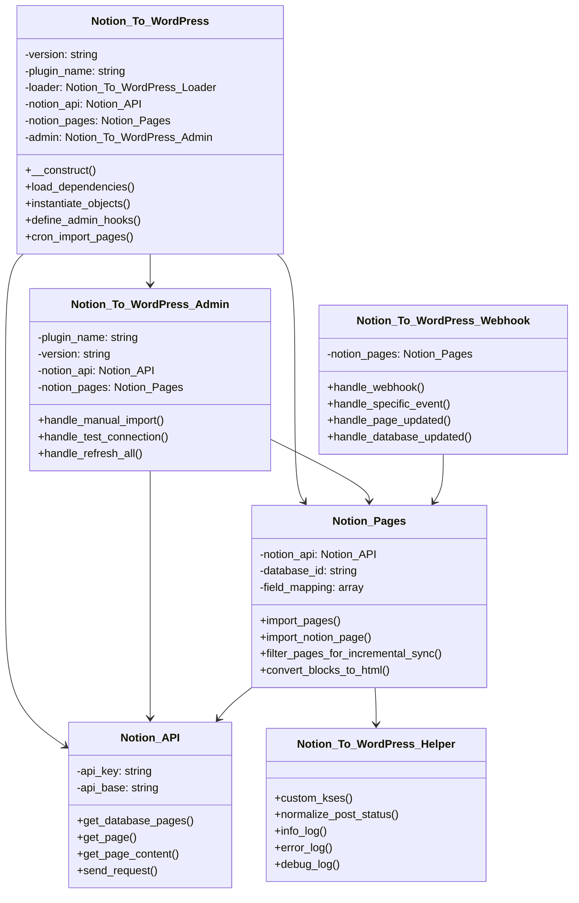
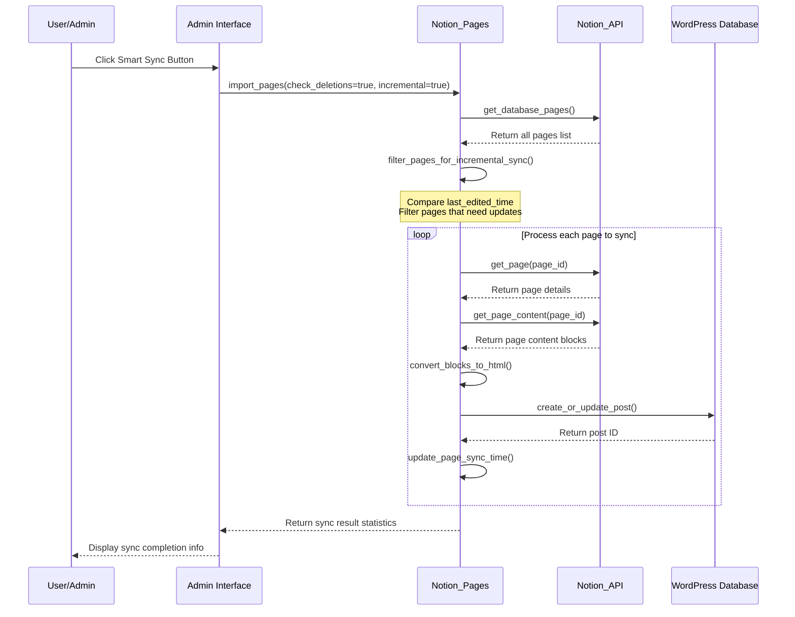
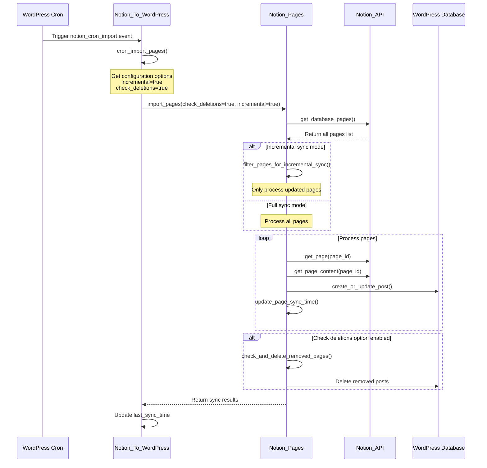
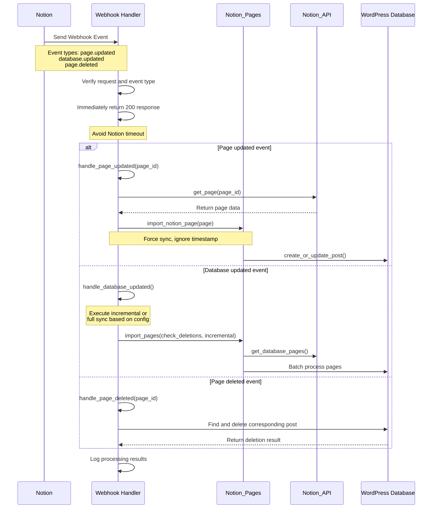

** [🏠 Home](../README.md) • [📚 User Guide](Wiki.md) • [📊 Project Overview](PROJECT_OVERVIEW.md) • **🚀 Developer Guide** • [🔄 Changelog](https://github.com/Frank-Loong/Notion-to-WordPress/commits)

**🌐 Language:** **English** • [中文](DEVELOPER_GUIDE-zh_CN.md)

---

# 🚀 Notion-to-WordPress Developer Guide

> **Professional WordPress Plugin Development, Contributing, and Release Complete Guide**

---

## 📋 Table of Contents

- [🚀 Quick Start](#-quick-start)
- [🛠️ Development Environment](#-development-environment)
- [🏗️ Project Architecture](#-project-architecture)
- [📝 Development Workflow](#-development-workflow)
- [🔧 Command Reference](#-command-reference)
- [🐛 Debug Guide](#-debug-guide)
- [🚀 Release Management](#-release-management)
- [📚 Best Practices](#-best-practices)
- [🤝 Contributing Guidelines](#-contributing-guidelines)
- [🔗 Resources](#-resources)

---

## 🚀 Quick Start

### ⚡ 5-Minute Setup

```bash
# 1. Clone project
git clone https://github.com/Frank-Loong/Notion-to-WordPress.git
cd Notion-to-WordPress

# 2. Install dependencies
npm install

# 3. Verify environment
npm run validate:config

# 4. Build test
npm run build

# 5. Check results
ls -la build/notion-to-wordpress-*.zip
```

### ✅ System Requirements

| Component | Minimum | Recommended |
|-----------|---------|-------------|
| Node.js | 16.0+ | 18.0+ |
| npm | 8.0+ | 9.0+ |
| Git | 2.0+ | Latest |
| PHP | 8.0+ | 8.1+ |
| WordPress | 6.0+ | Latest |

---

## 🛠️ Development Environment

### 🔧 IDE Configuration

#### VS Code Settings
```json
{
  "php.validate.executablePath": "/usr/bin/php",
  "editor.formatOnSave": true,
  "files.associations": {
    "*.php": "php"
  }
}
```

#### Git Configuration
```bash
git config core.autocrlf false
git config core.filemode false
git config pull.rebase true
```

### 🐳 WordPress Testing Environment

```bash
# Docker approach (recommended)
docker-compose up -d wordpress

# Local environment
# XAMPP, WAMP, MAMP, or Local by Flywheel
```

---

## 🏗️ Project Architecture

### 📁 Directory Structure

```
notion-to-wordpress/
├── admin/                  # Admin interface
├── includes/               # Core functionality classes
│   ├── class-notion-api.php
│   ├── class-notion-pages.php
│   └── class-notion-to-wordpress.php
├── scripts/                # Automation scripts
│   ├── build.js
│   ├── release.js
│   └── local-package.js
├── languages/              # Internationalization files
└── notion-to-wordpress.php # Plugin entry point
```

### 🔄 Core Class Relationship Diagram



### 🔄 Data Flow

```
Notion API → API Communication Layer → Data Transform → Sync Engine → WordPress Database
     ↑                                                        ↑
  Webhook Handler                                      Admin Interface Trigger
```

### 📊 Sync Process Sequence Diagrams

#### Smart Sync (Incremental Sync) Flow



#### Scheduled Sync (Cron Job) Flow



#### Webhook Real-time Sync Flow



---

## 📝 Development Workflow

### 🔄 Standard Workflow

```bash
# 1. Create feature branch
git checkout -b feature/your-feature

# 2. Development and testing
npm run build
npm run package:local:patch

# 3. Code checks
npm run validate:config
php -l notion-to-wordpress.php

# 4. Commit code
git add .
git commit -m "feat: add new feature"

# 5. Merge to main
git checkout main
git merge feature/your-feature
```

### 📋 Commit Conventions

```
<type>: <description>

Types:
- feat: New features
- fix: Bug fixes
- docs: Documentation updates
- style: Code formatting
- refactor: Refactoring
- test: Testing
- chore: Build tools
```

---

## 🔧 Command Reference

### 🏗️ Build Commands

| Command | Function | Purpose |
|---------|----------|---------|
| `npm run build` | Build production package | Pre-release build |
| `npm run validate:config` | Validate configuration | Environment check |
| `npm run validate:github-actions` | Validate CI configuration | Pre-release check |

### 📦 Local Packaging

| Command | Function | Version Change |
|---------|----------|----------------|
| `npm run package:local:patch` | Patch version | 1.2.0 → 1.2.1 |
| `npm run package:local:minor` | Minor version | 1.2.0 → 1.3.0 |
| `npm run package:local:major` | Major version | 1.2.0 → 2.0.0 |
| `npm run package:local:beta` | Beta version | 1.2.0 → 1.2.1-beta.1 |
| `npm run package:local:build-only` | Build only | No version update |
| `npm run package:local:help` | Show help | View options |

### 🚀 Release Commands

| Command | Function | Description |
|---------|----------|-------------|
| `npm run release:patch` | Patch release | Auto-release to GitHub |
| `npm run release:minor` | Minor release | Contains new features |
| `npm run release:major` | Major release | Breaking changes |
| `npm run release:beta` | Beta release | Pre-release version |
| `npm run test:release:patch` | Preview release | Safe preview mode |
| `npm run release:help` | Show help | View options |

### 🔍 Version Management

| Command | Function | Purpose |
|---------|----------|---------|
| `npm run version:bump` | Check version consistency | Diagnose version issues |
| `npm run version:bump:patch` | Patch version upgrade | Fix version inconsistency |
| `npm run version:bump:minor` | Minor version upgrade | Version management |
| `npm run version:bump:major` | Major version upgrade | Version management |
| `npm run version:bump:beta` | Beta version upgrade | Version management |
| `npm run version:bump:rollback` | Rollback version | Restore backup |

### 🧪 Testing Commands

| Command | Function | Purpose |
|---------|----------|---------|
| `npm run test:integration` | Integration testing | Comprehensive testing |
| `php -l *.php` | PHP syntax check | Code validation |
| `find includes/ -name "*.php" -exec php -l {} \;` | Batch syntax check | Full validation |

---

## 🐛 Debug Guide

### 🔍 Common Issues

#### Build Failures
```bash
# Check Node.js version
node --version  # Requires 18+

# Clean and reinstall
rm -rf node_modules package-lock.json
npm install

# Verify environment
npm run validate:config
```

#### Version Inconsistency
```bash
# Check versions
npm run version:bump

# Auto-fix
npm run version:bump:patch

# Manual check
grep -r "Version:" notion-to-wordpress.php
grep -r "version" package.json
```

#### Plugin Activation Failure
```bash
# PHP syntax check
php -l notion-to-wordpress.php

# Enable WordPress debug
# Add to wp-config.php:
# define('WP_DEBUG', true);
# define('WP_DEBUG_LOG', true);
```

### 🛠️ Debug Configuration

#### WordPress Debug
```php
// wp-config.php
define('WP_DEBUG', true);
define('WP_DEBUG_LOG', true);
define('WP_DEBUG_DISPLAY', false);
define('SCRIPT_DEBUG', true);
```

#### Performance Monitoring
```php
// Memory usage monitoring
$memory_before = memory_get_usage();
// ... code ...
$memory_after = memory_get_usage();
error_log('Memory used: ' . ($memory_after - $memory_before) . ' bytes');
```

---

## 🚀 Release Management

### 📋 Release Types

| Type | Version Change | Use Case |
|------|---------------|----------|
| Patch | 1.1.0 → 1.1.1 | Bug fixes, security patches |
| Minor | 1.1.0 → 1.2.0 | New features, backward compatible |
| Major | 1.1.0 → 2.0.0 | Breaking changes |
| Beta | 1.1.0 → 1.1.1-beta.1 | Pre-release testing |

### 🚀 Release Process

```bash
# 1. Pre-release checks
git status                    # Ensure clean working directory
npm run validate:config       # Validate configuration
npm run test:release:patch    # Preview release

# 2. Execute release
npm run release:patch         # Choose appropriate type

# 3. Post-release verification
# - Check GitHub Actions status
# - Verify GitHub Release page
# - Test downloaded ZIP package
```

### 🔧 Custom Versions

```bash
# Release candidates
npm run release:custom -- --version=1.3.0-rc.1

# Hotfix versions
npm run release:custom -- --version=1.2.1-hotfix.1

# Preview mode
npm run release:custom -- --version=1.3.0-rc.1 --dry-run
```

---

## 📚 Best Practices

### 🔒 Code Quality

#### PHP Code Standards
```php
<?php
/**
 * Example class demonstrating best practices
 */
class Notion_To_WordPress_Example {

    /**
     * Data processing method
     *
     * @param string $input Input parameter
     * @return array|WP_Error Processing result
     * @since 1.0.0
     */
    public function process_data( $input ) {
        // Input validation
        if ( empty( $input ) ) {
            return new WP_Error( 'invalid_input', 'Input cannot be empty' );
        }

        // Data sanitization
        $clean_input = sanitize_text_field( $input );

        // Processing logic
        $result = $this->transform_data( $clean_input );

        return $result;
    }
}
```

#### JavaScript Code Standards
```javascript
(function($) {
    'use strict';

    const NotionWordPress = {
        init: function() {
            this.bindEvents();
        },

        bindEvents: function() {
            $('.sync-button').on('click', this.handleSync.bind(this));
        },

        handleSync: function(event) {
            event.preventDefault();
            this.showLoading();

            $.ajax({
                url: ajaxurl,
                type: 'POST',
                data: {
                    action: 'notion_sync',
                    nonce: notion_ajax.nonce
                },
                success: this.handleSuccess.bind(this),
                error: this.handleError.bind(this)
            });
        }
    };

    $(document).ready(function() {
        NotionWordPress.init();
    });

})(jQuery);
```

### 🛡️ Security Standards

#### Data Validation
```php
// Input validation
$page_id = sanitize_text_field( $_POST['page_id'] );
if ( ! preg_match( '/^[a-f0-9-]{36}$/', $page_id ) ) {
    wp_die( 'Invalid page ID format' );
}

// Output escaping
echo '<h1>' . esc_html( $title ) . '</h1>';
echo '<a href="' . esc_url( $link ) . '">' . esc_html( $text ) . '</a>';

// Nonce verification
if ( ! wp_verify_nonce( $_POST['nonce'], 'notion_sync_action' ) ) {
    wp_die( 'Security verification failed' );
}
```

### ⚡ Performance Optimization

#### Caching Strategy
```php
// Use WordPress object cache
$cache_key = 'notion_pages_' . md5( $database_id );
$pages = wp_cache_get( $cache_key );

if ( false === $pages ) {
    $pages = $this->fetch_notion_pages( $database_id );
    wp_cache_set( $cache_key, $pages, '', HOUR_IN_SECONDS );
}
```

#### Database Optimization
```php
// Batch queries instead of loops
$post_ids = wp_list_pluck( $posts, 'ID' );
$meta_data = get_post_meta_batch( $post_ids, 'notion_id' );
```

---

## 🤝 Contributing Guidelines

### 📝 Contribution Types

| Type | Description | Submission Method |
|------|-------------|-------------------|
| 🐛 Bug Reports | Discover issues and provide detailed information | [GitHub Issues](https://github.com/Frank-Loong/Notion-to-WordPress/issues) |
| ✨ Feature Suggestions | Propose new feature ideas | [GitHub Discussions](https://github.com/Frank-Loong/Notion-to-WordPress/discussions) |
| 🔧 Code Contributions | Submit code fixes or new features | Pull Request |
| 📚 Documentation Improvements | Enhance documentation content | Pull Request |

### 🔄 Contribution Process

```bash
# 1. Fork the project
# Click Fork button on GitHub

# 2. Clone your fork
git clone https://github.com/YOUR_USERNAME/Notion-to-WordPress.git
cd Notion-to-WordPress

# 3. Create feature branch
git checkout -b feature/your-feature-name

# 4. Develop and test
npm run build
npm run package:local:patch

# 5. Commit changes
git add .
git commit -m "feat: add new feature description"

# 6. Push to your fork
git push origin feature/your-feature-name

# 7. Create Pull Request
# Create PR to main repository on GitHub
```

### ✅ Quality Requirements

- [ ] Follow WordPress coding standards
- [ ] Include complete PHPDoc comments
- [ ] Pass all existing tests
- [ ] Add test cases for new features
- [ ] Update relevant documentation

---

## 🔗 Resources

### 📚 Official Documentation
- [WordPress Plugin Development Handbook](https://developer.wordpress.org/plugins/)
- [WordPress Coding Standards](https://developer.wordpress.org/coding-standards/)
- [Notion API Documentation](https://developers.notion.com/)
- [Semantic Versioning Specification](https://semver.org/)

### 🛠️ Development Tools
- [WordPress CLI](https://wp-cli.org/) - WordPress command-line tool
- [PHPStan](https://phpstan.org/) - PHP static analysis
- [PHP_CodeSniffer](https://github.com/squizlabs/PHP_CodeSniffer) - Code standards checker

### 🆘 Getting Help
- **General Questions**: [GitHub Discussions](https://github.com/Frank-Loong/Notion-to-WordPress/discussions)
- **Bug Reports**: [GitHub Issues](https://github.com/Frank-Loong/Notion-to-WordPress/issues)
- **Security Issues**: Contact maintainers directly

---

**Thank you for contributing to the Notion-to-WordPress project! 🚀**

*Together, we're building the most advanced Notion-to-WordPress integration available.*

---

<div align="center">

**[⬆️ Back to Top](#-notion-to-wordpress-developer-guide) • [🏠 Home](../README.md) • [📚 User Guide](Wiki.md) • [📊 Project Overview](PROJECT_OVERVIEW.md) • [🇨🇳 中文版](DEVELOPER_GUIDE-zh_CN.md)**

</div>
