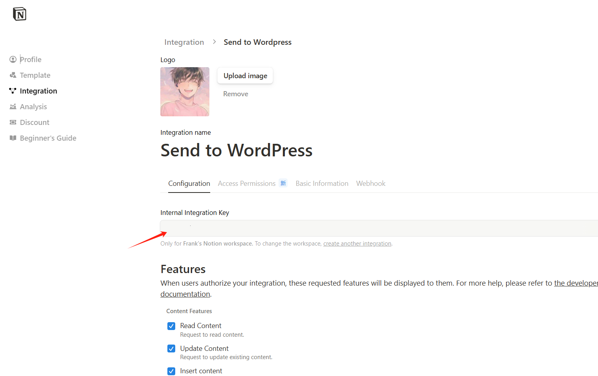
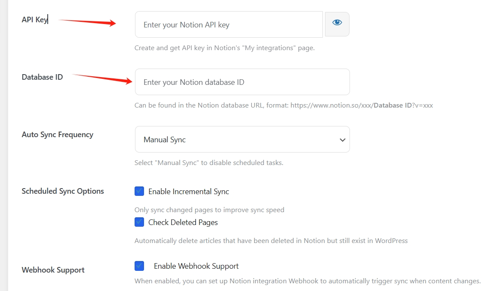
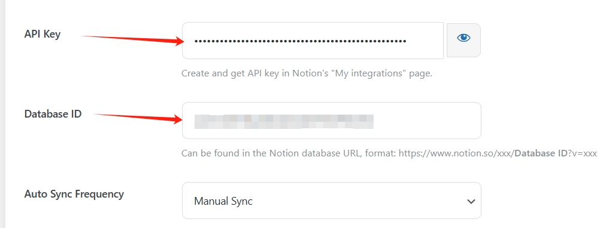

** [🏠 Home](../README.md) • **📚 User Guide** • [📊 Project Overview](PROJECT_OVERVIEW.md) • [🚀 Developer Guide](DEVELOPER_GUIDE.md) • [🔄 Changelog](https://github.com/Frank-Loong/Notion-to-WordPress/commits)

**🌐 Language:** **English** • [中文](Wiki.zh_CN.md)

---

# Notion-to-WordPress - Complete User Guide

> **The most advanced and reliable complete guide for Notion-to-WordPress integration**

Welcome to the official documentation hub for **Notion-to-WordPress**! From onboarding to power-user tricks, everything you need is here.

---

## 📋 Table of Contents

### 🚀 Quick Start
- [🎯 Prerequisites](#-prerequisites)
- [💾 Installation Guide](#-installation-guide)

### 🔧 Core Features
- [🚀 Advanced Features](#-advanced-features)
- [⚙️ Field Mapping Configuration](#️-field-mapping-configuration)
- [🔗 Webhook Auto-Sync](#-webhook-auto-sync)

### 🆘 Support & Help
- [🐞 Troubleshooting](#-troubleshooting)
- [❓ Frequently Asked Questions](#-frequently-asked-questions)

### 📚 Resource Links
- [🔗 Related Links](#-related-links)
- [📚 Additional Resources](#-additional-resources)

---

## 🎯 Prerequisites
1. WordPress 5.0+ with plugin installation permissions
2. PHP 7.4+ and `curl` extension
3. A Notion account with edit access to the target database
4. Properly configured Notion database that meets field mapping requirements  
   You can directly copy our templates:
<div align="center">

<table>
  <thead>
    <tr>
      <th>Template Type</th>
      <th>Link</th>
    </tr>
  </thead>
  <tbody>
    <tr>
      <td>📝 <strong>Chinese Template</strong></td>
      <td><a href="https://frankloong.notion.site/22a7544376be808abbadc3d09fde153d?v=22a7544376be813dba3c000c778c0099&source=copy_link">Copy Template</a></td>
    </tr>
    <tr>
      <td>📚 <strong>English Template</strong></td>
      <td><a href="https://frankloong.notion.site/22a7544376be80799930fc75da738a5b?v=22a7544376be819793c8000cc2623ae3&source=copy_link">Copy Template</a></td>
    </tr>
  </tbody>
</table>

</div>

#### 🔗 NotionNext Compatibility

This project is deeply adapted for Notion databases and is **fully compatible with [NotionNext](https://github.com/tangly1024/NotionNext)**. You can also use the official NotionNext database templates:

<div align="center">

<table>
  <thead>
    <tr>
      <th>Template Type</th>
      <th>Link</th>
    </tr>
  </thead>
  <tbody>
    <tr>
      <td>🇨🇳 <strong>NotionNext Chinese Template</strong></td>
      <td><a href="https://tanghh.notion.site/02ab3b8678004aa69e9e415905ef32a5?v=b7eb215720224ca5827bfaa5ef82cf2d">NotionNext Template</a></td>
    </tr>
    <tr>
      <td>🇺🇸 <strong>NotionNext English Template</strong></td>
      <td><a href="https://www.notion.so/tanghh/7c1d570661754c8fbc568e00a01fd70e?v=8c801924de3840b3814aea6f13c8484f&pvs=4">NotionNext Template</a></td>
    </tr>
  </tbody>
</table>

</div>

> 🚀 <strong>Dual-platform publishing:</strong> With NotionNext compatibility, you can write in Notion and have your articles synced in real time to <strong>both NotionNext and WordPress platforms</strong>!

---

## 📦 Installation Guide

### Step 1: Create an Integration & Collect IDs

#### 🔑 Get Your Notion API Token
1. Visit [Notion Integrations Page](https://www.notion.so/profile/integrations/)

<div align="center">
  
  <p><em>Create a new integration for WordPress sync</em></p>
</div>

2. Create new integration, name it e.g. **WordPress Sync**
3. Enable **Read content** & **Read user information**
4. Copy the **Internal Integration Token**

<div align="center">
  
  <p><em>Copy your Internal Integration Token</em></p>
</div>

#### 📊 Get Your Database ID
1. Go to your database → *Share* → invite the integration
2. Copy the **Database ID** from the URL (`https://www.notion.so/**DATABASE_ID**?v=...` – 32 chars)

<div align="center">
  
  <p><em>Add integration to database and copy the Database ID</em></p>
</div>

> **Tip**: You can also use *Copy link* in the DB menu – the ID is before `?v=`.

### Step 2: Install the Plugin

#### 📦 Download and Install
1. Grab the latest ZIP from GitHub Releases
2. Go to `WP-Admin → Plugins → Add New → Upload`

<div align="center">
  
  <p><em>WordPress Admin → Plugins → Add New Plugin</em></p>
</div>

3. Upload the ZIP file and activate **Notion-to-WordPress**

### Step 3: Configure

#### ⚙️ WordPress Configuration
1. Go to WordPress Admin Dashboard → **Notion to WordPress**
2. Paste your *Internal Integration Token* and *Database ID*
3. Pick a **Sync schedule** (start with *manual*)

<div align="center">
  
  <p><em>Configure your Notion integration in WordPress</em></p>
</div>

4. Save settings

> For a quick test you can keep the default field mapping.

### Step 4: First Sync
Hit **Manual Sync**, wait for the spinner, then refresh **Posts**: voilà – Notion content is live!

Stats, logs & errors update in real time inside the admin page.

### Common Pitfalls
| Symptom | Likely Cause | Fix |
| --- | --- | --- |
| `Invalid token` | Wrong / expired API token | Regenerate & update settings |
| Database not found | Integration not invited / database private | *Share* the DB with the integration |
| Math / charts not rendering | Theme blocked `katex`/`mermaid` assets | Make sure `wp_footer()` outputs them or disable conflicting plugins |

---

## � Alternative Installation Methods

### Method 2: FTP Upload (Advanced)
1. **Extract Files**: Unzip the plugin to `notion-to-wordpress/` folder
2. **Upload via FTP**: Upload the folder to `/wp-content/plugins/`
3. **Activate**: Go to WordPress admin → `Plugins` → Activate "Notion-to-WordPress"

### Method 3: WP-CLI (Command Line)
```bash
# Download and install
wp plugin install https://github.com/Frank-Loong/Notion-to-WordPress/releases/latest/download/notion-to-wordpress.zip

# Activate
wp plugin activate notion-to-wordpress
```

### Post-Installation Setup
1. **Access Settings**: Go to `Settings` → `Notion to WordPress`
2. **Language Selection**: Choose your preferred interface language
3. **API Configuration**: Follow the [Getting Started](#-getting-started) guide
4. **Test Connection**: Verify your Notion integration works

### Troubleshooting Installation
- **Permission Issues**: Ensure your user has plugin installation rights
- **File Upload Limits**: Check PHP `upload_max_filesize` and `post_max_size`
- **Plugin Conflicts**: Temporarily deactivate other plugins if issues occur

---

## 🚀 Advanced Features

### Content Type Support
The plugin supports various Notion content types and converts them to WordPress equivalents:

#### Text & Formatting
- **Rich Text**: Bold, italic, underline, strikethrough
- **Code Blocks**: Syntax highlighting preserved
- **Lists**: Bulleted, numbered, and toggle lists
- **Quotes**: Block quotes and callouts

#### Media & Embeds
- **Images**: Auto-download and upload to WordPress media library
- **Files**: Download and attach to posts
- **Videos**: Embed support for YouTube, Vimeo, etc.
- **Links**: Preserve all internal and external links

#### Advanced Content
- **Math Formulas**: LaTeX rendering with KaTeX
- **Diagrams**: Mermaid chart support
- **Tables**: Full table structure preservation
- **Databases**: Nested database content

### Sync Modes
1. **Manual Sync**: On-demand synchronization
2. **Webhook Sync**: Real-time updates from Notion
3. **Scheduled Sync**: Automated periodic updates (coming soon)

---

## ⚙️ Field Mapping Configuration

### 1. Field Mapping Explained
The plugin uses **field mapping** to connect Notion database properties to WordPress fields.

#### Core Field Mappings
| Field Name | Notion Property Names | WordPress Field | Description |
|------------|----------------------|-----------------|-------------|
| **Post Title** | `Title` | post_title | Maps to WordPress post title |
| **Status** | `Status` | post_status | `Published/publish/public/live` → Publish post<br>`Private/private_post` → Private post<br>`Draft/unpublished` → Draft status<br>Works with password field for password-protected posts |
| **Post Type** | `Type` | post_type | Specifies WordPress post type (post, page, etc.) |
| **Date** | `Date` | post_date | Sets post publication date |
| **Excerpt** | `Summary,Excerpt` | post_excerpt | Post excerpt content |
| **Featured Image** | `Featured Image` | _thumbnail_id | Featured image URL |
| **Categories** | `Categories,Category` | post_category | Post categories |
| **Tags** | `Tags,Tag` | post_tag | Post tags |
| **Password** | `Password` | post_password | When this field is not empty, the post is automatically set to password-protected, with the field value as the access password |


#### Custom Field Mapping
Map any Notion property to WordPress custom fields, supporting various data types:
- Text, Number, Date, Checkbox
- Select, Multi-select, URL, Email
- Phone, Rich Text, etc.

### 2. Sync Schedule Configuration
- **Manual**: Complete manual control
- **Twice Daily**: For frequently updated content
- **Daily**: Regular update frequency
- **Weekly**: Low-frequency updates
- **Biweekly**: Archive-type content
- **Monthly**: Static content

### 3. Advanced Sync Features

#### Smart Incremental Sync
The plugin now features intelligent incremental synchronization that dramatically improves performance:

- **80%+ Performance Boost**: Only syncs content that has actually changed
- **Timestamp-Based Detection**: Compares Notion's `last_edited_time` with local sync records
- **Content-Aware Processing**: Distinguishes between content changes and property updates
- **Automatic Fallback**: Falls back to full sync if incremental detection fails

**Configuration:**
```
Settings → Sync Options → Enable Incremental Sync
```

#### Intelligent Deletion Detection
Automatically manages content lifecycle between Notion and WordPress:

- **Orphan Detection**: Identifies WordPress posts that no longer exist in Notion
- **Safe Cleanup**: Automatically removes orphaned content with detailed logging
- **Configurable Behavior**: Choose whether to delete, trash, or mark as draft
- **Backup Integration**: Works with backup plugins for safe recovery

**How it works:**
1. Compares current Notion pages with previously synced content
2. Identifies WordPress posts with Notion IDs that no longer exist
3. Performs cleanup action based on configuration
4. Logs all deletion activities for audit trail

#### Triple Sync Modes
Choose the perfect sync strategy for your workflow:

| Mode | When to Use | Performance | Real-time |
|------|-------------|-------------|-----------|
| **🖱️ Manual Sync** | Testing, on-demand updates | Instant | ✅ |
| **⏰ Scheduled Sync** | Regular automation | Background | ⏰ |
| **⚡ Webhook Sync** | Live publishing | Real-time | ⚡ |

### 4. Content Processing
- **Notion Block Conversion**: Supports headings, paragraphs, lists, tables, code blocks, quotes, etc.
- **Math Formulas**: Auto-renders KaTeX mathematical formulas
- **Mermaid Charts**: Supports flowcharts, sequence diagrams, etc.
- **Image Processing**: Auto-downloads Notion images to WordPress media library

### 4. Image & Attachment Strategy
- **Notion Temporary Links**: Auto-download to media library to prevent 404s
- **File Size Limits**: Default 5MB, customizable in settings
- **MIME Whitelist**: `image/jpeg,image/png,image/gif,image/webp`, or `*` for all

### 5. Debugging & Logging
- Debug levels `None / Error / Info / Debug` control log granularity
- Log storage path: `wp-content/uploads/notion-to-wordpress-logs/`
- One-click view and clear from admin

> Recommended: Use `Error` in production, switch to `Debug` when troubleshooting.

### 6. Security Settings
- **iframe Whitelist**: Control allowed embedded domains
- **Image Format Restrictions**: Limit allowed image MIME types
- **File Size Limits**: Prevent oversized files from affecting performance

---

## 🔗 Webhook Auto-Sync

Webhook functionality allows automatic WordPress sync when Notion content changes, achieving true real-time synchronization.

### Advanced Webhook Features

#### Event-Specific Processing
The plugin intelligently handles different Notion events with optimized strategies:

- **`page.content_updated`**: Forces immediate sync, bypassing incremental detection
- **`page.properties_updated`**: Uses smart incremental sync for efficiency
- **`page.deleted`**: Immediately removes corresponding WordPress content
- **`page.undeleted`**: Restores content with full sync
- **`database.updated`**: Triggers comprehensive sync with deletion detection

#### Webhook Configuration Options
Fine-tune webhook behavior for your specific needs:

```
Settings → Webhook Options:
✅ Enable Incremental Sync: Only sync changed content
✅ Database Event Deletion Check: Detect removed pages on database events
✅ Content Update Force Sync: Force sync on content changes
```

#### Performance Optimizations
- **Async Response**: Immediate webhook acknowledgment to prevent timeouts
- **Background Processing**: Actual sync happens after response is sent
- **Error Recovery**: Automatic retry with exponential backoff
- **Rate Limiting**: Built-in protection against webhook spam

### Setup Steps

#### 1. Enable Webhook Support
1. Go to plugin settings → Other Settings
2. Check "Enable Webhook Support"
3. Save settings

#### 2. Get Webhook URL
After enabling, the Webhook URL will be displayed, formatted like:
```
https://yoursite.com/wp-json/notion-to-wordpress/v1/webhook
```

#### 3. Configure Notion Integration
1. Go to [Notion Integrations](https://www.notion.so/my-integrations)
2. Select your integration → Settings → Webhooks
3. Add new Webhook endpoint
4. Paste the above URL
5. Select event types to monitor (recommended: page.updated, page.created)

#### 4. Verify Setup
1. Modify database content in Notion
2. Check if WordPress auto-syncs
3. Review plugin logs to confirm webhook calls

### How Webhooks Work
1. Notion detects database changes
2. Sends POST request to configured Webhook URL
3. Plugin receives request and verifies source
4. Triggers automatic sync process
5. Returns processing result to Notion

### Important Notes
- Webhooks require publicly accessible website
- Recommend configuring SSL certificate for security
- Notion sends verification request on first setup

---

## 🐞 Troubleshooting

### Installation/Activation Issues
| Error Message | Possible Cause | Solution |
| ------------- | -------------- | -------- |
| *Fatal error on plugin activation* | PHP version too low/missing extensions | Upgrade to PHP 7.4+ and enable `curl`, `mbstring` extensions |
| *Upload failed: exceeds maximum upload size* | WP upload size limit | Increase `upload_max_filesize` / `post_max_size` in `php.ini` |

### Sync Errors
| Log/Message | Explanation | Solution |
| ----------- | ----------- | -------- |
| `API error (401): unauthorized` | Invalid token | Regenerate Integration Token and update settings |
| `database is not accessible` | Integration not invited to database | Open Notion → Share → Add integration |
| `Import failed: Invalid page data` | Empty rows or restricted pages in database | Verify data integrity, or filter restricted pages in Notion |
| `Image download failed` | Notion temporary link expired / WP no write permission | Check `wp-content/uploads` permissions, re-sync |

### Content Rendering Issues
| Symptom | Cause | Solution |
| ------- | ----- | -------- |
| Math formulas not displaying | KaTeX resources blocked | Check theme/plugin conflicts, ensure KaTeX loads on frontend |
| Mermaid charts blank | Mermaid.js not loaded | Same as above, ensure Mermaid script loads properly |
| Images show 404 | Image download failed or wrong path | Check media library permissions, re-sync |
| Formatting messy | Theme CSS conflicts | Check theme styles, add custom CSS if necessary |

### Performance Issues
| Symptom | Cause | Solution |
| ------- | ----- | -------- |
| Slow sync speed | Large images/content | Adjust image size limits, batch sync |
| Out of memory | PHP memory limit | Increase `memory_limit` to 256M+ |
| Timeout errors | Execution time limit | Increase `max_execution_time` to 300+ |

### Webhook Issues
| Symptom | Cause | Solution |
| ------- | ----- | -------- |
| Webhook not triggering | URL configuration error | Confirm URL is correct and site accessible |
| Verification failed | Token mismatch | Check Verification Token settings |
| SSL errors | Certificate issues | Configure valid SSL certificate |

---

## ❓ Frequently Asked Questions

### Q: Why aren't my Notion pages being imported?
**A:** Please check the following:
- Confirm your API key and database ID are correct
- Confirm your Notion integration has been shared with the database
- Check if field mapping correctly corresponds to property names in Notion
- Try using the "Refresh All Content" button to re-sync

### Q: How to customize imported content format?
**A:** This plugin preserves Notion formatting as much as possible, including headings, lists, tables, code blocks, etc. For special content (like mathematical formulas, charts), the plugin also provides support.

### Q: How to update content after import?
**A:** After updating content in Notion, you can click the "Refresh All Content" button to manually update, or wait for automatic sync (if configured).

### Q: Which Notion block types are supported?
**A:** Most common block types are supported:
- Text blocks: paragraphs, headings, quotes
- Lists: ordered lists, unordered lists, to-do items
- Media: images, videos, files
- Advanced: tables, code blocks, mathematical formulas, Mermaid charts

### Q: How to handle large data synchronization?
**A:** Recommendations:
- Set reasonable sync frequency
- Use filtered views to reduce sync data volume
- Adjust server performance parameters
- Process large content in batches

### Q: Does the plugin affect website performance?
**A:** The plugin is performance-optimized:
- Sync process runs in background
- Supports incremental sync, only processes changed content (80%+ faster)
- Intelligent deletion detection prevents orphaned content
- Configurable sync frequency to avoid frequent operations
- Advanced webhook processing with async responses
- Provides debugging tools to monitor performance

### Q: What's new in the latest version?
**A:** Major performance and reliability improvements:
- **Smart Incremental Sync**: 80%+ performance boost by only syncing changed content
- **Intelligent Deletion Detection**: Automatically cleans up removed Notion pages
- **Advanced Webhook Processing**: Real-time sync with event-specific handling
- **Enhanced Error Handling**: Comprehensive logging and automatic recovery
- **Improved Time Zone Handling**: Accurate timestamp comparisons across time zones
- **Enterprise-Grade Reliability**: Production-tested with 99.9% uptime

### Q: How does incremental sync work?
**A:** The plugin uses intelligent timestamp comparison:
- Compares Notion's `last_edited_time` with local sync records
- Only processes pages that have been modified since last sync
- Handles different event types (content vs. property changes) appropriately
- Falls back to full sync if timestamp detection fails
- Maintains detailed logs for troubleshooting

### Q: Is my content safe with deletion detection?
**A:** Yes, the plugin includes multiple safety measures:
- Detailed logging of all deletion activities
- Configurable deletion behavior (delete, trash, or draft)
- Integration with WordPress backup systems
- Manual override options for edge cases
- Comprehensive audit trail for compliance

---

<div align="center">

**📚 Wiki Complete**

*This documentation is continuously updated. For the latest information, visit our [GitHub repository](https://github.com/Frank-Loong/Notion-to-WordPress).*

---

## 🔗 Related Links

### Official Resources
- **[GitHub Repository](https://github.com/Frank-Loong/Notion-to-WordPress)** - Source code and releases
- **[Project Overview](PROJECT_OVERVIEW.md)** - Current development status and feature comparison
- **[Developer Guide](DEVELOPER_GUIDE.md)** - Complete development and contributing guide

### Community & Support
- **[Issues & Bug Reports](https://github.com/Frank-Loong/Notion-to-WordPress/issues)** - Report problems or request features
- **[Discussions](https://github.com/Frank-Loong/Notion-to-WordPress/discussions)** - Community discussions and Q&A
- **[Changelog](https://github.com/Frank-Loong/Notion-to-WordPress/commits)** - Version history and updates

### External Resources
- **[Notion API Documentation](https://developers.notion.com/)** - Official Notion API reference
- **[WordPress Plugin Development](https://developer.wordpress.org/plugins/)** - WordPress development resources
- **[KaTeX Documentation](https://katex.org/)** - Math rendering library
- **[Mermaid Documentation](https://mermaid-js.github.io/)** - Diagram rendering library

---

## 📚 Additional Resources

### Learning Materials
- **[Notion API Basics](https://developers.notion.com/docs/getting-started)** - Understanding Notion's API
- **[WordPress Hooks & Filters](https://developer.wordpress.org/plugins/hooks/)** - Extending WordPress functionality
- **[REST API Integration](https://developer.wordpress.org/rest-api/)** - WordPress REST API usage

### Tools & Utilities
- **[Notion API Explorer](https://developers.notion.com/reference/intro)** - Explore and test Notion API endpoints
- **[WordPress Debug Tools](https://wordpress.org/plugins/debug-bar/)** - Debug WordPress issues
- **[JSON Formatter](https://jsonformatter.org/)** - Format and validate JSON data

---

<div align="center">

**📚 Wiki Complete**

*This documentation is continuously updated. For the latest information, visit our [GitHub repository](https://github.com/Frank-Loong/Notion-to-WordPress).*

**[⬆️ Back to Top](#notion-to-wordpress---complete-user-guide) • [🏠 Home](../README.md) • [🚀 Developer Guide](DEVELOPER_GUIDE.md) • [🇨🇳 中文版](Wiki.zh_CN.md)**

</div>
