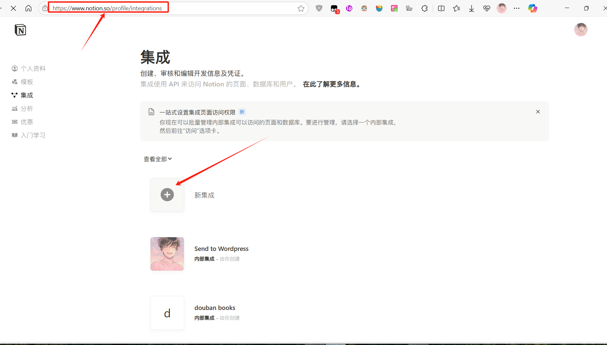
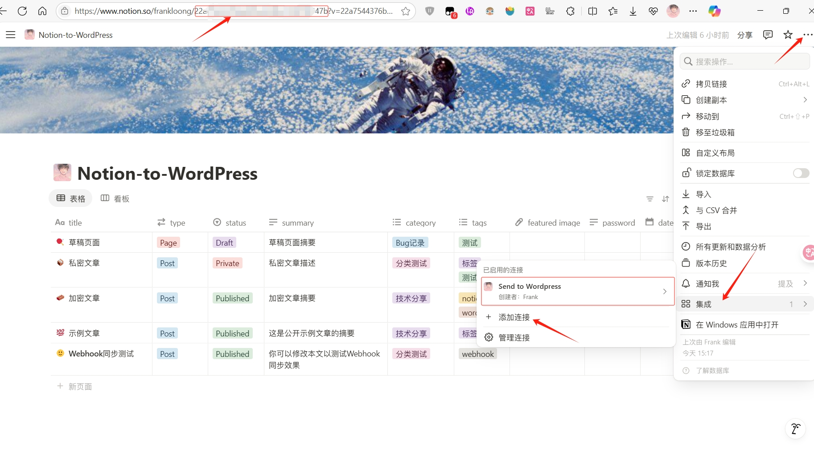
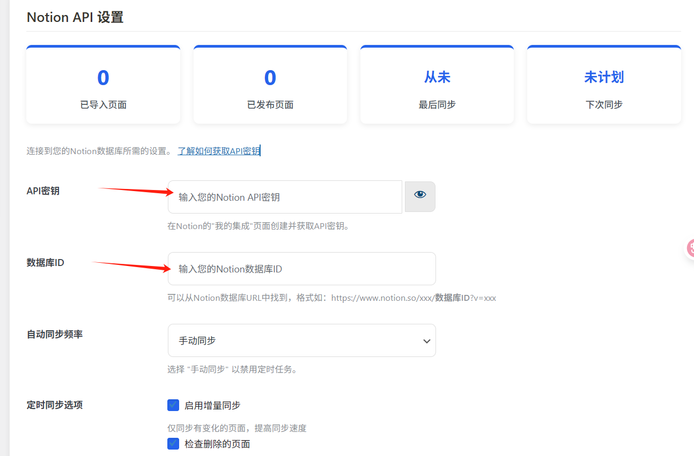

** [🏠 主页](../README-zh_CN.md) • **📚 用户指南** • [📊 项目概览](PROJECT_OVERVIEW-zh_CN.md) • [🚀 开发者指南](DEVELOPER_GUIDE-zh_CN.md) • [🔄 更新日志](https://github.com/Frank-Loong/Notion-to-WordPress/commits)

**🌐 语言：** [English](Wiki.md) • **中文**

---

# 📚 Notion to WordPress - 用户指南

> **最先进、最可靠的 Notion-to-WordPress 集成解决方案 - 从零到专家的完整教程**

欢迎来到 **Notion to WordPress** 官方文档中心！本指南将带你从零开始，逐步掌握这个强大的集成工具，实现 Notion 与 WordPress 之间的无缝同步。

---

## 📋 完整目录导航

### 🚀 第一部分：快速上手（新手必读）
- [🎯 环境要求与准备](#-环境要求与准备)
- [📦 完整安装指南](#-完整安装指南)
- [⚙️ 基础配置设置](#️-基础配置设置)
- [🎉 首次同步验证](#-首次同步验证)

### 🔧 第二部分：深入使用（进阶功能）
- [🎛️ 高级配置选项](#️-高级配置选项)
- [⚡ 三种同步模式详解](#-三种同步模式详解)
- [🎨 内容处理与转换](#-内容处理与转换)
- [🔒 安全与性能优化](#-安全与性能优化)

### 🆘 第三部分：问题解决（支持帮助）
- [❓ 常见问题解答](#-常见问题解答)
- [🐞 系统化故障排查](#-系统化故障排查)
- [📝 使用最佳实践](#-使用最佳实践)

### 📚 第四部分：资源与扩展
- [🔗 官方资源链接](#-官方资源链接)
- [📖 进阶学习资料](#-进阶学习资料)
- [🤝 社区与支持](#-社区与支持)

---

# 🚀 第一部分：快速上手（新手必读）

## 🎯 环境要求与准备

在开始使用 Notion to WordPress 插件之前，请确保你的环境满足以下要求。我们提供了详细的检查清单，帮助你快速验证和准备环境。

### 📋 系统要求检查清单

#### ✅ WordPress 环境要求
- **WordPress 版本：** 5.0 或更高版本
- **用户权限：** 管理员权限（能够安装和激活插件）
- **主题兼容性：** 支持标准 WordPress 钩子的主题
- **必需插件：** 无特殊要求，与大多数插件兼容

> **💡 如何检查：** 进入 WordPress 后台 → 仪表盘 → 概览，查看 WordPress 版本信息

#### ✅ 服务器环境要求
- **PHP 版本：** 7.4 或更高版本（推荐 8.0+）
- **必需扩展：** `curl`, `mbstring`, `json`, `openssl`
- **内存限制：** 最低 128MB（推荐 256MB+）
- **执行时间：** 最低 60 秒（推荐 300 秒+）
- **上传限制：** 最低 10MB（推荐 50MB+）

> **💡 如何检查：** 使用插件如 "Site Health Status" 或在 WordPress 后台 → 工具 → 站点健康

#### ✅ Notion 账号要求
- **账号类型：** 个人或团队账号均可
- **权限要求：** 能够创建集成和编辑目标数据库
- **数据库访问：** 对同步数据库具有完整编辑权限

### 🗄️ Notion 数据库准备

为了确保同步效果最佳，你需要准备一个符合要求的 Notion 数据库。我们提供了多种模板选择：

#### 🎯 官方推荐模板

<div align="center">

| 模板类型 | 特点 | 链接 | 推荐场景 |
|---------|------|------|----------|
| 📝 **中文博客模板** | 完整字段配置，中文优化 | [复制模板](https://frankloong.notion.site/22a7544376be808abbadc3d09fde153d?v=22a7544376be813dba3c000c778c0099&source=copy_link) | 中文博客、个人网站 |
| 📚 **English Blog Template** | 英文环境优化，国际化支持 | [Copy Template](https://frankloong.notion.site/22a7544376be80799930fc75da738a5b?v=22a7544376be819793c8000cc2623ae3&source=copy_link) | 英文博客、国际网站 |

</div>

#### 🔗 NotionNext 生态兼容

**🎉 重大特性：双平台发布能力**

本插件与 [NotionNext](https://github.com/tangly1024/NotionNext) 完全兼容，实现真正的"一次写作，多平台发布"：

<div align="center">

| 平台组合 | 模板链接 | 适用场景 |
|---------|----------|----------|
| 🇨🇳 **NotionNext + WordPress 中文** | [NotionNext 中文模板](https://tanghh.notion.site/02ab3b8678004aa69e9e415905ef32a5?v=b7eb215720224ca5827bfaa5ef82cf2d) | 中文技术博客、知识分享 |
| 🇺🇸 **NotionNext + WordPress English** | [NotionNext English Template](https://www.notion.so/tanghh/7c1d570661754c8fbc568e00a01fd70e?v=8c801924de3840b3814aea6f13c8484f&pvs=4) | 国际化内容发布 |

</div>

> **🚀 双平台发布优势：**
> - ✅ **统一内容管理：** 在 Notion 中统一管理所有内容
> - ✅ **自动同步：** 内容自动同步到 NotionNext 和 WordPress
> - ✅ **SEO 优化：** 两个平台都能获得搜索引擎收录
> - ✅ **受众覆盖：** 覆盖不同平台的用户群体

### 🔍 环境检查工具

在继续之前，建议使用以下方法验证你的环境：

```bash
# 检查 PHP 版本和扩展
php -v
php -m | grep -E "(curl|mbstring|json|openssl)"

# 检查 WordPress 版本（在 WordPress 根目录执行）
wp core version
```

**✅ 准备完成检查清单：**
- [ ] WordPress 版本 ≥ 5.0
- [ ] PHP 版本 ≥ 7.4，包含必需扩展
- [ ] 拥有 WordPress 管理员权限
- [ ] 拥有 Notion 账号和数据库编辑权限
- [ ] 已选择并复制合适的数据库模板

---

## 📦 完整安装指南

本章节将指导你完成从 Notion 配置到 WordPress 插件安装的全部流程。整个过程大约需要 10-15 分钟。

### 🔧 第一步：配置 Notion 集成

#### 🔑 创建 Notion 集成并获取 API 密钥

**1. 访问 Notion 集成管理页面**
- 打开 [Notion 集成页面](https://www.notion.so/profile/integrations/)
- 使用你的 Notion 账号登录

<div align="center">
  
  <p><em>Notion 集成管理界面</em></p>
</div>

**2. 创建新的集成**
- 点击 "**+ New integration**" 按钮
- 填写集成信息：
  - **Name（名称）：** `WordPress 同步` 或 `WordPress Sync`，也可自定义
  - **Logo（图标）：** 可选，上传自定义图标
  - **Associated workspace（关联工作区）：** 选择包含目标数据库的工作区

**3. 配置集成权限**
- ✅ **Read content（读取内容）** - 必需，用于读取页面内容
- ✅ **Read user information（读取用户信息）** - 推荐，用于获取作者信息
- ❌ **Update content（更新内容）** - 不需要，插件只读取不修改
- ❌ **Insert content（插入内容）** - 不需要

**4. 保存并获取密钥**
- 点击 "**Submit**" 保存集成
- 在集成详情页面，复制 "**Internal Integration Token**"
- ⚠️ **重要：** 请妥善保存此密钥，后续配置需要使用

<div align="center">
  
  <p><em>复制并保存你的内部集成秘钥</em></p>
</div>

#### 📊 获取数据库 ID 并配置权限

**1. 找到目标数据库**
- 打开你要同步的 Notion 数据库页面
- 确保数据库包含必要的属性（标题、状态等）

**2. 添加集成到数据库**
- 在数据库页面点击右上角的 "**三个点**" 按钮
- 在弹出窗口中点击 "**集成**"
- 搜索并选择刚才创建的集成（如 "WordPress 同步"）
- 点击 "**添加连接**" 完成添加

<div align="center">
  
  <p><em>将集成连接到数据库并复制数据库ID</em></p>
</div>

**3. 获取数据库 ID**
- 在数据库页面的浏览器地址栏中找到 URL
- 数据库 ID 是 URL 中的 32 位字符串：`https://www.notion.so/数据库ID?v=...`
- 复制这个 32 位字符串（不包含 `?v=` 及其后面的内容）

> **💡 快速获取技巧：**
> - 方法1：在数据库页面点击右上角 "**⋯**" → "**Copy link**"，从链接中提取 ID
> - 方法2：直接从浏览器地址栏复制 URL 中的 ID 部分

**✅ 第一步完成检查：**
- [ ] 已创建 Notion 集成并获得 API 密钥
- [ ] 已将集成邀请到目标数据库
- [ ] 已获取 32 位数据库 ID
- [ ] API 密钥和数据库 ID 已安全保存

### 🔌 第二步：安装 WordPress 插件

#### 📦 方法一：WordPress 后台安装（推荐）

**1. 下载插件文件**
- 访问 [GitHub Releases 页面](https://github.com/Frank-Loong/Notion-to-WordPress/releases)
- 下载最新版本的 `notion-to-wordpress.zip` 文件
- 确保下载的是 `.zip` 格式的插件包

**2. 上传并安装插件**
- 登录 WordPress 管理后台
- 进入 `插件` → `添加新插件` → `上传插件`

<div align="center">
  
  <p><em>WordPress 插件上传界面</em></p>
</div>

- 点击 "**选择文件**"，选择刚才下载的 `.zip` 文件
- 点击 "**立即安装**" 开始安装
- 安装完成后，点击 "**激活插件**"

**3. 验证安装**
- 在 WordPress 后台左侧菜单中查找 "**Notion to WordPress**"
- 如果看到该菜单项，说明插件安装成功

#### 🔧 方法二：FTP 上传（高级用户）

**适用场景：** 服务器限制文件上传或需要批量部署

**操作步骤：**
1. **解压插件文件**
   ```bash
   unzip notion-to-wordpress.zip
   ```

2. **上传到服务器**
   - 使用 FTP 客户端连接服务器
   - 将解压后的 `notion-to-wordpress/` 文件夹上传到 `/wp-content/plugins/` 目录

3. **激活插件**
   - 进入 WordPress 管理后台 → `插件`
   - 找到 "Notion-to-WordPress" 并点击 "**激活**"

#### ⚡ 方法三：WP-CLI 命令行（开发者）

**适用场景：** 服务器管理、批量部署、自动化脚本

```bash
# 下载并安装最新版本
wp plugin install https://github.com/Frank-Loong/Notion-to-WordPress/releases/latest/download/notion-to-wordpress.zip

# 激活插件
wp plugin activate notion-to-wordpress

# 验证安装（可选）
wp plugin list | grep notion-to-wordpress
```

**✅ 第二步完成检查：**
- [ ] 插件文件已成功下载
- [ ] 插件已安装到 WordPress
- [ ] 插件已成功激活
- [ ] 在后台菜单中能看到 "Notion to WordPress" 选项

---

## ⚙️ 基础配置设置

### 🎛️ 第三步：WordPress 插件配置

#### 🔧 访问插件设置页面

**1. 进入设置界面**
- 在 WordPress 后台左侧菜单中点击 "**Notion to WordPress**"
- 或者进入 `设置` → `Notion to WordPress`

**2. 界面概览**
插件设置页面包含以下主要部分：
- **基本设置：** API 密钥和数据库配置
- **字段映射：** Notion 属性与 WordPress 字段的对应关系
- **同步选项：** 同步频率和行为设置
- **高级选项：** 调试、安全和性能设置

#### 🔑 配置 API 连接

**1. 填写基本信息**
- **Notion API Token（Notion API 密钥）：** 粘贴第一步获取的内部集成秘钥
- **Database ID（数据库 ID）：** 粘贴第一步获取的 32 位数据库 ID

<div align="center">
  
  <p><em>在 WordPress 中配置 Notion 集成信息</em></p>
</div>

**2. 测试连接**
- 填写完成后，点击 "**测试连接**" 按钮
- 如果显示 "✅ 连接成功"，说明配置正确
- 如果显示错误，请检查 API 密钥和数据库 ID 是否正确

#### 📋 基础字段映射（快速上手）

**对于新手用户，建议保持默认字段映射设置：**

| WordPress 字段 | Notion 属性名 | 说明 |
|---------------|--------------|------|
| 文章标题 | `Title` 或 `标题` | 文章的主标题 |
| 发布状态 | `Status` 或 `状态` | 控制文章是否发布 |
| 文章类型 | `Type` 或 `类型` | 文章或页面类型 |
| 发布日期 | `Date` 或 `日期` | 文章发布时间 |

> **💡 提示：** 如果你使用的是我们提供的模板，默认字段映射已经完全匹配，无需修改。

#### ⏰ 同步计划设置

**选择合适的同步频率：**
- **手动同步：** 完全手动控制，适合测试和按需更新
- **每天一次：** 适合日常博客更新
- **每天两次：** 适合频繁更新的内容网站
- **每周一次：** 适合低频更新的内容

> **🚀 首次使用建议：** 选择 "**手动同步**"，熟悉流程后再设置自动同步。

**4. 保存配置**
- 检查所有设置无误后，点击 "**保存设置**" 按钮
- 系统会显示 "设置已保存" 的确认消息

**✅ 第三步完成检查：**
- [ ] 已成功填写 API 密钥和数据库 ID
- [ ] 连接测试显示成功
- [ ] 字段映射配置完成（可使用默认设置）
- [ ] 同步计划已选择
- [ ] 设置已成功保存

---

## 🎉 首次同步验证

### 🚀 第四步：执行首次同步

#### 📊 开始同步

**1. 启动手动同步**
- 在插件设置页面顶部，点击 "**智能同步**" 按钮
- 系统会显示同步进度条和实时状态

**2. 观察同步过程**
- **进度显示：** 实时显示同步进度百分比
- **状态信息：** 显示当前正在处理的内容
- **统计数据：** 显示已同步的文章数量

**3. 等待同步完成**
- 同步时间取决于数据库中的内容数量
- 通常 10-50 篇文章需要 1-3 分钟
- 请勿在同步过程中关闭页面

#### ✅ 验证同步结果

**1. 检查文章列表**
- 进入 WordPress 后台 → `文章` → `所有文章`
- 查看是否出现了来自 Notion 的文章
- 检查文章标题、状态是否正确

**2. 查看文章内容**
- 点击任意一篇同步的文章进行编辑
- 检查内容格式是否正确保留
- 验证图片、链接等元素是否正常

**3. 前端显示验证**
- 访问网站前端，查看文章显示效果
- 检查数学公式、图表等特殊内容是否正常渲染

#### 📋 常见首次同步问题

| 现象 | 可能原因 | 解决方案 |
|------|----------|----------|
| 提示 `Invalid token` | API Token 复制错误或已失效 | 重新生成 API 密钥并更新设置 |
| 提示 `Database not found` | 未邀请集成或数据库 ID 错误 | 确认集成已邀请到数据库，检查 ID 是否正确 |
| 部分文章未同步 | 文章状态不符合同步条件 | 检查 Notion 中文章的状态字段设置 |
| 图片显示异常 | 图片下载失败或权限问题 | 检查 `wp-content/uploads` 目录权限 |
| 公式/图表未渲染 | 主题阻止了相关资源加载 | 检查主题兼容性，必要时联系主题开发者 |

**✅ 第四步完成检查：**
- [ ] 手动同步已成功执行
- [ ] WordPress 文章列表中出现了 Notion 内容
- [ ] 文章内容格式正确，图片正常显示
- [ ] 前端页面显示效果符合预期
- [ ] 没有出现错误提示或异常情况

---

### 🎊 恭喜！基础设置完成

如果你已经完成了以上四个步骤，那么恭喜你！你已经成功建立了 Notion 与 WordPress 之间的基础同步连接。

**🎯 接下来你可以：**
- 📖 继续阅读 [第二部分：深入使用](#-第二部分深入使用进阶功能) 了解高级功能
- ⚡ 设置 [Webhook 自动同步](#-webhook-自动同步) 实现实时更新
- 🎨 自定义 [字段映射配置](#️-字段映射配置) 满足特殊需求
- 🔒 优化 [安全与性能设置](#-安全与性能优化) 提升使用体验

---

# 🔧 第二部分：深入使用（进阶功能）

## 🎛️ 高级配置选项

### 📋 详细字段映射配置

字段映射是插件的核心功能，它决定了 Notion 数据库的属性如何对应到 WordPress 的字段。正确的字段映射配置是确保同步效果的关键。

#### 🔑 核心字段映射详解

| WordPress 字段 | Notion 属性名称 | 数据类型 | 说明与配置要点 |
|---------------|----------------|----------|----------------|
| **文章标题** | `Title`, `标题` | 标题 | 必需字段，作为 WordPress 文章标题 |
| **发布状态** | `Status`, `状态` | 选择 | 控制文章发布状态，支持多种状态值 |
| **文章类型** | `Type`, `类型` | 选择 | 指定 WordPress 内容类型（post, page 等） |
| **发布日期** | `Date`, `日期` | 日期 | 设置文章发布时间，支持自动和手动设置 |
| **摘要** | `Summary`, `摘要`, `Excerpt` | 文本/富文本 | 文章摘要，用于 SEO 和列表显示 |
| **特色图片** | `Featured Image`, `特色图片` | 文件/URL | 文章特色图片，支持 Notion 文件和外部链接 |
| **分类** | `Categories`, `分类`, `Category` | 多选 | 文章分类，支持多个分类 |
| **标签** | `Tags`, `标签`, `Tag` | 多选 | 文章标签，支持多个标签 |
| **密码保护** | `Password`, `密码` | 文本 | 设置文章访问密码，非空时自动启用密码保护 |

#### 📊 状态字段配置详解

状态字段是控制文章发布的关键字段，支持以下状态值：

**发布状态映射：**
```
✅ 发布文章：
- Published, 已发布, publish, public, 公开, live, 上线

🔒 私密文章：
- Private, 私密, private_post

📝 草稿状态：
- Draft, 草稿, unpublished, 未发布

🔐 密码保护：
- 任意状态 + 密码字段非空 = 密码保护文章
```

#### 🎨 自定义字段映射

除了核心字段，你还可以将任意 Notion 属性映射到 WordPress 自定义字段：

**支持的 Notion 数据类型：**
- **文本类型：** 文本、富文本、URL、电子邮件、电话
- **数值类型：** 数字、货币
- **选择类型：** 选择、多选
- **日期类型：** 日期、创建时间、最后编辑时间
- **关系类型：** 人员、关系、公式
- **媒体类型：** 文件、图片

**配置示例：**
```
Notion 属性 "作者" (人员) → WordPress 自定义字段 "post_author_name"
Notion 属性 "阅读时间" (数字) → WordPress 自定义字段 "reading_time"
Notion 属性 "SEO关键词" (多选) → WordPress 自定义字段 "seo_keywords"
```

#### ⚙️ 高级映射选项

**1. 条件映射**
- 根据 Notion 属性值的不同，映射到不同的 WordPress 字段
- 支持正则表达式匹配和条件逻辑

**2. 数据转换**
- 自动转换数据格式（如日期格式、数值格式）
- 支持自定义转换规则

**3. 默认值设置**
- 为空值字段设置默认值
- 支持动态默认值（如当前时间、当前用户等）

### 🔄 同步选项配置

#### 📅 同步频率设置

根据你的内容更新频率选择合适的同步计划：

| 同步频率 | 适用场景 | 资源消耗 | 推荐指数 |
|---------|----------|----------|----------|
| **手动同步** | 测试环境、按需更新 | 最低 | ⭐⭐⭐⭐⭐ |
| **每天两次** | 活跃博客、新闻网站 | 中等 | ⭐⭐⭐⭐ |
| **每天一次** | 个人博客、企业网站 | 较低 | ⭐⭐⭐⭐⭐ |
| **每周一次** | 文档网站、知识库 | 最低 | ⭐⭐⭐ |
| **每两周一次** | 归档内容、静态网站 | 最低 | ⭐⭐ |

#### 🎯 智能同步功能

**1. 增量同步**
- **功能：** 仅同步自上次同步以来发生变化的内容
- **优势：** 80%+ 性能提升，减少服务器负载
- **原理：** 比较 Notion 的 `last_edited_time` 与本地同步记录
- **配置：** `设置` → `同步选项` → `启用增量同步`

**2. 智能删除检测**
- **功能：** 自动检测并处理在 Notion 中已删除的内容
- **安全措施：** 详细日志记录、可配置删除行为
- **处理选项：** 删除、移至回收站、标记为草稿
- **配置：** `设置` → `同步选项` → `启用删除检测`

**3. 内容感知处理**
- **功能：** 区分内容变更和属性更新，采用不同的处理策略
- **优势：** 避免不必要的全量同步，提升效率
- **自动回退：** 检测失败时自动回退到完整同步

### 🔧 调试与日志配置

#### 📊 日志等级设置

| 等级 | 记录内容 | 适用场景 | 性能影响 |
|------|----------|----------|----------|
| **None** | 不记录日志 | 生产环境（不推荐） | 无 |
| **Error** | 仅记录错误 | 生产环境 | 极低 |
| **Info** | 记录重要信息和错误 | 测试环境 | 低 |
| **Debug** | 记录详细调试信息 | 开发调试 | 中等 |

#### 📁 日志管理

**日志存储位置：** `wp-content/uploads/notion-to-wordpress-logs/`

**日志文件结构：**
```
notion-to-wordpress-logs/
├── sync-2024-12-10.log          # 同步日志
├── webhook-2024-12-10.log       # Webhook 日志
├── error-2024-12-10.log         # 错误日志
└── debug-2024-12-10.log         # 调试日志
```

**日志查看和管理：**
- **在线查看：** 插件设置页面 → `日志管理` → `查看日志`
- **下载日志：** 支持下载指定日期的日志文件
- **清理日志：** 一键清理过期日志文件
- **日志轮转：** 自动删除超过 30 天的日志文件

## ⚡ 三种同步模式详解

### 🎯 同步模式选择指南

根据你的使用场景和需求，选择最适合的同步模式：

| 同步模式 | 触发方式 | 实时性 | 适用场景 | 技术要求 | 推荐指数 |
|---------|----------|--------|----------|----------|----------|
| **🖱️ 手动同步** | 手动点击按钮 | 即时 | 测试、按需更新、完全控制 | 无 | ⭐⭐⭐⭐⭐ |
| **⏰ 定时同步** | 系统定时任务 | 延迟 | 定期自动化、无人值守 | WordPress Cron | ⭐⭐⭐⭐ |
| **⚡ Webhook 同步** | Notion 事件触发 | 实时 | 实时发布、团队协作 | 公网访问、SSL | ⭐⭐⭐⭐⭐ |

### 🖱️ 手动同步模式

**特点：** 完全手动控制，适合测试和精确控制同步时机

**使用方法：**
1. 进入插件设置页面
2. 点击页面顶部的 "**手动同步**" 按钮
3. 观察同步进度和结果

**适用场景：**
- ✅ 初次设置和测试
- ✅ 内容发布前的最终检查
- ✅ 需要精确控制同步时机
- ✅ 服务器资源有限的环境

**优势：**
- 🎯 完全可控，按需执行
- 🚀 即时同步，无延迟
- 💡 便于调试和问题排查
- 🔒 最高安全性，无自动化风险

### ⏰ 定时同步模式

**特点：** 基于 WordPress Cron 系统的自动化同步

**配置方法：**
1. 在插件设置中选择同步频率
2. 保存设置后自动启用定时任务
3. 可在 `工具` → `站点健康` 中查看 Cron 状态

**同步频率选项：**
```
📅 每天两次    → 适合活跃博客、新闻网站
📅 每天一次    → 适合个人博客、企业网站
📅 每周一次    → 适合文档网站、知识库
📅 每两周一次  → 适合归档内容、静态网站
📅 每月一次    → 适合极低频更新内容
```

**技术要求：**
- WordPress Cron 系统正常运行
- 服务器支持后台任务执行
- 足够的 PHP 执行时间和内存

**监控和管理：**
- 查看上次同步时间和结果
- 设置同步失败时的邮件通知
- 支持手动触发定时任务

### ⚡ Webhook 实时同步模式

**特点：** 基于 Notion Webhook 的实时同步，内容变更即时同步

**工作原理：**
1. Notion 检测到数据库变更
2. 向 WordPress 发送 Webhook 请求
3. 插件接收请求并触发同步
4. 返回处理结果给 Notion

**事件类型处理：**
- **`page.content_updated`** → 强制立即同步，绕过增量检测
- **`page.properties_updated`** → 智能增量同步
- **`page.deleted`** → 立即删除对应 WordPress 内容
- **`page.undeleted`** → 完整同步恢复内容
- **`database.updated`** → 全面同步 + 删除检测

**配置要求：**
- 网站必须可公网访问
- 推荐配置 SSL 证书
- 服务器支持接收 POST 请求

**性能优化特性：**
- 🚀 异步响应，立即确认 Webhook
- 🔄 后台处理，避免超时
- 🛡️ 自动重试机制
- ⚡ 速率限制保护

#### 🔧 Webhook 配置详细步骤

**1. 启用 Webhook 支持**
```
WordPress 后台 → Notion to WordPress → 其他设置 → 启用 Webhook 支持
```

**2. 获取 Webhook URL**
启用后会显示类似以下格式的 URL：
```
https://yoursite.com/wp-json/notion-to-wordpress/v1/webhook
```

**3. 在 Notion 中配置 Webhook**
- 访问 [Notion Integrations](https://www.notion.so/my-integrations)
- 选择你的集成 → Settings → Webhooks
- 添加新的 Webhook endpoint
- 粘贴上述 URL
- 选择监听的事件类型

**4. 验证配置**
- 在 Notion 中发送验证请求
- 在 WordPress 插件设置页面点击刷新验证令牌按钮
- 获取验证令牌并复制到 Notion 集成设置完成验证

**5. 测试 Webhook**
- 在 Notion 中修改数据库内容
- 检查 WordPress 是否自动同步
- 查看插件日志确认 Webhook 调用

---

## 🎨 内容处理与转换

### 📝 支持的 Notion 块类型

插件支持几乎所有常用的 Notion 块类型，并能准确转换为对应的 WordPress 内容：

#### 📄 文本内容块
| Notion 块类型 | WordPress 转换 | 保留特性 | 注意事项 |
|--------------|----------------|----------|----------|
| **段落** | `<p>` 标签 | 富文本格式、链接、内联代码 | 完全支持 |
| **标题 1-6** | `<h1>` - `<h6>` | 标题层级、锚点链接 | 自动生成目录 |
| **引用** | `<blockquote>` | 嵌套引用、富文本 | 支持多层嵌套 |
| **代码块** | `<pre><code>` | 语法高亮、语言标识 | 需主题支持 |
| **分割线** | `<hr>` | 样式保持 | 完全支持 |

#### 📋 列表与结构
| Notion 块类型 | WordPress 转换 | 保留特性 | 注意事项 |
|--------------|----------------|----------|----------|
| **无序列表** | `<ul><li>` | 嵌套列表、富文本 | 支持多层嵌套 |
| **有序列表** | `<ol><li>` | 编号、嵌套列表 | 自动编号 |
| **待办事项** | 自定义复选框 | 选中状态、嵌套 | CSS 样式可定制 |
| **切换列表** | 折叠展开组件 | 展开状态、嵌套 | 需 JavaScript 支持 |

#### 🖼️ 媒体与嵌入
| Notion 块类型 | WordPress 转换 | 处理方式 | 注意事项 |
|--------------|----------------|----------|----------|
| **图片** | WordPress 媒体库 | 自动下载、优化 | 支持标题和说明 |
| **文件** | 下载链接 | 自动下载到媒体库 | 检查文件大小限制 |
| **视频** | 嵌入代码 | YouTube、Vimeo 等 | 保持响应式 |
| **音频** | HTML5 音频播放器 | 自动下载音频文件 | 支持多种格式 |
| **PDF** | 嵌入查看器 | 下载 + 在线预览 | 需插件支持 |

#### 🔢 高级内容
| Notion 块类型 | WordPress 转换 | 渲染引擎 | 配置要求 |
|--------------|----------------|----------|----------|
| **数学公式** | KaTeX 渲染 | KaTeX.js | 插件内置 CDN 与本地资源 |
| **Mermaid 图表** | SVG 图表 | Mermaid.js | 插件内置 CDN 与本地资源 |
| **表格** | HTML 表格 | 响应式表格 | CSS 样式可定制 |
| **数据库** | 简化表格视图 | 静态 HTML | 不支持交互 |
| **同步块** | 引用内容 | 静态快照 | 不实时更新 |

### 🎯 内容转换配置

#### 🖼️ 图片处理策略

**自动下载配置：**
```
设置 → 媒体处理 → 图片下载策略
```

**配置选项：**
- **文件大小限制：** 默认 5MB，可自定义
- **支持格式：** JPEG, PNG, GIF, WebP, SVG
- **命名规则：** 保持原名 / 自动重命名 / 自定义规则
- **存储路径：** 按年月分文件夹 / 统一目录

**优化选项：**
- ✅ 自动压缩图片
- ✅ 生成响应式图片
- ✅ 添加 Alt 文本
- ✅ 保留 EXIF 信息

#### 🔗 链接处理

**内部链接转换：**
- Notion 页面链接 → WordPress 文章链接
- 自动更新链接目标
- 保持链接有效性

**外部链接处理：**
- 保持原始链接
- 添加 `rel="noopener"` 属性
- 可配置在新窗口打开

#### 📊 公式与图表配置

**数学公式设置：**
```javascript
// KaTeX 配置示例
{
  "displayMode": false,
  "throwOnError": false,
  "errorColor": "#cc0000",
  "macros": {
    "\\RR": "\\mathbb{R}",
    "\\NN": "\\mathbb{N}"
  }
}
```

**Mermaid 图表设置：**
```javascript
// Mermaid 配置示例
{
  "theme": "default",
  "themeVariables": {
    "primaryColor": "#ff0000"
  },
  "flowchart": {
    "useMaxWidth": true
  }
}
```

---

## 🔒 安全与性能优化

### 🛡️ 安全设置

#### 🔐 访问控制

**API 安全：**
- ✅ API 密钥加密存储
- ✅ 请求来源验证
- ✅ 速率限制保护
- ✅ 异常访问监控

**Webhook 安全：**
- ✅ 签名验证
- ✅ 时间戳检查
- ✅ 重放攻击防护
- ✅ IP 白名单（可选）

#### 🚫 内容安全

**文件上传限制：**
```
设置 → 安全选项 → 文件上传限制
```

**配置项：**
- **允许的文件类型：** 图片、文档、音视频
- **文件大小限制：** 单文件最大 50MB
- **文件名过滤：** 移除特殊字符
- **病毒扫描：** 集成第三方扫描服务

**内容过滤：**
- 🔍 恶意脚本检测
- 🔍 SQL 注入防护
- 🔍 XSS 攻击防护
- 🔍 敏感信息过滤

### ⚡ 性能优化

#### 🚀 同步性能优化

**增量同步配置：**
```
设置 → 性能优化 → 启用增量同步
```

**优化效果：**
- 📈 同步速度提升 80%+
- 📉 服务器负载降低 70%+
- 📉 内存使用减少 60%+
- 📉 数据库查询减少 90%+

**批处理设置：**
- **批处理大小：** 每批处理 10-50 篇文章
- **处理间隔：** 批次间暂停 1-5 秒
- **超时设置：** 单批最大执行时间 300 秒

#### 💾 缓存策略

**内容缓存：**
- 🗄️ Notion API 响应缓存
- 🗄️ 图片下载缓存
- 🗄️ 转换结果缓存
- 🗄️ 字段映射缓存

**缓存配置：**
```
设置 → 缓存设置
```
- **缓存时间：** 1-24 小时可选
- **缓存大小：** 最大 100MB
- **自动清理：** 定期清理过期缓存
- **手动清理：** 一键清空所有缓存

#### 📊 性能监控

**监控指标：**
- ⏱️ 同步耗时统计
- 📈 成功率统计
- 💾 内存使用监控
- 🔄 API 调用频率

**性能报告：**
- 📋 每日性能摘要
- 📊 性能趋势图表
- ⚠️ 性能异常告警
- 💡 优化建议提示

---

# 🆘 第三部分：问题解决（支持帮助）

## ❓ 常见问题解答

### 🚀 安装与配置问题

#### Q1: 插件安装后无法激活，提示 "Fatal error"
**A:** 这通常是 PHP 版本或扩展问题导致的。

**解决步骤：**
1. **检查 PHP 版本**
   ```bash
   php -v
   ```
   确保版本 ≥ 7.4

2. **检查必需扩展**
   ```bash
   php -m | grep -E "(curl|mbstring|json|openssl)"
   ```
   确保所有扩展都已安装

3. **检查内存限制**
   ```php
   // 在 wp-config.php 中添加
   ini_set('memory_limit', '256M');
   ```

4. **查看详细错误信息**
   - 启用 WordPress 调试模式
   - 查看 `wp-content/debug.log` 文件

#### Q2: 提示 "Invalid token" 或 "unauthorized"
**A:** API 密钥配置问题。

**解决步骤：**
1. **重新生成 API 密钥**
   - 访问 [Notion Integrations](https://www.notion.so/my-integrations)
   - 选择你的集成 → "Show" → "Regenerate"

2. **检查密钥格式**
   - 确保密钥以 `secret_` 开头
   - 长度应为 50+ 字符
   - 不包含空格或特殊字符

3. **验证集成权限**
   - 确保启用了 "Read content" 权限
   - 确保集成已邀请到目标数据库

#### Q3: 找不到数据库或提示 "Database not accessible"
**A:** 数据库权限或 ID 配置问题。

**解决步骤：**
1. **验证数据库 ID**
   - 确保 ID 长度为 32 位字符
   - 不包含连字符或其他符号
   - 从正确的 URL 位置复制

2. **检查数据库权限**
   - 在数据库页面点击 "Share"
   - 确保集成已被邀请
   - 确保集成有 "Can edit" 权限

3. **测试连接**
   - 在插件设置页面点击 "测试连接"
   - 查看详细错误信息

### 🔄 同步相关问题

#### Q4: 部分文章没有同步
**A:** 通常是字段映射或文章状态问题。

**排查步骤：**
1. **检查文章状态**
   - 确保 Notion 中状态字段设置正确
   - 状态值必须匹配插件配置

2. **验证字段映射**
   - 检查标题字段是否为空
   - 确保必需字段都有值

3. **查看同步日志**
   - 启用 Debug 日志等级
   - 查看具体的跳过原因

#### Q5: 图片显示 404 或无法加载
**A:** 图片下载或权限问题。

**解决方案：**
1. **检查媒体库权限**
   ```bash
   chmod 755 wp-content/uploads
   chown www-data:www-data wp-content/uploads -R
   ```

2. **验证文件大小限制**
   - 检查 PHP `upload_max_filesize` 设置
   - 检查插件文件大小限制配置

3. **重新同步图片**
   - 删除有问题的文章
   - 重新执行同步

#### Q6: 数学公式或图表不显示
**A:** 前端资源加载问题。

**解决方法：**
1. **检查主题兼容性**
   - 确保主题调用了 `wp_footer()` 钩子
   - 检查是否有插件冲突

2. **手动加载资源**
   在主题的 `functions.php` 中添加：
   ```php
   function load_notion_assets() {
       wp_enqueue_script('katex', 'https://cdn.jsdelivr.net/npm/katex@0.16.0/dist/katex.min.js');
       wp_enqueue_style('katex', 'https://cdn.jsdelivr.net/npm/katex@0.16.0/dist/katex.min.css');
       wp_enqueue_script('mermaid', 'https://cdn.jsdelivr.net/npm/mermaid@10.0.0/dist/mermaid.min.js');
   }
   add_action('wp_enqueue_scripts', 'load_notion_assets');
   ```

### ⚡ Webhook 相关问题

#### Q7: Webhook 不触发或延迟很大
**A:** 网络连接或配置问题。

**排查步骤：**
1. **验证网站可访问性**
   ```bash
   curl -X POST https://yoursite.com/wp-json/notion-to-wordpress/v1/webhook
   ```

2. **检查 SSL 证书**
   - 确保证书有效且未过期
   - 使用 SSL 检测工具验证

3. **查看 Webhook 日志**
   - 在插件设置中查看 Webhook 调用记录
   - 检查 Notion 的 Webhook 状态

#### Q8: Webhook 验证失败
**A:** 签名验证或时间戳问题。

**解决方案：**
1. **检查服务器时间**
   ```bash
   date
   ntpdate -s time.nist.gov
   ```

2. **验证 Webhook 配置**
   - 确保 URL 完全正确
   - 检查是否有重定向

3. **临时禁用验证**
   - 在调试时可临时禁用签名验证
   - 问题解决后重新启用

### 🔧 性能相关问题

#### Q9: 同步速度很慢或超时
**A:** 服务器性能或配置问题。

**优化方案：**
1. **调整 PHP 配置**
   ```ini
   max_execution_time = 300
   memory_limit = 512M
   max_input_vars = 3000
   ```

2. **启用增量同步**
   - 在插件设置中启用增量同步
   - 减少每次同步的数据量

3. **优化服务器性能**
   - 使用 SSD 硬盘
   - 增加服务器内存
   - 使用 PHP 7.4+ 版本

#### Q10: 网站在同步时变慢
**A:** 资源竞争问题。

**解决方案：**
1. **调整同步频率**
   - 降低自动同步频率
   - 避免在高峰时段同步

2. **使用后台处理**
   - 启用 WordPress Cron
   - 使用队列处理大量数据

3. **监控资源使用**
   - 使用性能监控插件
   - 定期检查服务器负载

---

## 🐞 系统化故障排查

### 🔍 诊断流程总览

当遇到问题时，请按照以下系统化流程进行排查：

```
1. 确定问题类型 → 2. 收集诊断信息 → 3. 执行对应解决方案 → 4. 验证修复结果
```

### 📊 问题分类与诊断

#### 🚨 第一类：安装与激活问题

**症状识别：**
- 插件无法上传或安装
- 激活时出现 Fatal Error
- 插件列表中不显示或显示异常

**诊断步骤：**
1. **环境检查**
   ```bash
   # 检查 PHP 版本
   php -v

   # 检查必需扩展
   php -m | grep -E "(curl|mbstring|json|openssl)"

   # 检查内存限制
   php -i | grep memory_limit
   ```

2. **权限检查**
   ```bash
   # 检查插件目录权限
   ls -la wp-content/plugins/

   # 检查上传目录权限
   ls -la wp-content/uploads/
   ```

3. **日志分析**
   - 启用 WordPress 调试：在 `wp-config.php` 中添加：
     ```php
     define('WP_DEBUG', true);
     define('WP_DEBUG_LOG', true);
     define('WP_DEBUG_DISPLAY', false);
     ```
   - 查看错误日志：`wp-content/debug.log`

**常见解决方案：**
| 错误类型 | 解决方案 | 验证方法 |
|---------|----------|----------|
| PHP 版本过低 | 升级到 PHP 7.4+ | `php -v` 确认版本 |
| 缺少扩展 | 安装 curl、mbstring 等扩展 | `php -m` 确认扩展 |
| 内存不足 | 增加 `memory_limit` 到 256M+ | 查看插件是否正常激活 |
| 权限问题 | 设置正确的文件权限 | 重新上传插件测试 |

#### ⚡ 第二类：连接与认证问题

**症状识别：**
- 提示 "Invalid token" 或 "unauthorized"
- 无法连接到 Notion API
- 数据库访问被拒绝

**诊断工具：**
```bash
# 测试网络连接
curl -I https://api.notion.com/v1/users/me \
  -H "Authorization: Bearer YOUR_TOKEN" \
  -H "Notion-Version: 2022-06-28"

# 测试数据库访问
curl https://api.notion.com/v1/databases/YOUR_DATABASE_ID \
  -H "Authorization: Bearer YOUR_TOKEN" \
  -H "Notion-Version: 2022-06-28"
```

**系统化排查：**
1. **验证 API 密钥**
   - 确保密钥格式正确
   - 确保密钥未过期或被撤销
   - 重新生成密钥进行测试

2. **验证数据库配置**
   - 确保数据库 ID 长度为 32 位
   - 确保集成已被邀请到数据库
   - 确保集成有正确的权限

3. **网络连通性测试**
   - 检查服务器是否能访问 api.notion.com
   - 检查防火墙设置
   - 验证 SSL 证书

#### 🔄 第三类：同步相关问题

**症状识别：**
- 部分或全部内容未同步
- 同步过程中断或失败
- 内容格式异常

**诊断流程：**
1. **启用详细日志**
   ```
   插件设置 → 调试选项 → 日志等级 → Debug
   ```

2. **分析同步日志**
   - 查看 `wp-content/uploads/notion-to-wordpress-logs/sync-*.log`
   - 识别具体的错误信息和失败原因

3. **逐步排查**
   - 测试单个页面同步
   - 检查字段映射配置
   - 验证 Notion 页面状态

**解决方案矩阵：**
| 问题类型 | 可能原因 | 解决步骤 | 验证方法 |
|---------|----------|----------|----------|
| 内容未同步 | 状态字段不匹配 | 检查并修正状态值 | 手动同步测试 |
| 图片 404 | 下载权限问题 | 修复媒体库权限 | 重新同步图片 |
| 格式异常 | 主题 CSS 冲突 | 添加自定义样式 | 前端查看效果 |
| 同步超时 | 服务器性能不足 | 优化 PHP 配置 | 监控同步时间 |

#### 🌐 第四类：Webhook 相关问题

**症状识别：**
- Webhook 不触发或延迟
- 验证失败
- 同步不及时

**诊断工具：**
```bash
# 测试 Webhook 端点
curl -X POST https://yoursite.com/wp-json/notion-to-wordpress/v1/webhook \
  -H "Content-Type: application/json" \
  -d '{"test": "webhook"}'

# 检查 SSL 证书
openssl s_client -connect yoursite.com:443 -servername yoursite.com
```

**排查清单：**
- [ ] 网站可公网访问
- [ ] SSL 证书有效
- [ ] Webhook URL 配置正确
- [ ] Notion 集成 Webhook 设置正确
- [ ] 服务器时间同步

### 🛠️ 高级诊断工具

#### 📋 系统信息收集脚本

在 WordPress 后台创建临时页面，添加以下代码进行系统诊断：

```php
<?php
// 系统信息诊断
echo "<h3>PHP 信息</h3>";
echo "PHP 版本: " . phpversion() . "<br>";
echo "内存限制: " . ini_get('memory_limit') . "<br>";
echo "执行时间限制: " . ini_get('max_execution_time') . "<br>";
echo "上传大小限制: " . ini_get('upload_max_filesize') . "<br>";

echo "<h3>WordPress 信息</h3>";
echo "WordPress 版本: " . get_bloginfo('version') . "<br>";
echo "主题: " . get_template() . "<br>";
echo "插件数量: " . count(get_option('active_plugins')) . "<br>";

echo "<h3>服务器信息</h3>";
echo "服务器软件: " . $_SERVER['SERVER_SOFTWARE'] . "<br>";
echo "操作系统: " . php_uname() . "<br>";

echo "<h3>扩展检查</h3>";
$required_extensions = ['curl', 'mbstring', 'json', 'openssl'];
foreach ($required_extensions as $ext) {
    echo $ext . ": " . (extension_loaded($ext) ? "✅ 已安装" : "❌ 未安装") . "<br>";
}
?>
```

#### 🔧 自动修复脚本

```php
<?php
// 自动修复常见问题
function auto_fix_common_issues() {
    // 修复媒体库权限
    $upload_dir = wp_upload_dir();
    if (!is_writable($upload_dir['basedir'])) {
        chmod($upload_dir['basedir'], 0755);
        echo "已修复媒体库权限<br>";
    }

    // 清理过期缓存
    if (function_exists('wp_cache_flush')) {
        wp_cache_flush();
        echo "已清理缓存<br>";
    }

    // 重新生成重写规则
    flush_rewrite_rules();
    echo "已刷新重写规则<br>";
}

// 执行自动修复
auto_fix_common_issues();
?>
```

### 📞 获取技术支持

如果以上方法都无法解决问题，请按以下格式收集信息并寻求技术支持：

**问题报告模板：**
```
【环境信息】
- WordPress 版本：
- PHP 版本：
- 插件版本：
- 主题名称：
- 服务器类型：

【问题描述】
- 具体症状：
- 出现时间：
- 重现步骤：
- 错误信息：

【已尝试的解决方案】
- 方案1：
- 方案2：
- 结果：

【日志信息】
（请附上相关的错误日志）
```

**联系方式：**
- GitHub Issues: [提交问题](https://github.com/Frank-Loong/Notion-to-WordPress/issues)
- 讨论区: [社区讨论](https://github.com/Frank-Loong/Notion-to-WordPress/discussions)

---

## 📝 使用最佳实践

### 🎯 内容组织最佳实践

#### 📚 Notion 数据库设计原则

**1. 字段命名规范**
```
推荐命名：
✅ Title / 标题          - 清晰明确
✅ Status / 状态         - 标准化
✅ Date / 日期           - 简洁易懂
✅ Categories / 分类     - 复数形式

避免命名：
❌ 我的标题              - 过于个性化
❌ post_title_field     - 过于技术化
❌ 状态123              - 包含数字
❌ Cat                  - 过于简略
```

**2. 状态值标准化**
```
建议使用统一的状态值：
📝 草稿阶段：Draft, 草稿, 未发布
🔍 审核阶段：Review, 审核中, 待审核
✅ 发布状态：Published, 已发布, 公开
🔒 私密内容：Private, 私密
🗄️ 归档内容：Archived, 已归档
```

**3. 分类和标签策略**
- **分类（Categories）：** 用于主要内容分类，建议不超过 10 个
- **标签（Tags）：** 用于细分标记，可以较多但要有规律
- **层级关系：** 避免过深的分类层级，建议最多 3 层

#### 🗂️ 内容结构最佳实践

**文章结构建议：**
```markdown
# 主标题（H1）- 每篇文章只有一个

## 主要章节（H2）- 文章的主要部分

### 子章节（H3）- 章节下的细分内容

#### 详细说明（H4）- 具体的说明点

- 列表项目
- 相关要点

> 重要提示或引用

```代码示例```
```

### ⚡ 同步策略最佳实践

#### 🕐 同步频率选择指南

**根据网站类型选择：**

| 网站类型 | 推荐频率 | 原因 | 注意事项 |
|---------|----------|------|----------|
| **个人博客** | 每天一次 | 更新频率适中，资源消耗低 | 可在低峰时段执行 |
| **企业官网** | 每天一次 | 内容相对稳定，专业性要求高 | 建议设置在非工作时间 |
| **新闻网站** | 每天两次或 Webhook | 内容更新频繁，时效性要求高 | 需要充足的服务器资源 |
| **文档网站** | 每周一次 | 内容变化较少，稳定性优先 | 可配合手动同步 |
| **电商网站** | Webhook 实时 | 产品信息需要实时更新 | 确保服务器稳定性 |

#### 🎛️ 性能优化策略

**1. 内容优化**
```
图片优化：
- 压缩图片大小（推荐 < 1MB）
- 使用适当的图片格式（JPEG/PNG/WebP）
- 添加有意义的 Alt 文本

内容结构：
- 避免过长的单篇文章（推荐 < 5000 字）
- 合理使用标题层级
- 适当分段，提高可读性
```

**2. 服务器配置优化**
```ini
# PHP 配置建议
memory_limit = 512M
max_execution_time = 300
upload_max_filesize = 50M
post_max_size = 50M
max_input_vars = 3000

# MySQL 配置建议
max_allowed_packet = 64M
innodb_buffer_pool_size = 256M
```

### 🔒 安全最佳实践

#### 🛡️ API 安全管理

**1. 密钥管理**
- 定期更换 API 密钥（建议每 3-6 个月）
- 不要在代码或配置文件中硬编码密钥
- 使用环境变量或加密存储
- 限制 API 密钥的权限范围

**2. 访问控制**
```php
// 在 wp-config.php 中设置 API 密钥
define('NOTION_API_TOKEN', getenv('NOTION_API_TOKEN'));

// 限制插件设置页面访问
if (!current_user_can('manage_options')) {
    wp_die('权限不足');
}
```

#### 🔐 内容安全

**1. 内容过滤**
- 启用内容安全扫描
- 过滤恶意脚本和代码
- 验证上传文件类型
- 限制文件大小

**2. 备份策略**
```
备份频率建议：
- 数据库：每日备份
- 文件：每周备份
- 完整备份：每月备份

备份存储：
- 本地备份 + 云端备份
- 多地域存储
- 定期测试恢复
```

### 🎨 用户体验最佳实践

#### 📱 响应式设计

**确保内容在各种设备上正常显示：**
- 测试移动端显示效果
- 优化图片加载速度
- 确保表格在小屏幕上可滚动
- 验证数学公式和图表的响应式效果

#### ⚡ 性能优化

**前端优化：**
```javascript
// 延迟加载 KaTeX 和 Mermaid
document.addEventListener('DOMContentLoaded', function() {
    // 只在需要时加载数学公式渲染
    if (document.querySelector('.math-formula')) {
        loadKaTeX();
    }

    // 只在需要时加载图表渲染
    if (document.querySelector('.mermaid')) {
        loadMermaid();
    }
});
```

### 🔄 维护最佳实践

#### 📊 监控和维护

**1. 定期检查清单**
```
每周检查：
□ 同步日志是否有错误
□ 网站性能是否正常
□ 备份是否成功执行
□ SSL 证书是否即将过期

每月检查：
□ 插件是否有更新
□ 服务器资源使用情况
□ 数据库优化
□ 安全扫描

每季度检查：
□ API 密钥轮换
□ 备份恢复测试
□ 性能基准测试
□ 用户反馈收集
```

**2. 故障预防**
- 设置监控告警
- 建立故障响应流程
- 准备回滚方案
- 文档化操作流程

#### 🎯 持续优化

**数据分析：**
- 监控同步成功率
- 分析性能瓶颈
- 收集用户反馈
- 优化内容结构

**版本管理：**
- 跟踪插件更新
- 测试新功能
- 保持兼容性
- 记录变更日志

---

# 📚 第四部分：资源与扩展

## 🔗 官方资源链接

### 📂 项目核心资源

#### 🏠 主要文档
| 资源类型 | 链接 | 描述 | 更新频率 |
|---------|------|------|----------|
| **GitHub 仓库** | [Notion-to-WordPress](https://github.com/Frank-Loong/Notion-to-WordPress) | 源代码、发布版本、问题追踪 | 持续更新 |
| **项目概览** | [PROJECT_OVERVIEW-zh_CN.md](PROJECT_OVERVIEW-zh_CN.md) | 当前开发状态和功能对比 | 每月更新 |
| **开发者指南** | [DEVELOPER_GUIDE-zh_CN.md](DEVELOPER_GUIDE-zh_CN.md) | 完整的开发和贡献指南 | 按需更新 |
| **更新日志** | [Commits](https://github.com/Frank-Loong/Notion-to-WordPress/commits) | 版本历史和详细更新记录 | 实时更新 |

#### 📦 下载与发布
- **[最新版本下载](https://github.com/Frank-Loong/Notion-to-WordPress/releases/latest)** - 获取最新稳定版本
- **[所有版本历史](https://github.com/Frank-Loong/Notion-to-WordPress/releases)** - 查看所有发布版本
- **[开发版本](https://github.com/Frank-Loong/Notion-to-WordPress/archive/refs/heads/dev.zip)** - 获取最新开发版本（不推荐生产使用）

### 🛠️ 技术参考资源

#### 📚 官方 API 文档
| 平台 | 文档链接 | 重点内容 | 适用场景 |
|------|----------|----------|----------|
| **Notion API** | [developers.notion.com](https://developers.notion.com/) | API 参考、认证、限制 | 深度定制开发 |
| **WordPress API** | [developer.wordpress.org](https://developer.wordpress.org/) | 插件开发、钩子系统 | 插件扩展开发 |
| **REST API** | [WordPress REST API](https://developer.wordpress.org/rest-api/) | RESTful 接口设计 | API 集成开发 |

#### 🎨 前端技术栈
| 技术 | 官方文档 | 用途 | 配置要求 |
|------|----------|------|----------|
| **KaTeX** | [katex.org](https://katex.org/) | 数学公式渲染 | 主题需支持 JavaScript |
| **Mermaid** | [mermaid-js.github.io](https://mermaid-js.github.io/) | 图表和流程图 | 需要 Mermaid.js 库 |
| **Prism.js** | [prismjs.com](https://prismjs.com/) | 代码语法高亮 | 可选，增强代码显示 |

---

## 📖 进阶学习资料

### 🎓 学习路径推荐

#### 🚀 初学者路径
1. **Notion 基础** → [Notion 官方帮助](https://www.notion.so/help)
2. **WordPress 基础** → [WordPress 官方教程](https://wordpress.org/support/)
3. **插件使用** → 本文档快速上手部分
4. **基础故障排查** → 本文档常见问题部分

#### 🔧 进阶用户路径
1. **API 理解** → [Notion API 入门](https://developers.notion.com/docs/getting-started)
2. **自定义开发** → [WordPress 插件开发](https://developer.wordpress.org/plugins/)
3. **性能优化** → [WordPress 性能指南](https://developer.wordpress.org/advanced-administration/performance/)
4. **安全加固** → [WordPress 安全最佳实践](https://wordpress.org/support/article/hardening-wordpress/)

#### 👨‍💻 开发者路径
1. **源码分析** → [GitHub 仓库](https://github.com/Frank-Loong/Notion-to-WordPress)
2. **贡献指南** → [DEVELOPER_GUIDE-zh_CN.md](DEVELOPER_GUIDE-zh_CN.md)
3. **API 深度集成** → [Notion API 参考](https://developers.notion.com/reference)
4. **插件架构** → [WordPress 插件架构](https://developer.wordpress.org/plugins/plugin-basics/)

### 📚 推荐学习资源

#### 📖 在线教程
| 平台 | 课程名称 | 难度 | 时长 | 重点内容 |
|------|----------|------|------|----------|
| **Notion 官方** | Notion API 快速入门 | 初级 | 2小时 | API 基础、认证、基本操作 |
| **WordPress.org** | 插件开发基础 | 中级 | 4小时 | 钩子系统、数据库操作 |
| **MDN** | JavaScript 现代教程 | 中级 | 8小时 | ES6+、异步编程、DOM 操作 |
| **PHP.net** | PHP 官方教程 | 初级 | 6小时 | PHP 基础、面向对象编程 |

#### 🛠️ 实用工具

**开发工具：**
- **[Postman](https://www.postman.com/)** - API 测试和调试
- **[VS Code](https://code.visualstudio.com/)** - 代码编辑器
- **[Git](https://git-scm.com/)** - 版本控制
- **[Composer](https://getcomposer.org/)** - PHP 依赖管理

**调试工具：**
- **[Query Monitor](https://wordpress.org/plugins/query-monitor/)** - WordPress 性能监控
- **[Debug Bar](https://wordpress.org/plugins/debug-bar/)** - WordPress 调试工具
- **[Xdebug](https://xdebug.org/)** - PHP 调试器
- **[Browser DevTools](https://developer.chrome.com/docs/devtools/)** - 浏览器开发者工具

**测试工具：**
- **[PHPUnit](https://phpunit.de/)** - PHP 单元测试
- **[WP-CLI](https://wp-cli.org/)** - WordPress 命令行工具
- **[Selenium](https://selenium.dev/)** - 自动化测试
- **[Jest](https://jestjs.io/)** - JavaScript 测试框架

---

## 🤝 社区与支持

### 💬 获取帮助的最佳方式

#### 🔍 自助解决（推荐优先级）
1. **📚 查阅文档** - 本完整指南涵盖了 90% 的常见问题
2. **🔍 搜索已知问题** - 在 [GitHub Issues](https://github.com/Frank-Loong/Notion-to-WordPress/issues) 中搜索
3. **📊 查看故障排查** - 使用本文档的系统化故障排查流程
4. **🛠️ 使用诊断工具** - 运行内置的诊断和修复工具

#### 🤝 社区支持
| 平台 | 适用场景 | 响应时间 | 参与方式 |
|------|----------|----------|----------|
| **GitHub Discussions** | 一般讨论、经验分享、功能建议 | 1-3 天 | [加入讨论](https://github.com/Frank-Loong/Notion-to-WordPress/discussions) |
| **GitHub Issues** | Bug 报告、功能请求 | 1-7 天 | [提交 Issue](https://github.com/Frank-Loong/Notion-to-WordPress/issues/new) |
| **WordPress 论坛** | WordPress 相关问题 | 1-5 天 | [WordPress 支持论坛](https://wordpress.org/support/) |

### 📝 如何有效提问

#### ✅ 好的问题示例
```
标题：[Bug] 同步时图片下载失败 - 权限错误

环境信息：
- WordPress: 6.3.1
- PHP: 8.0.28
- 插件版本: 1.1.0
- 主题: Twenty Twenty-Three
- 服务器: Apache 2.4

问题描述：
在执行手动同步时，文本内容正常同步，但所有图片都显示 404 错误。
错误日志显示：Permission denied: /wp-content/uploads/

重现步骤：
1. 在 Notion 中创建包含图片的页面
2. 执行手动同步
3. 查看 WordPress 文章，图片显示 404

已尝试的解决方案：
- 检查了 wp-content/uploads 权限（已设置为 755）
- 重新安装了插件
- 清空了所有缓存

附加信息：
[附上相关的错误日志截图]
```

#### ❌ 不好的问题示例
```
标题：不工作

插件不工作，怎么办？
```

### 🎯 贡献方式

#### 💻 代码贡献
- **Fork 项目** → 创建功能分支 → 提交 Pull Request
- **遵循代码规范** → 添加测试 → 更新文档
- **参与 Code Review** → 响应反馈 → 持续改进

#### 📚 文档贡献
- **改进现有文档** - 修正错误、补充内容、优化结构
- **翻译文档** - 帮助翻译为其他语言
- **创建教程** - 分享使用经验和最佳实践

#### 🐛 问题报告
- **详细描述问题** - 提供完整的环境信息和重现步骤
- **提供日志信息** - 附上相关的错误日志和截图
- **跟进问题状态** - 及时响应开发者的询问

#### 💡 功能建议
- **描述使用场景** - 说明为什么需要这个功能
- **提供设计思路** - 如果有具体的实现想法
- **考虑兼容性** - 确保建议不会破坏现有功能

### 🏆 社区荣誉

#### 🌟 贡献者认可
我们感谢所有为项目做出贡献的社区成员：
- **代码贡献者** - 在 GitHub 仓库中展示
- **文档贡献者** - 在文档中署名感谢
- **问题报告者** - 帮助改进产品质量
- **社区支持者** - 帮助其他用户解决问题

#### 🎖️ 特别感谢
- **[NotionNext](https://github.com/tangly1024/NotionNext)** - 提供了宝贵的技术参考
- **[Elog](https://github.com/LetTTGACO/elog)** - 提供了有益的启发
- **[notion-content](https://github.com/pchang78/notion-content)** - 提供了初步的实现思路
- **WordPress 社区** - 提供了强大的插件开发框架
- **Notion 开发团队** - 提供了优秀的 API 接口

---

### 📞 联系方式

**项目维护者：** Frank Loong
**GitHub：** [@Frank-Loong](https://github.com/Frank-Loong)
**项目主页：** [Notion-to-WordPress](https://github.com/Frank-Loong/Notion-to-WordPress)

---

<div align="center">

**📚 用户指南结束**

*感谢您阅读 Notion to WordPress 用户指南！*

**[⬆️ 返回顶部](#-notion-to-wordpress---用户指南) • [🏠 主页](../README-zh_CN.md) • [📊 项目概览](PROJECT_OVERVIEW-zh_CN.md) • [🚀 开发者指南](DEVELOPER_GUIDE-zh_CN.md) • [🇺🇸 English Version](Wiki.md)**

---

**🎉 如果这份指南对您有帮助，请考虑：**
- ⭐ 给项目点个 Star
- 🔄 分享给其他需要的用户
- 💬 在社区中分享您的使用经验
- 🐛 报告文档中的错误或改进建议

</div>

> © 2025 Frank-Loong · Notion-to-WordPress v1.8.3-beta.1