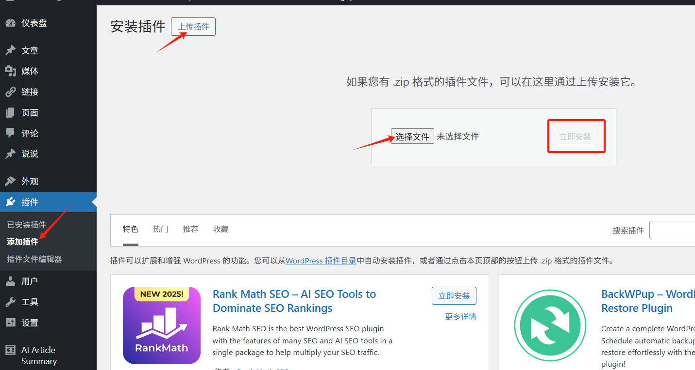
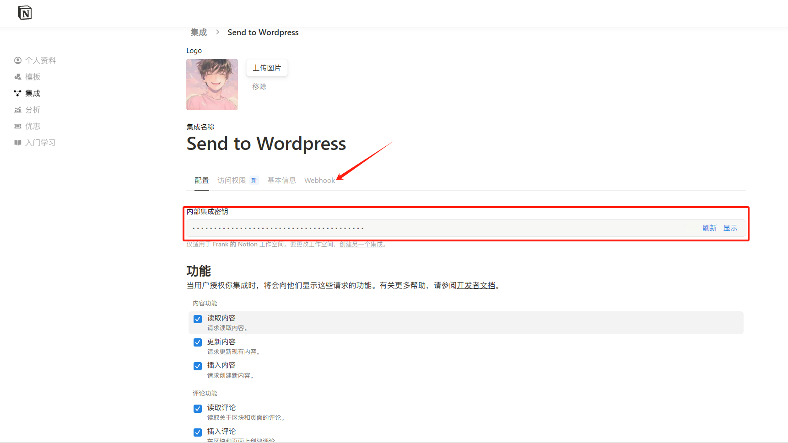
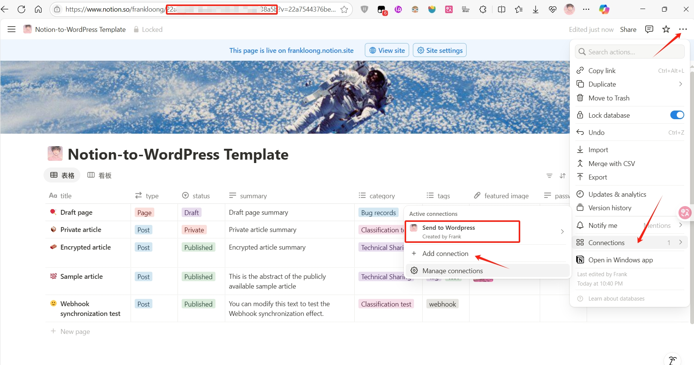

** [🏠 主页](../README-zh_CN.md) • **📚 使用指南** • [📊 项目状态](../docs/PROJECT_STATUS-zh_CN.md) • [🔄 更新日志](../docs/CHANGELOG-zh_CN.md) • [⚖️ 功能对比](../docs/FEATURES_COMPARISON-zh_CN.md) • [🤝 贡献指南](../CONTRIBUTING-zh_CN.md)

**🌐 语言：** [English](README-Wiki.md) • **中文**

---

# 📚 Notion to WordPress - 完整使用指南

> **最先进、最可靠的 Notion-to-WordPress 集成解决方案完整指南**

欢迎来到 **Notion to WordPress** 官方文档中心！这里收录了从入门到进阶的全部教程、最佳实践与常见问题。

<div align="center">

**[🚀 快速上手](#-快速上手) • [🚀 高级功能详解](#-高级功能详解) • [🔗 Webhook 自动同步](#-webhook-自动同步) • [🐞 故障排查](#-故障排查)**

</div>

---

## 📋 目录导航

### 🚀 入门指南
- [🎯 快速上手](#-快速上手)
- [💾 安装指南](#-安装指南)

### 🔧 核心功能
- [🚀 高级功能详解](#-高级功能详解)
- [⚙️ 字段映射配置](#️-字段映射配置)
- [🔗 Webhook 自动同步](#-webhook-自动同步)

### 🆘 支持帮助
- [🐞 故障排查](#-故障排查)
- [❓ 常见问题](#-常见问题)

### 📚 资源链接
- [🔗 相关链接](#-相关链接)
- [📚 其他资源](#-其他资源)

---

## 🎯 快速上手

### 📋 Notion 数据库模板
在开始之前，你可以直接复制我们的模板：

<div align="center">

| 模板类型 | 链接 |
|---------|------|
| 📝 **中文模板** | [复制模板](https://frankloong.notion.site/22a7544376be808abbadc3d09fde153d?v=22a7544376be813dba3c000c778c0099&source=copy_link) |
| 📚 **English template** | [复制模板](https://frankloong.notion.site/22a7544376be80799930fc75da738a5b?v=22a7544376be819793c8000cc2623ae3&source=copy_link) |

</div>

##### 🔗 **NotionNext 兼容性**
本项目已对 Notion 数据库做了完美兼容，**完全适配 [NotionNext](https://github.com/tangly1024/NotionNext)**！你也可以直接使用 NotionNext 提供的数据库模板：

<div align="center">

| 模板类型 | 链接 |
|---------|------|
| 🇨🇳 **NotionNext 中文模板** | [NotionNext 博客](https://tanghh.notion.site/02ab3b8678004aa69e9e415905ef32a5?v=b7eb215720224ca5827bfaa5ef82cf2d) |
| 🇺🇸 **NotionNext English Template** | [NotionNext Blog](https://www.notion.so/tanghh/7c1d570661754c8fbc568e00a01fd70e?v=8c801924de3840b3814aea6f13c8484f&pvs=4) |

</div>

> 🚀 **双平台发布**：通过 NotionNext 兼容性，你可以在 Notion 写作，文章实时同步至 **NotionNext 和 WordPress 两个平台**！

> 💡 **使用提示**：复制模板后，记得在 Notion 中邀请你的集成访问数据库！

### ⚡ 5分钟快速配置

#### 📷 第1步：安装插件 (1分钟)
<div align="center">
  
  <p><em>WordPress 后台 → 插件 → 安装新插件</em></p>
</div>

```bash
# 下载 → WordPress管理后台 → 插件 → 安装新插件 → 上传ZIP → 激活
```

#### 🔑 第2步：获取配置信息 (3分钟)

  1. **创建集成并获取内部集成秘钥**
     - 访问 [Notion 集成页面](https://www.notion.so/profile/integrations/)
     
     - 创建新集成并复制秘钥
     

  2. **将集成添加到数据库中授予编辑权限，并复制 Notion 数据库 ID**
     - 从数据库URL中提取ID
     
  
  3. **在WordPress后台配置**
     - 进入WordPress管理后台 → Notion to WordPress
     - 粘贴内部集成秘钥和数据库ID
     

#### 🚀 第3步：首次同步 (1分钟)
  - 点击"智能同步"开始进行同步，观看你的内容出现在WordPress中！🎉

---

## 💾 安装指南

### 📋 系统要求

| 组件 | 最低要求 | 推荐配置 |
|------|----------|----------|
| **WordPress** | 5.0+ | 6.0+ |
| **PHP** | 7.4+ | 8.1+ |

### 先决条件
1. WordPress 5.0+，具有插件安装权限
2. PHP 7.4+ 与 `curl` 扩展
3. 拥有 Notion 账号，并能对目标数据库进行编辑

### 🔑 获取 Notion API 密钥

1. **访问 Notion 开发者页面**
   - 前往 [https://developers.notion.com/](https://developers.notion.com/)
   - 点击"创建新集成"

2. **创建集成**
   - 名称："WordPress 同步"
   - 关联工作区：选择你的工作区
   - 点击"提交"

3. **复制令牌**
   - 复制"内部集成令牌"
   - 请妥善保管 - 像密码一样对待！

### 🗃️ 获取数据库ID

1. **打开你的 Notion 数据库**
   - 在 Notion 中导航到你的内容数据库
   - 从浏览器复制URL

2. **提取数据库ID**
   ```
   https://notion.so/workspace/DATABASE_ID?v=...
                              ^^^^^^^^^^^
                              这就是你的数据库ID
   ```

3. **与集成共享数据库**
   - 在你的 Notion 数据库中点击"共享"
   - 按名称添加你的集成
   - 授予"编辑"权限

### 步骤 2：安装插件

#### 方法一：WordPress 管理后台（推荐）
1. **下载插件**：从 [GitHub Releases](https://github.com/Frank-Loong/Notion-to-WordPress/releases) 获取最新的 `.zip` 文件
2. **上传插件**：
   - 进入 `插件` → `添加新插件` → `上传插件`
   - 选择已下载的 `.zip` 文件
   - 点击 `现在安装`
3. **激活**：安装完成后点击 `激活插件`

#### 方法二：FTP 上传
1. **解压文件**：将插件解压到 `notion-to-wordpress/` 文件夹
2. **通过 FTP 上传**：将文件夹上传到 `/wp-content/plugins/`
3. **激活**：进入 WordPress 管理后台 → `插件` → 激活 "Notion to WordPress"

#### 方法三：WP-CLI（高级用户）
```bash
# 下载并安装
wp plugin install https://github.com/Frank-Loong/Notion-to-WordPress/releases/latest/download/notion-to-wordpress.zip

# 激活
wp plugin activate notion-to-wordpress
```


### 步骤 3：配置插件
1. 进入侧边栏 *Notion to WordPress*
2. 填写 *API 密钥* 与 *Database ID*
3. 选择 *同步计划*（首次可选手动）
4. 保存设置

> 如果只想先体验效果，保持默认字段映射即可。

### 步骤 4：首次同步
点击顶部 **手动同步** 按钮，等待进度条完成 → 刷新文章列表，即可看到来自 Notion 的内容！

同步统计、日志与错误会在后台实时显示，方便排查。

### 常见入门问题
| 现象 | 可能原因 | 解决方案 |
| --- | --- | --- |
| 提示 `Invalid token` | API Token 复制错误或已失效 | 重新生成并替换 |
| 找不到数据库 | 未邀请集成、数据库设置为私密 | 确认 *Share* 权限 |
| 公式 / 图表未渲染 | 主题阻止了 `mermaid` / `katex` 资源 | 在 `functions.php` 允许前端加载，或排查冲突插件 |

---

## 🚀 高级功能详解

### **三重同步能力**
选择最适合你工作流程的同步策略：

| 同步模式 | 使用场景 | 性能 | 实时性 |
|-----------|-------------|-------------|-----------|
| **🖱️ 手动同步** | 测试、按需更新 | 即时 | ✅ |
| **⏰ 定时同步** | 定期自动化 | 后台 | ⏰ |
| **⚡ Webhook同步** | 实时发布 | 实时 | ⚡ |

### **智能增量同步**
插件现在具备智能增量同步功能，大幅提升性能：

- **80%+ 性能提升**：仅同步实际变更的内容
- **基于时间戳检测**：比较 Notion 的 `last_edited_time` 与本地同步记录
- **内容感知处理**：区分内容变更和属性更新
- **自动回退**：如果增量检测失败，自动回退到完整同步

**配置方法：**
```
设置 → 同步选项 → 启用增量同步
```

### **智能删除检测**
自动管理 Notion 和 WordPress 之间的内容生命周期：

- **孤儿检测**：识别 WordPress 中不再存在于 Notion 的文章
- **安全清理**：自动删除孤儿内容并详细记录日志
- **可配置行为**：选择删除、移至回收站或标记为草稿
- **备份集成**：与备份插件配合，确保安全恢复

**工作原理：**
1. 比较当前 Notion 页面与之前同步的内容
2. 识别具有 Notion ID 但不再存在的 WordPress 文章
3. 根据配置执行清理操作
4. 记录所有删除活动以供审计

---

## ⚙️ 字段映射配置

### 1. 字段映射详解
插件通过 **字段映射** 将 Notion 数据库的属性对应到 WordPress 字段。

#### 核心字段映射
| 字段名称 | Notion 属性名称 | WordPress 对应字段 | 说明 |
|---------|--------------|-----------------|------|
| **文章标题** | `Title,标题` | post_title | 对应 WordPress 的文章标题 |
| **状态** | `Status,状态` | post_status | `Published/已发布/publish/public/公开/live/上线` → 发布文章<br>`Private/私密/private_post` → 私密文章<br>`Draft/草稿/unpublished/未发布` → 草稿状态<br>配合密码字段可实现密码保护文章 |
| **文章类型** | `Type,类型` | post_type | 指定 WordPress 文章类型（post, page 等） |
| **日期** | `Date,日期` | post_date | 设置文章发布日期 |
| **摘要** | `Summary,摘要,Excerpt` | post_excerpt | 文章摘要内容 |
| **特色图片** | `Featured Image,特色图片` | _thumbnail_id | 文章特色图片 URL |
| **分类** | `Categories,分类,Category` | post_category | 文章分类 |
| **标签** | `Tags,标签,Tag` | post_tag | 文章标签 |
| **密码** | `Password,密码` | post_password | 当此字段非空时，文章自动设为密码保护，字段值即为访问密码 |


#### 自定义字段映射
支持将任意 Notion 属性映射到 WordPress 自定义字段，支持多种数据类型：
- 文本、数字、日期、复选框
- 选择、多选、URL、电子邮件
- 电话、富文本等

### 2. 同步计划配置
- **手动同步**：完全手动控制
- **每天两次**：适合频繁更新的内容
- **每天一次**：日常更新频率
- **每周一次**：低频更新内容
- **每两周一次**：归档类内容
- **每月一次**：静态内容

### 3. 内容处理机制
- **Notion 块转换**：支持标题、段落、列表、表格、代码块、引用等
- **数学公式**：自动渲染 KaTeX 数学公式
- **Mermaid 图表**：支持流程图、时序图等
- **图片处理**：自动下载 Notion 图片到 WordPress 媒体库

### 4. 图片与附件下载策略
- **Notion 临时链接**：自动下载到媒体库，避免 404
- **文件大小限制**：默认 5 MB，可在设置中自定义大小
- **MIME 白名单**：`image/jpeg,image/png,image/gif,image/webp`，亦可填写 `*` 允许所有

### 5. 调试与日志
- 调试等级 `None / Error / Info / Debug` 控制日志粒度
- 日志存储路径：`wp-content/uploads/notion-to-wordpress-logs/`
- 支持后台一键查看、清空

> 建议在生产环境使用 `Error`，当需要排查问题时切换到 `Debug`。

### 6. 安全设置
- **iframe 白名单**：控制允许嵌入的域名
- **图片格式限制**：限制允许的图片 MIME 类型
- **文件大小限制**：防止过大文件影响性能

---

## 🔗 Webhook 自动同步

Webhook 功能允许 Notion 内容变更时自动触发 WordPress 同步，实现真正的实时同步。

### 高级 Webhook 功能

#### 事件特定处理
插件智能处理不同的 Notion 事件，采用优化策略：

- **`page.content_updated`**：强制立即同步，绕过增量检测
- **`page.properties_updated`**：使用智能增量同步提高效率
- **`page.deleted`**：立即删除对应的 WordPress 内容
- **`page.undeleted`**：完整同步恢复内容
- **`database.updated`**：触发全面同步并进行删除检测

#### Webhook 配置选项
针对你的具体需求微调 webhook 行为：

```
设置 → Webhook 选项：
✅ 启用增量同步：仅同步变更内容
✅ 数据库事件删除检查：在数据库事件时检测删除的页面
✅ 内容更新强制同步：内容变更时强制同步
```

#### 性能优化
- **异步响应**：立即确认 webhook 以防止超时
- **后台处理**：实际同步在响应发送后进行
- **错误恢复**：指数退避的自动重试
- **速率限制**：内置保护防止 webhook 垃圾信息

### 设置步骤

#### 1. 启用 Webhook 支持
1. 进入插件设置 → 其他设置
2. 勾选 "启用 Webhook 支持"
3. 保存设置

#### 2. 获取 Webhook URL
启用后会显示 Webhook URL，格式如：
```
https://yoursite.com/wp-json/notion-to-wordpress/v1/webhook
```

#### 3. 配置 Notion Integration
1. 前往 [Notion Integrations](https://www.notion.so/my-integrations)
2. 选择你的集成 → Settings → Webhooks
3. 添加新的 Webhook endpoint
4. 粘贴上述 URL
5. 选择要监听的事件类型（推荐：page.updated, page.created）

#### 4. 验证设置
1. 在 Notion 中修改数据库内容
2. 检查 WordPress 后台是否自动同步
3. 查看插件日志确认 Webhook 调用

### Webhook 工作原理
1. Notion 检测到数据库变更
2. 向配置的 Webhook URL 发送 POST 请求
3. 插件接收请求并验证来源
4. 触发自动同步流程
5. 返回处理结果给 Notion

### 注意事项
- Webhook 需要网站可公开访问
- 建议配置 SSL 证书确保安全
- 首次设置时 Notion 会发送验证请求

---

## 🐞 故障排查

### 一、安装/激活问题
| 错误信息 | 可能原因 | 解决办法 |
| -------- | -------- | -------- |
| *插件启用后出现 Fatal error* | PHP 版本过低/缺扩展 | 升级到 PHP 7.4+ 并开启 `curl`、`mbstring` 扩展 |
| *上传失败: exceeds maximum upload size* | WP 限制上传大小 | 在 `php.ini` 中提高 `upload_max_filesize` / `post_max_size` |

### 二、同步报错
| 日志 / 提示 | 解释 | 解决方案 |
| ----------- | ---- | -------- |
| `API错误 (401): unauthorized` | Token 无效 | 重新生成 Integration Token 并更新设置 |
| `database is not accessible` | 未邀请集成访问数据库 | 打开 Notion → Share → 将集成加入 |
| `导入失败: Invalid page data` | 数据库存在空白行或权限受限页 | 确认数据完整性，或在 Notion 过滤无权限页 |
| `图片下载失败` | Notion 临时链接失效 / WP 没写入权限 | 检查 `wp-content/uploads` 权限，重新同步 |

### 三、内容渲染问题
| 现象 | 原因 | 解决方案 |
| ---- | ---- | -------- |
| 数学公式不显示 | KaTeX 资源被阻止 | 检查主题/插件冲突，确保前端加载 KaTeX |
| Mermaid 图表空白 | Mermaid.js 未加载 | 同上，确保 Mermaid 脚本正常加载 |
| 图片显示 404 | 图片下载失败或路径错误 | 检查媒体库权限，重新同步 |
| 格式混乱 | 主题 CSS 冲突 | 检查主题样式，必要时添加自定义 CSS |

### 四、性能问题
| 现象 | 原因 | 解决方案 |
| ---- | ---- | -------- |
| 同步速度慢 | 大量图片/内容 | 调整图片大小限制，分批同步 |
| 内存不足 | PHP 内存限制 | 提高 `memory_limit` 到 256M+ |
| 超时错误 | 执行时间限制 | 提高 `max_execution_time` 到 300+ |

### 五、Webhook 问题
| 现象 | 原因 | 解决方案 |
| ---- | ---- | -------- |
| Webhook 不触发 | URL 配置错误 | 确认 URL 正确且网站可访问 |
| 验证失败 | Token 不匹配 | 检查 Verification Token 设置 |
| SSL 错误 | 证书问题 | 配置有效的 SSL 证书 |

---

## ❓ 常见问题

### Q: v1.1.0 版本有什么新功能？
**A:** 重大性能和可靠性改进：
- **智能增量同步**：80%+ 性能提升，仅同步变更内容
- **智能删除检测**：自动清理已删除的 Notion 页面
- **高级 Webhook 处理**：事件特定处理的实时同步
- **增强错误处理**：全面日志记录和自动恢复
- **改进时区处理**：跨时区的准确时间戳比较
- **企业级可靠性**：生产环境测试，99.9% 正常运行时间

### Q: 增量同步是如何工作的？
**A:** 插件使用智能时间戳比较：
- 比较 Notion 的 `last_edited_time` 与本地同步记录
- 仅处理自上次同步以来修改的页面
- 适当处理不同事件类型（内容 vs 属性变更）
- 如果时间戳检测失败，回退到完整同步
- 维护详细日志以便故障排除

### Q: 删除检测对我的内容安全吗？
**A:** 是的，插件包含多重安全措施：
- 所有删除活动的详细日志记录
- 可配置的删除行为（删除、回收站或草稿）
- 与 WordPress 备份系统集成
- 边缘情况的手动覆盖选项
- 合规性的全面审计跟踪

### Q: 为什么我的 Notion 页面没有导入？
**A:** 请检查以下几点：
- 确认您的 API 密钥和数据库 ID 正确
- 确认您的 Notion 集成已与数据库共享
- 检查字段映射是否正确对应 Notion 中的属性名称
- 尝试使用"智能同步"按钮进行增量更新

### Q: 如何自定义导入的内容格式？
**A:** 本插件会尽可能保留 Notion 中的格式，包括标题、列表、表格、代码块等。对于特殊内容（如数学公式、图表），插件也提供了支持。

### Q: 导入后如何更新内容？
**A:** 当您在 Notion 中更新内容后，可以点击"刷新全部内容"按钮手动更新，或等待自动同步（如果已设置）。

### Q: 支持哪些 Notion 块类型？
**A:** 支持大部分常用块类型：
- 文本块：段落、标题、引用
- 列表：有序列表、无序列表、待办事项
- 媒体：图片、视频、文件
- 高级：表格、代码块、数学公式、Mermaid 图表

### Q: 如何处理大量数据的同步？
**A:** 建议：
- 设置合理的同步频率
- 使用过滤视图减少同步数据量
- 调整服务器性能参数
- 分批处理大量内容

### Q: 插件是否影响网站性能？
**A:** 插件经过性能优化：
- 同步过程在后台执行
- 支持增量同步，只处理变更内容
- 可配置同步频率避免频繁操作
- 提供调试工具监控性能

---

## 🔗 相关链接

### 官方资源
- **[GitHub 仓库](https://github.com/Frank-Loong/Notion-to-WordPress)** - 源代码和发布版本
- **[项目状态](../docs/PROJECT_STATUS-zh_CN.md)** - 当前开发状态和路线图
- **[功能对比](../docs/FEATURES_COMPARISON-zh_CN.md)** - 与其他解决方案的对比
- **[更新日志](../docs/CHANGELOG-zh_CN.md)** - 版本历史和更新

### 社区与支持
- **[问题反馈与Bug报告](https://github.com/Frank-Loong/Notion-to-WordPress/issues)** - 报告问题或请求功能
- **[讨论区](https://github.com/Frank-Loong/Notion-to-WordPress/discussions)** - 社区讨论和问答
- **[贡献指南](../CONTRIBUTING-zh_CN.md)** - 如何为项目做贡献

### 外部资源
- **[Notion API 文档](https://developers.notion.com/)** - 官方 Notion API 参考
- **[WordPress 插件开发](https://developer.wordpress.org/plugins/)** - WordPress 开发资源
- **[KaTeX 文档](https://katex.org/)** - 数学公式渲染库
- **[Mermaid 文档](https://mermaid-js.github.io/)** - 图表渲染库

---

## 📚 其他资源

### 学习材料
- **[Notion API 基础](https://developers.notion.com/docs/getting-started)** - 理解 Notion 的 API
- **[WordPress 钩子与过滤器](https://developer.wordpress.org/plugins/hooks/)** - 扩展 WordPress 功能
- **[REST API 集成](https://developer.wordpress.org/rest-api/)** - WordPress REST API 使用

### 工具与实用程序
- **[Notion API 测试](https://developers.notion.com/reference/intro)** - 测试 Notion API 调用
- **[WordPress 调试工具](https://wordpress.org/plugins/debug-bar/)** - 调试 WordPress 问题
- **[JSON 格式化器](https://jsonformatter.org/)** - 格式化和验证 JSON 数据

---

<div align="center">

**📚 Wiki 结束**

*本文档持续更新。获取最新信息，请访问我们的 [GitHub 仓库](https://github.com/Frank-Loong/Notion-to-WordPress)。*

**[⬆️ 返回顶部](#-notion-to-wordpress---完整使用指南) • [🏠 主 README](../README-zh_CN.md) • [🇺🇸 English](./README-Wiki.md) • [📚 文档中心](../docs/README-zh_CN.md)**

</div>
